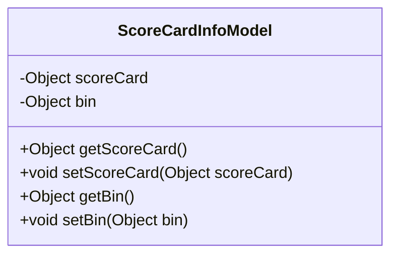
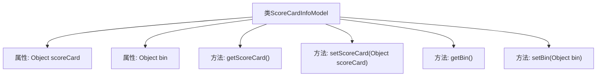

# 基础信息

|      |      |
|------|------|
| 名称 | ScoreCardInfoModel |
| 编码语言 | .java |
| 代码路径 | WeFe/serving/serving-sdk-java/src/main/java/com/welab/wefe/serving/sdk/model/ScoreCardInfoModel.java |
| 包名 | com.welab.wefe.serving.sdk.model |
| 依赖项 | ['com.welab.wefe.common.util.JObject'] |
| 概述说明 | ScoreCardInfoModel类包含scoreCard和bin两个Object类型属性，提供对应的getter和setter方法。 |

# 说明

该代码定义了一个名为ScoreCardInfoModel的Java类，包含两个私有成员变量scoreCard和bin，类型均为Object。类中提供了这两个变量的公共getter和setter方法，用于获取和设置变量的值。该模型类主要用于封装评分卡和bin的相关信息，结构简单，便于数据存取操作。

# 类列表 Class Summary

| 名称   | 类型  | 说明 |
|-------|------|-------------|
| ScoreCardInfoModel | class | ScoreCardInfoModel类包含scoreCard和bin两个Object属性，提供对应的getter和setter方法。 |

## 类 ScoreCardInfoModel

|      |      |
|------|------|
| 访问范围 | public |
| 类型 | class |
| 名称 | ScoreCardInfoModel |
| 说明 | ScoreCardInfoModel类包含scoreCard和bin两个Object属性，提供对应的getter和setter方法。 |

### UML类图

这段代码展示了一个简单的Java类`ScoreCardInfoModel`，它包含两个私有属性`scoreCard`和`bin`，以及对应的getter和setter方法。该类主要用于封装和管理评分卡和bin信息，通过公共方法提供对这些私有属性的访问和修改能力。这种设计模式符合JavaBean规范，便于数据封装和对象属性的安全访问。

### 内部方法调用关系图

这段流程图描述了ScoreCardInfoModel类的结构，包含两个Object类型的私有属性scoreCard和bin，以及对应的getter和setter方法。类通过四个公共方法提供对属性的访问和修改能力，整体结构是典型的数据模型类设计，用于封装和管理评分卡和bin信息，体现了JavaBean的标准模式。

### 字段列表 Field List

| 名称  | 类型  | 说明 |
|-------|-------|------|
| scoreCard | Object | 私有变量scoreCard，类型为Object。 |
| bin | Object | 私有对象变量bin。 |

### 方法列表

| 名称  | 类型  | 说明 |
|-------|-------|------|
| getScoreCard | Object | 这是一个Java方法，返回名为scoreCard的对象。 |
| getBin | Object | 方法返回对象bin的值。 |
| setBin | void | 这是一个Java方法，用于设置对象的bin属性值。方法接受一个Object类型参数，并将其赋值给当前对象的bin字段。 |
| setScoreCard | void | 这是一个Java方法，用于设置对象的scoreCard属性。方法接收一个Object类型的参数，并将其赋值给当前对象的scoreCard字段。 |

