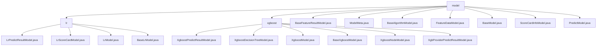

# 基础信息

|      |      |
|------|------|
| 名称 | model |
| 编码语言 | .java |
| 代码路径 | WeFe/serving/serving-sdk-java/src/main/java/com/welab/wefe/serving/sdk/model |
| 包名 | docs.serving.serving-sdk-java.src.main.java.com.welab.wefe.serving.sdk.model |
| 概述说明 | 该模块实现逻辑回归和XGBoost模型预测功能，包括参数存储、结果封装和错误处理。关键类有LrModel、XgboostModel等，支持信用评分和风险预测等场景，采用工厂方法和分层封装设计。 |

# 说明

## 概述  
该模块核心职责是提供机器学习模型预测的统一框架，支持逻辑回归(LR)和XGBoost等算法的数据封装、参数管理和结果生成。接口规范采用工厂模式（例如`of`/`fail`）和标准Getter/Setter，关键数据结构包括预测结果模型（如`LrPredictResultModel`和`XgboostPredictResultModel`）、决策树模型（如`XgboostNodeModel`）及基础模型（如`BaseAlgorithmModel`）。外部依赖涉及Java集合类、XGBoost框架和联邦学习参数（如`flType`）。例如`BaseModel`通过`modelId`标识模型，`FeatureDataModel`采用类似DTO的模式管理特征数据。

## 主要业务场景  
模块支持端到端预测流程：从模型加载（如`BaseXgboostModel`初始化树结构）、特征处理（如`ScoreCardInfoModel`管理分箱）到结果封装（如`PredictModel`聚合错误信息）。交互模式分层设计，类似微服务架构，例如`BaseFeatureResultModel`统一处理特征缺失场景。典型应用包括信用评分（LR评分卡分箱）和风险预测（XGBoost多分类），API涵盖模型配置（如`ModelMeta`学习率）、节点操作（如XGBoost缺失值处理）和结果工厂（如`ofScores`）。例如联邦学习场景通过`BaseModel`的`myRole`参数实现角色控制。

### 包内部结构视图

该流程图展示了WeFe服务SDK中Java模型的层级结构。根节点"model"下包含两个子目录(lr和xgboost)以及多个基础模型文件。lr目录包含线性回归相关模型，xgboost目录包含梯度提升树相关模型，两者均采用继承结构设计。同级还包含8个通用模型基类和工具类，形成完整的机器学习推理模型体系。

# 文件列表

| 名称   | 类型  | 说明 |
|-------|------|-------------|
| [BaseFeatureResultModel.java](BaseFeatureResultModel.md) | file | BaseFeatureResultModel类包含found和error属性，提供构造方法of及getter/setter方法，用于返回特征查找结果和错误信息。 |
| [ModelMeta.java](ModelMeta.md) | file | ModelMeta类包含学习率、容差和工作模式三个属性，提供对应的getter和setter方法。 |
| [BaseAlgorithmModel.java](BaseAlgorithmModel.md) | file | BaseAlgorithmModel类包含ModelMeta和ScoreCardInfoModel属性，提供获取学习率的方法及属性的getter/setter。 |
| [FeatureDataModel.java](FeatureDataModel.md) | file | FeatureDataModel类继承BaseFeatureResultModel，包含featureDataMap属性和相关操作方法，支持通过of方法创建实例并检查数据有效性，以及fail方法处理错误情况。 |
| [BaseModel.java](BaseModel.md) | file | BaseModel类包含模型ID、算法、联邦学习类型、成员角色和参数字段，提供各属性的getter和setter方法。 |
| [ScoreCardInfoModel.java](ScoreCardInfoModel.md) | file | ScoreCardInfoModel类包含scoreCard和bin两个Object类型属性，提供对应的getter和setter方法。 |
| [PredictModel.java](PredictModel.md) | file | PredictModel类包含用户ID、错误信息和特征结果，提供失败静态方法及getter/setter，支持特征结果提取。 |
| [xgboost](xgboost/_module.md) | package | XgboostPredictResultModel存储预测分数和错误信息。XgboostDecisionTreeModel管理决策树节点和缺失值处理。XgboostModel配置XGBoost模型参数和结构。BaseXgboostModel封装模型参数。XgboostNodeModel定义节点结构。XgbProviderPredictResultModel封装预测结果。 |
| [lr](lr/_module.md) | package | LrPredictResultModel存储预测结果，含score和scoreCard属性及工厂方法。LrScoreCardModel封装评分卡数据，含feature、value等属性。LrModel表示线性回归模型，含weight、intercept等参数。BaseLrModel继承BaseAlgorithmModel，封装LrModel参数。 |

