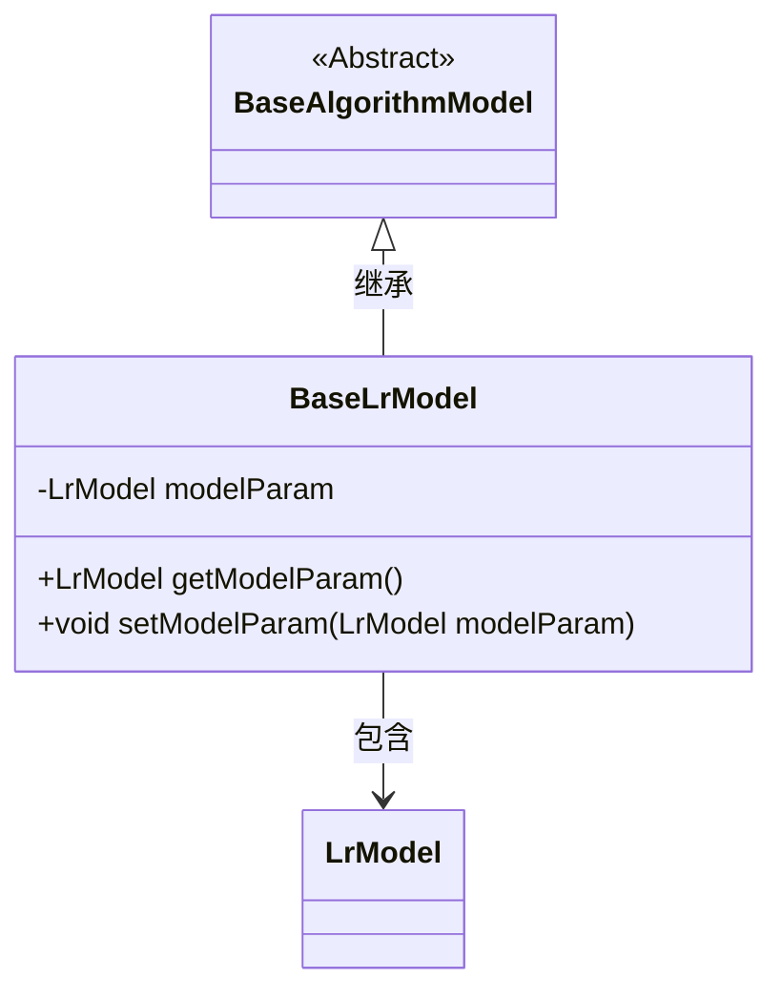
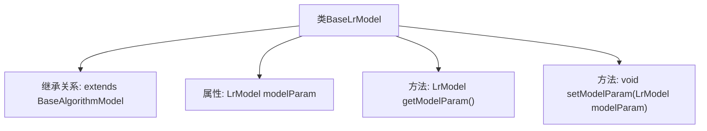

# 基础信息

|      |      |
|------|------|
| 名称 | BaseLrModel |
| 编码语言 | .java |
| 代码路径 | WeFe/serving/serving-sdk-java/src/main/java/com/welab/wefe/serving/sdk/model/lr/BaseLrModel.java |
| 包名 | com.welab.wefe.serving.sdk.model.lr |
| 依赖项 | ['com.welab.wefe.serving.sdk.model.BaseAlgorithmModel'] |
| 概述说明 | BaseLrModel类继承BaseAlgorithmModel，包含LrModel类型属性modelParam及其getter/setter方法。 |

# 说明

这段代码定义了一个名为BaseLrModel的类，它继承自BaseAlgorithmModel。该类包含一个私有成员变量modelParam，类型为LrModel。提供了两个公共方法：getModelParam用于获取当前modelParam的值，setModelParam用于设置modelParam的值。这个类主要用于封装和管理LrModel类型的模型参数。

# 类列表 Class Summary

| 名称   | 类型  | 说明 |
|-------|------|-------------|
| BaseLrModel | class | BaseLrModel继承BaseAlgorithmModel，包含LrModel类型属性modelParam及其getter和setter方法。 |

## 类 BaseLrModel

|      |      |
|------|------|
| 访问范围 | public |
| 类型 | class |
| 名称 | BaseLrModel |
| 说明 | BaseLrModel继承BaseAlgorithmModel，包含LrModel类型属性modelParam及其getter和setter方法。 |

### UML类图

这段类图展示了BaseLrModel继承自抽象类BaseAlgorithmModel，并包含一个LrModel类型的私有成员modelParam。BaseLrModel提供了对modelParam的getter和setter方法，体现了封装特性。LrModel作为独立类存在，被BaseLrModel通过组合方式引用，这种设计实现了模型参数与算法模型的解耦，便于参数管理和扩展。整体结构符合面向对象设计原则，层次清晰且职责单一。

### 内部方法调用关系图

这段流程图描述了BaseLrModel类的结构，该类继承自BaseAlgorithmModel，包含一个LrModel类型的私有属性modelParam，以及对应的getter和setter方法。通过继承关系，BaseLrModel获得了父类的特性，同时通过封装modelParam属性并提供了访问和修改该属性的方法，实现了对模型参数的管理。这种设计模式体现了面向对象编程的封装和继承特性。

### 字段列表 Field List

| 名称  | 类型  | 说明 |
|-------|-------|------|
| modelParam | LrModel | 私有模型参数对象。 |

### 方法列表

| 名称  | 类型  | 说明 |
|-------|-------|------|
| getModelParam | LrModel | 获取模型参数的方法，返回LrModel类型对象。 |
| setModelParam | void | 设置模型参数方法，将传入的LrModel对象赋值给当前对象的modelParam属性。 |

