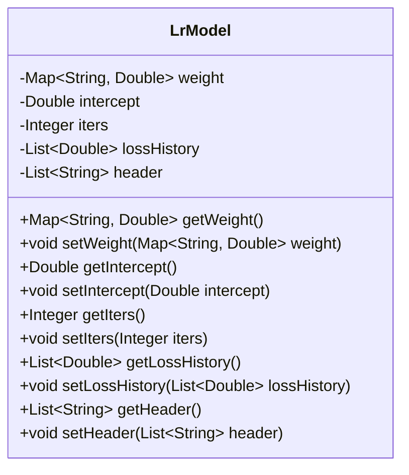

# 基础信息

|      |      |
|------|------|
| 名称 | LrModel |
| 编码语言 | .java |
| 代码路径 | WeFe/serving/serving-sdk-java/src/main/java/com/welab/wefe/serving/sdk/model/lr/LrModel.java |
| 包名 | com.welab.wefe.serving.sdk.model.lr |
| 依赖项 | ['java.util.List', 'java.util.Map'] |
| 概述说明 | 线性回归模型类，包含权重、截距、迭代次数、损失历史和表头字段及对应getter/setter方法。 |

# 说明

该代码定义了一个名为LrModel的类，用于表示线性回归模型。类中包含五个私有属性：weight（权重映射，键为字符串，值为双精度浮点数）、intercept（截距，默认值为0.0）、iters（迭代次数）、lossHistory（损失历史记录列表）和header（表头列表）。每个属性都有对应的getter和setter方法，用于获取和设置属性值。该类主要用于存储和管理线性回归模型的参数和训练过程中的相关信息。

# 类列表 Class Summary

| 名称   | 类型  | 说明 |
|-------|------|-------------|
| LrModel | class | LrModel类包含权重、截距、迭代次数、损失历史和表头字段，提供各字段的getter和setter方法。 |

## 类 LrModel

|      |      |
|------|------|
| 访问范围 | public |
| 类型 | class |
| 名称 | LrModel |
| 说明 | LrModel类包含权重、截距、迭代次数、损失历史和表头字段，提供各字段的getter和setter方法。 |

### UML类图

这段代码定义了一个名为LrModel的类，它表示一个线性回归模型。该类包含五个私有成员变量：weight（权重映射）、intercept（截距）、iters（迭代次数）、lossHistory（损失历史记录）和header（表头信息）。每个成员变量都有对应的getter和setter方法，用于访问和修改这些私有变量。这个类主要用于存储和管理线性回归模型的参数和训练过程中的相关信息，适合在机器学习场景中使用。

### 内部方法调用关系图

```mermaid
graph TD
    A["类LrModel"]
    B["私有属性: Map<String, Double> weight"]
    C["私有属性: Double intercept = 0.0"]
    D["私有属性: Integer iters"]
    E["私有属性: List<Double> lossHistory"]
    F["私有属性: List<String> header"]
    G["公有方法: getWeight()"]
    H["公有方法: setWeight(Map<String, Double>)"]
    I["公有方法: getIntercept()"]
    J["公有方法: setIntercept(Double)"]
    K["公有方法: getIters()"]
    L["公有方法: setIters(Integer)"]
    M["公有方法: getLossHistory()"]
    N["公有方法: setLossHistory(List<Double>)"]
    O["公有方法: getHeader()"]
    P["公有方法: setHeader(List<String>)"]

    A --> B
    A --> C
    A --> D
    A --> E
    A --> F
    A --> G
    A --> H
    A --> I
    A --> J
    A --> K
    A --> L
    A --> M
    A --> N
    A --> O
    A --> P
```

该流程图展示了LrModel类的结构，包含5个私有属性和10个公有方法。属性包括weight（权重映射）、intercept（截距默认0.0）、iters（迭代次数）、lossHistory（损失历史记录）和header（表头信息）。每个属性都配有对应的getter和setter方法，用于外部访问和修改这些私有属性。类设计遵循了封装原则，通过公有方法暴露私有属性的访问接口，这是典型的Java Bean设计模式。

### 字段列表 Field List

| 名称  | 类型  | 说明 |
|-------|-------|------|
| lossHistory | List<Double> | 私有双精度浮点数列表，记录损失历史。 |
| intercept = 0.0 | Double | 定义私有双精度变量intercept，初始值为0.0。 |
| weight | Map<String, Double> | 定义了一个私有映射变量weight，键为字符串类型，值为双精度浮点数类型。 |
| header | List<String> | 私有字符串列表header。 |
| iters | Integer | 私有整型变量iters |

### 方法列表

| 名称  | 类型  | 说明 |
|-------|-------|------|
| setLossHistory | void | 设置损失历史记录的方法，将输入的损失历史列表赋值给类的成员变量lossHistory。 |
| setIters | void | Java方法：设置整数类型变量iters的值。 |
| getIntercept | Double | 方法getIntercept返回Double类型的intercept值。 |
| getWeight | Map<String, Double> | 获取权重映射表的方法，返回键为字符串、值为双精度数的映射。 |
| setIntercept | void | 设置截距值的方法，将参数intercept赋值给当前对象的intercept属性。 |
| setWeight | void | Java方法：设置权重映射，参数为字符串到双精度值的映射，直接赋值给类变量weight。 |
| getLossHistory | List<Double> | 获取损失历史记录的方法，返回一个双精度浮点数列表。 |
| setHeader | void | 方法setHeader接收字符串列表header，并将其赋值给类的成员变量header。 |
| getHeader | List<String> | 方法返回字符串列表header。 |
| getIters | Integer | 获取iters值的公共方法，返回Integer类型。 |

