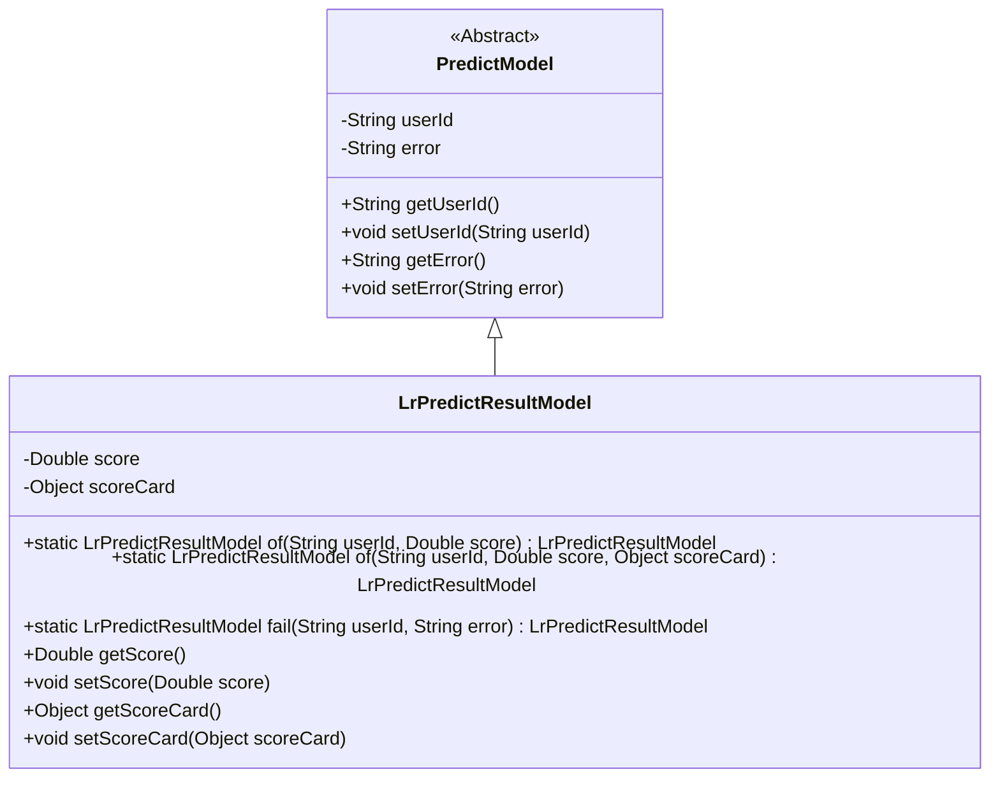
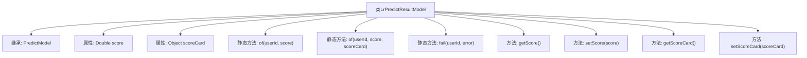

# 基础信息

|      |      |
|------|------|
| 名称 | LrPredictResultModel |
| 编码语言 | .java |
| 代码路径 | WeFe/serving/serving-sdk-java/src/main/java/com/welab/wefe/serving/sdk/model/lr/LrPredictResultModel.java |
| 包名 | com.welab.wefe.serving.sdk.model.lr |
| 依赖项 | ['com.welab.wefe.serving.sdk.model.PredictModel'] |
| 概述说明 | LrPredictResultModel继承PredictModel，包含score和scoreCard属性，提供两种带userId和score的静态构建方法，一种带scoreCard，另一种处理失败情况，包含getter和setter方法。 |

# 说明

LrPredictResultModel是一个继承自PredictModel的类，用于存储预测结果。它包含两个主要属性：score（分数，Double类型）和scoreCard（记分卡，Object类型）。提供了三个静态工厂方法：of方法用于创建包含用户ID和分数的实例，可选的scoreCard参数；fail方法用于创建包含用户ID和错误信息的失败实例。类还提供了score和scoreCard的getter和setter方法，用于访问和修改属性值。

# 类列表 Class Summary

| 名称   | 类型  | 说明 |
|-------|------|-------------|
| LrPredictResultModel | class | LrPredictResultModel继承PredictModel，包含score和scoreCard属性，提供带userId、score或scoreCard的静态构建方法，以及失败处理方法，含getter/setter。 |

## 类 LrPredictResultModel

|      |      |
|------|------|
| 访问范围 | public |
| 类型 | class |
| 名称 | LrPredictResultModel |
| 说明 | LrPredictResultModel继承PredictModel，包含score和scoreCard属性，提供带userId、score或scoreCard的静态构建方法，以及失败处理方法，含getter/setter。 |

### UML类图

该类图展示了LrPredictResultModel继承自抽象类PredictModel的关系。LrPredictResultModel作为预测结果模型，包含score（分数）和scoreCard（评分卡）两个核心属性，提供三种静态工厂方法（两个of方法和一个fail方法）来创建实例，并封装了标准的getter/setter方法。父类PredictModel定义了基础字段userId和error，体现了模型的基础属性和错误处理能力。

### 内部方法调用关系图

该流程图展示了LrPredictResultModel类的结构和功能。该类继承自PredictModel，包含两个私有属性score和scoreCard，以及多个静态工厂方法（of和fail）和常规的getter/setter方法。静态工厂方法用于创建并初始化对象实例，其中of方法有两种重载形式，分别用于带或不带scoreCard参数的场景，而fail方法用于创建包含错误信息的实例。

### 字段列表 Field List

| 名称  | 类型  | 说明 |
|-------|-------|------|
| score | Double | 声明一个私有的双精度浮点数变量score。 |
| scoreCard | Object | 私有对象scoreCard，用于存储评分卡数据。 |

### 方法列表

| 名称  | 类型  | 说明 |
|-------|-------|------|
| of | LrPredictResultModel | 静态方法`of`创建`LrPredictResultModel`实例，设置用户ID和分数后返回。 |
| of | LrPredictResultModel | 静态方法`of`创建`LrPredictResultModel`实例，设置用户ID、分数和评分卡对象后返回。 |
| fail | LrPredictResultModel | 静态方法创建失败结果模型，包含用户ID和错误信息。 |
| setScoreCard | void | 这是一个Java方法，用于设置对象的scoreCard属性。方法接受一个Object类型的参数，并将其赋值给当前对象的scoreCard字段。 |
| getScore | Double | 这是一个Java方法，返回Double类型的score值。 |
| setScore | void | 这是一个Java方法，用于设置对象的score属性值为传入的Double类型参数。 |
| getScoreCard | Object | 获取分数卡对象的方法。 |

