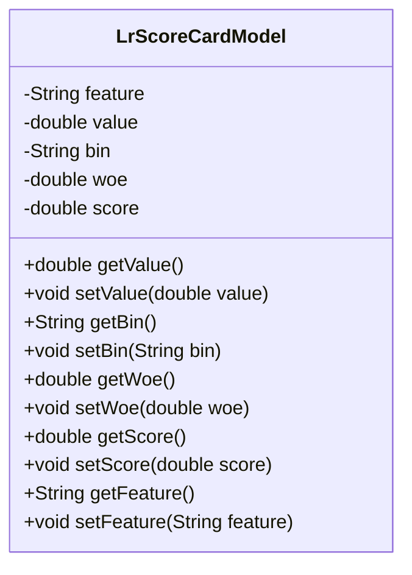

# 基础信息

|      |      |
|------|------|
| 名称 | LrScoreCardModel |
| 编码语言 | .java |
| 代码路径 | WeFe/serving/serving-sdk-java/src/main/java/com/welab/wefe/serving/sdk/model/lr/LrScoreCardModel.java |
| 包名 | com.welab.wefe.serving.sdk.model.lr |
| 依赖项 | [] |
| 概述说明 | LrScoreCardModel类包含特征、值、分箱、WOE和分数属性，提供各字段的getter和setter方法。 |

# 说明

LrScoreCardModel类是一个用于存储逻辑回归评分卡模型相关数据的Java类。它包含五个主要属性：feature表示特征名称，value表示特征值，bin表示分箱信息，woe表示证据权重，score表示得分。类中为每个属性提供了对应的getter和setter方法，用于获取和设置属性值。这个类主要用于封装评分卡模型中的特征及其相关计算结果。

# 类列表 Class Summary

| 名称   | 类型  | 说明 |
|-------|------|-------------|
| LrScoreCardModel | class | Java类LrScoreCardModel包含特征、值、分箱、WOE和分数属性，提供各字段的getter和setter方法。 |

## 类 LrScoreCardModel

|      |      |
|------|------|
| 访问范围 | public |
| 类型 | class |
| 名称 | LrScoreCardModel |
| 说明 | Java类LrScoreCardModel包含特征、值、分箱、WOE和分数属性，提供各字段的getter和setter方法。 |

### UML类图

该代码定义了一个名为LrScoreCardModel的类，用于表示逻辑回归评分卡模型中的数据项。类中包含五个私有属性：feature（特征名称）、value（特征值）、bin（分箱信息）、woe（权重证据值）和score（得分），并为每个属性提供了对应的getter和setter方法。这个类主要用于存储和管理评分卡模型中各个特征的相关信息，便于后续的评分计算和模型分析。

### 内部方法调用关系图

```mermaid
graph TD
    A["类LrScoreCardModel"]
    B["属性: String feature"]
    C["属性: double value"]
    D["属性: String bin"]
    E["属性: double woe"]
    F["属性: double score"]
    G["方法: getValue()"]
    H["方法: setValue(double value)"]
    I["方法: getBin()"]
    J["方法: setBin(String bin)"]
    K["方法: getWoe()"]
    L["方法: setWoe(double woe)"]
    M["方法: getScore()"]
    N["方法: setScore(double score)"]
    O["方法: getFeature()"]
    P["方法: setFeature(String feature)"]

    A --> B
    A --> C
    A --> D
    A --> E
    A --> F
    A --> G
    A --> H
    A --> I
    A --> J
    A --> K
    A --> L
    A --> M
    A --> N
    A --> O
    A --> P
```

该流程图展示了LrScoreCardModel类的结构，包含5个属性和对应的getter/setter方法。属性包括feature（特征名称）、value（数值）、bin（分箱标签）、woe（权重证据值）和score（评分分数）。每个属性都有对应的获取和设置方法，用于封装数据访问。这是一个典型的POJO（Plain Old Java Object）类设计，常用于存储逻辑回归评分卡模型的特征数据，通过方法提供对私有属性的安全访问和修改。

### 字段列表 Field List

| 名称  | 类型  | 说明 |
|-------|-------|------|
| bin | String | 声明字符串变量bin。 |
| woe | double | 声明了一个双精度浮点型变量woe。 |
| score | double | 声明一个双精度浮点型变量score。 |
| value | double | 声明一个双精度浮点型变量value。 |
| feature | String | 字符串特征 |

### 方法列表

| 名称  | 类型  | 说明 |
|-------|-------|------|
| setScore | void | 设置分数方法，将输入值赋给对象的score属性。 |
| getWoe | double | 方法getWoe返回双精度浮点数woe的值。 |
| setBin | void | 设置bin属性的方法，将参数bin赋值给对象的bin成员变量。 |
| getScore | double | 方法getScore返回双精度浮点数score的值。 |
| setWoe | void | 这是一个Java方法，用于设置类成员变量woe的值。方法接受一个double类型参数，并将其赋值给当前对象的woe属性。 |
| setValue | void | 设置数值方法，将输入值赋给类成员变量value。 |
| getValue | double | 这是一个公共方法，返回双精度浮点数类型的value值。 |
| getFeature | String | 获取feature属性的字符串值。 |
| getBin | String | 获取bin值的公共方法。 |
| setFeature | void | 设置对象属性feature的值。 |

