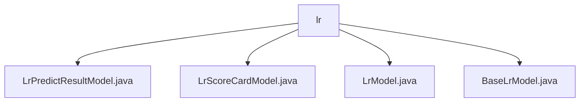

# 基础信息

|      |      |
|------|------|
| 名称 | lr |
| 编码语言 | .java |
| 代码路径 | WeFe/serving/serving-sdk-java/src/main/java/com/welab/wefe/serving/sdk/model/lr |
| 包名 | docs.serving.serving-sdk-java.src.main.java.com.welab.wefe.serving.sdk.model.lr |
| 概述说明 | LrPredictResultModel存储预测结果，含score和scoreCard属性及工厂方法。LrScoreCardModel封装评分卡数据，含feature、value等属性。LrModel表示线性回归模型，含weight、intercept等参数。BaseLrModel继承BaseAlgorithmModel，封装LrModel参数。 |

# 说明

## 概述  
该模块核心职责是实现逻辑回归(LR)模型的预测结果管理和参数存储，包含预测结果封装、评分卡数据存储及模型参数维护。接口规范包括工厂方法创建预测实例（例如`of`和`fail`）及标准Getter/Setter访问属性。关键数据结构为`LrPredictResultModel`（含分数和记分卡）、`LrScoreCardModel`（特征分箱和得分）及`LrModel`（权重和训练历史）。外部依赖仅涉及Java基础类型和集合类。例如`LrModel`通过Map存储特征权重，`BaseLrModel`继承体系类似模板模式。

## 主要业务场景  
模块支持完整LR预测流程：从模型加载（如`BaseLrModel`管理参数）、特征计算（如`LrScoreCardModel`记录WOE值）到结果生成（如`LrPredictResultModel`工厂构建响应）。交互模式采用分层封装，类似DTO转换，例如预测结果通过静态工厂隔离构造逻辑。典型应用包括信用评分（使用评分卡特征分箱）和风险预测（依赖权重映射）。API类型涵盖参数访问、实例构建及错误处理，例如`fail`方法封装异常场景。

### 包内部结构视图

该流程图展示了WeFe项目中逻辑回归模型相关的Java类文件结构。lr作为父节点，包含4个子节点文件：LrPredictResultModel.java、LrScoreCardModel.java、LrModel.java和BaseLrModel.java，这些文件都属于serving-sdk-java模块下的逻辑回归模型实现部分。

# 文件列表

| 名称   | 类型  | 说明 |
|-------|------|-------------|
| [LrPredictResultModel.java](LrPredictResultModel.md) | file | LrPredictResultModel继承PredictModel，包含score和scoreCard属性，提供两种带userId和score的静态构建方法，一种带scoreCard，另一种处理失败情况，包含getter和setter方法。 |
| [LrScoreCardModel.java](LrScoreCardModel.md) | file | LrScoreCardModel类包含特征、值、分箱、WOE和分数属性，提供各字段的getter和setter方法。 |
| [LrModel.java](LrModel.md) | file | 线性回归模型类，包含权重、截距、迭代次数、损失历史和表头字段及对应getter/setter方法。 |
| [BaseLrModel.java](BaseLrModel.md) | file | BaseLrModel类继承BaseAlgorithmModel，包含LrModel类型属性modelParam及其getter/setter方法。 |

