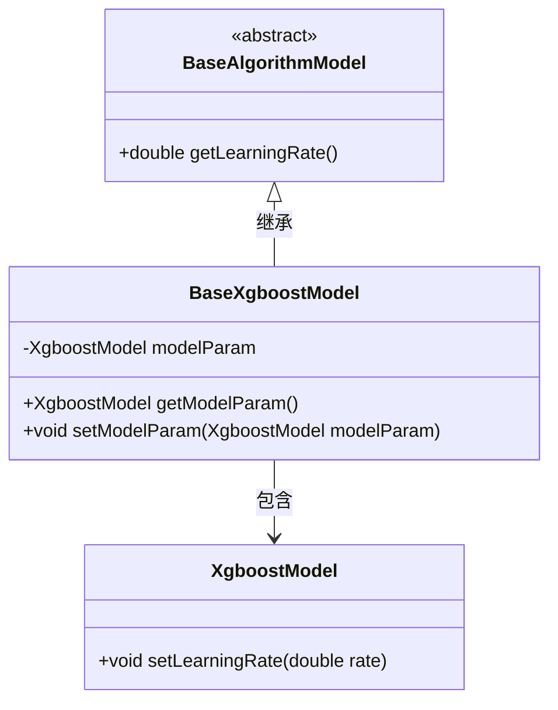
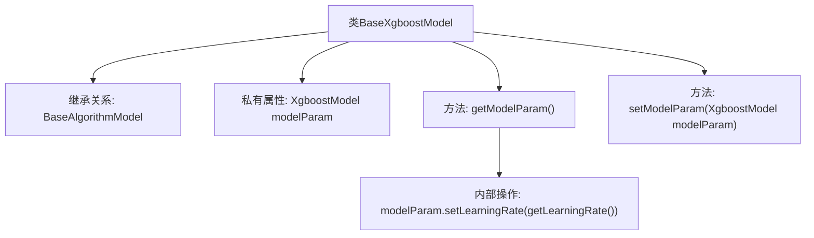

# 基础信息

|      |      |
|------|------|
| 名称 | BaseXgboostModel |
| 编码语言 | .java |
| 代码路径 | WeFe/serving/serving-sdk-java/src/main/java/com/welab/wefe/serving/sdk/model/xgboost/BaseXgboostModel.java |
| 包名 | com.welab.wefe.serving.sdk.model.xgboost |
| 依赖项 | ['com.welab.wefe.serving.sdk.model.BaseAlgorithmModel'] |
| 概述说明 | BaseXgboostModel继承BaseAlgorithmModel，包含XgboostModel参数及其getter/setter方法，getter会设置学习率。 |

# 说明

BaseXgboostModel类继承自BaseAlgorithmModel，包含一个私有成员变量modelParam，类型为XgboostModel。提供了getModelParam方法，该方法在返回modelParam前会设置其学习率为当前对象的学习率值。同时提供了setModelParam方法用于设置modelParam的值。该类主要用于封装Xgboost模型参数及相关操作。

# 类列表 Class Summary

| 名称   | 类型  | 说明 |
|-------|------|-------------|
| BaseXgboostModel | class | BaseXgboostModel继承BaseAlgorithmModel，包含XgboostModel参数及其getter和setter方法。 |

## 类 BaseXgboostModel

|      |      |
|------|------|
| 访问范围 | public |
| 类型 | class |
| 名称 | BaseXgboostModel |
| 说明 | BaseXgboostModel继承BaseAlgorithmModel，包含XgboostModel参数及其getter和setter方法。 |

### UML类图

这段类图展示了BaseXgboostModel继承自抽象类BaseAlgorithmModel，并包含一个XgboostModel对象。BaseXgboostModel通过getModelParam()方法在返回前会调用setLearningRate()更新模型参数，体现了对父类方法getLearningRate()的调用关系。整体结构清晰地表现了类之间的继承与组合关系。

### 内部方法调用关系图

流程图描述了BaseXgboostModel类的结构，该类继承自BaseAlgorithmModel，包含一个私有属性modelParam和两个方法。getModelParam()方法在返回modelParam前会调用setLearningRate()方法更新学习率，setModelParam()方法用于设置modelParam的值。展示了类成员间的调用关系和属性操作流程。

### 字段列表 Field List

| 名称  | 类型  | 说明 |
|-------|-------|------|
| modelParam | XgboostModel | 私有XGBoost模型参数变量。 |

### 方法列表

| 名称  | 类型  | 说明 |
|-------|-------|------|
| getModelParam | XgboostModel | 该方法返回Xgboost模型参数，设置学习率后返回modelParam对象。 |
| setModelParam | void | 设置Xgboost模型的参数方法。 |

