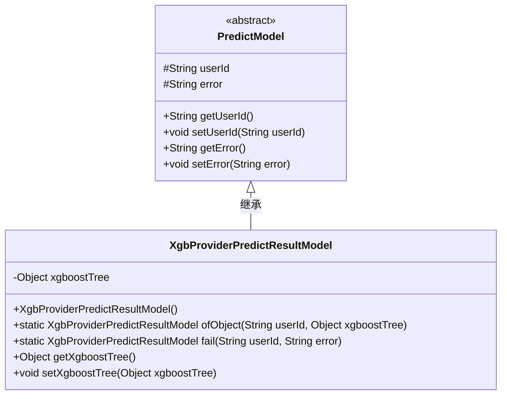
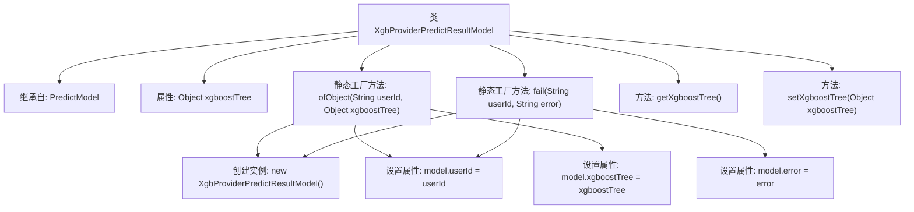

# 基础信息

|      |      |
|------|------|
| 名称 | XgbProviderPredictResultModel |
| 编码语言 | .java |
| 代码路径 | WeFe/serving/serving-sdk-java/src/main/java/com/welab/wefe/serving/sdk/model/xgboost/XgbProviderPredictResultModel.java |
| 包名 | com.welab.wefe.serving.sdk.model.xgboost |
| 依赖项 | ['com.welab.wefe.serving.sdk.model.PredictModel', 'com.welab.wefe.serving.sdk.model.lr.LrPredictResultModel'] |
| 概述说明 | XgbProviderPredictResultModel继承PredictModel，包含xgboostTree属性和两个静态方法：ofObject用于创建带用户ID和xgboostTree的实例，fail用于创建带错误信息的实例。提供xgboostTree的getter和setter。 |

# 说明

XgbProviderPredictResultModel是一个继承自PredictModel的类，用于封装XGBoost模型的预测结果。它包含一个xgboostTree对象属性，提供getter和setter方法。类提供了两个静态工厂方法：ofObject用于创建包含用户ID和xgboostTree对象的实例，fail用于创建包含用户ID和错误信息的失败实例。该类主要用于管理XGBoost模型预测结果的数据结构。

# 类列表 Class Summary

| 名称   | 类型  | 说明 |
|-------|------|-------------|
| XgbProviderPredictResultModel | class | XgbProviderPredictResultModel继承PredictModel，含xgboostTree字段，提供ofObject和fail两种构建方法，支持get/set操作。 |

## 类 XgbProviderPredictResultModel

|      |      |
|------|------|
| 访问范围 | public |
| 类型 | class |
| 名称 | XgbProviderPredictResultModel |
| 说明 | XgbProviderPredictResultModel继承PredictModel，含xgboostTree字段，提供ofObject和fail两种构建方法，支持get/set操作。 |

### UML类图

这段代码展示了一个XgbProviderPredictResultModel类，它继承自抽象类PredictModel。主要功能是封装XGBoost树模型预测结果，提供两种静态工厂方法：ofObject用于创建包含有效结果的模型实例，fail用于创建包含错误信息的失败实例。类中包含xgboostTree私有字段及其访问器方法，继承了父类的userId和error字段。该设计实现了预测结果的成功/失败两种状态封装，适用于机器学习模型预测结果的标准化返回场景。

### 内部方法调用关系图

这段流程图展示了XgbProviderPredictResultModel类的结构，它继承自PredictModel类，包含一个Object类型的xgboostTree属性。类提供了两个静态工厂方法：ofObject用于创建包含xgboostTree对象的实例，fail用于创建包含错误信息的实例。同时包含标准的getter/setter方法用于操作xgboostTree属性。流程图清晰地展示了类成员之间的关系和工厂方法内部的操作步骤。

### 字段列表 Field List

| 名称  | 类型  | 说明 |
|-------|-------|------|
| xgboostTree | Object | 私有变量xgboostTree，用于存储XGBoost树模型对象。 |

### 方法列表

| 名称  | 类型  | 说明 |
|-------|-------|------|
| ofObject | XgbProviderPredictResultModel | 静态方法创建Xgb预测结果模型，传入用户ID和XGBoost树对象，返回填充后的模型实例。 |
| setXgboostTree | void | 设置XGBoost树对象的方法。 |
| fail | XgbProviderPredictResultModel | 静态方法创建失败结果模型，包含用户ID和错误信息。 |
| getXgboostTree | Object | 这是一个Java方法，返回名为xgboostTree的对象。 |

