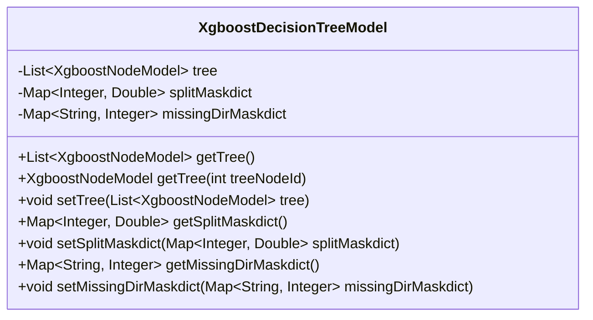
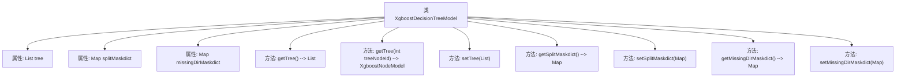

# 基础信息

|      |      |
|------|------|
| 名称 | XgboostDecisionTreeModel |
| 编码语言 | .java |
| 代码路径 | WeFe/serving/serving-sdk-java/src/main/java/com/welab/wefe/serving/sdk/model/xgboost/XgboostDecisionTreeModel.java |
| 包名 | com.welab.wefe.serving.sdk.model.xgboost |
| 依赖项 | ['java.util.List', 'java.util.Map'] |
| 概述说明 | Xgboost决策树模型类，包含树节点列表、分割掩码字典和缺失方向掩码字典，提供各属性的获取和设置方法。 |

# 说明

这是一个名为XgboostDecisionTreeModel的Java类，用于表示XGBoost决策树模型。该类包含三个主要成员变量：tree是一个XgboostNodeModel类型的列表，存储决策树节点；splitMaskdict是一个整数到双精度浮点数的映射，用于存储分割掩码信息；missingDirMaskdict是一个字符串到整数的映射，用于处理缺失值方向。类中提供了对这些变量的getter和setter方法，包括获取整个树结构、通过节点ID获取特定节点、设置树结构、获取和设置分割掩码字典、获取和设置缺失值方向字典等功能。

# 类列表 Class Summary

| 名称   | 类型  | 说明 |
|-------|------|-------------|
| XgboostDecisionTreeModel | class | Xgboost决策树模型类，包含树节点列表、分割掩码字典和缺失方向掩码字典，提供各属性的获取和设置方法。 |

## 类 XgboostDecisionTreeModel

|      |      |
|------|------|
| 访问范围 | public |
| 类型 | class |
| 名称 | XgboostDecisionTreeModel |
| 说明 | Xgboost决策树模型类，包含树节点列表、分割掩码字典和缺失方向掩码字典，提供各属性的获取和设置方法。 |

### UML类图

这段代码定义了一个Xgboost决策树模型类，包含三个私有成员变量：tree（节点列表）、splitMaskdict（分割掩码字典）和missingDirMaskdict（缺失方向掩码字典）。类提供了对这些变量的获取和设置方法，其中getTree方法有两个重载版本，一个返回整个树结构，另一个根据节点ID返回特定节点。该类主要用于管理XGBoost算法中决策树的结构和相关掩码信息，支持对树节点和掩码字典的灵活访问和修改。

### 内部方法调用关系图

这段代码定义了一个Xgboost决策树模型类，包含三个核心属性：tree（节点列表）、splitMaskdict（分割掩码字典）和missingDirMaskdict（缺失方向掩码字典）。类提供了完整的getter/setter方法，其中getTree()有两种重载形式，分别返回整个节点列表或单个节点。所有方法均围绕这三个属性进行数据存取操作，构成一个典型的POJO类结构，用于封装XGBoost算法中决策树的相关数据和操作。

### 字段列表 Field List

| 名称  | 类型  | 说明 |
|-------|-------|------|
| splitMaskdict | Map<Integer, Double> | 私有映射，键为整数，值为双精度浮点数。 |
| missingDirMaskdict | Map<String, Integer> | 定义私有变量missingDirMaskdict，类型为Map，键为String，值为Integer。 |
| tree | List<XgboostNodeModel> | 私有变量tree，类型为XgboostNodeModel的列表。 |

### 方法列表

| 名称  | 类型  | 说明 |
|-------|-------|------|
| getMissingDirMaskdict | Map<String, Integer> | 获取缺失目录掩码字典的方法，返回类型为Map<String, Integer>。 |
| getSplitMaskdict | Map<Integer, Double> | 该方法返回一个整数到双精度浮点数的映射字典splitMaskdict。 |
| setTree | void | 这是一个Java方法，用于设置XgboostNodeModel类型的树结构列表。方法接受一个列表参数，并将其赋值给类的成员变量tree。 |
| setSplitMaskdict | void | 这是一个Java方法，用于设置splitMaskdict属性，参数为整数到双精度浮点数的映射。 |
| getTree | List<XgboostNodeModel> | 获取Xgboost树模型的节点列表。 |
| getTree | XgboostNodeModel | 该方法通过传入的树节点ID返回对应的Xgboost树模型节点。 |
| setMissingDirMaskdict | void | Java方法：设置缺失目录掩码字典，参数为字符串到整数的映射。 |

