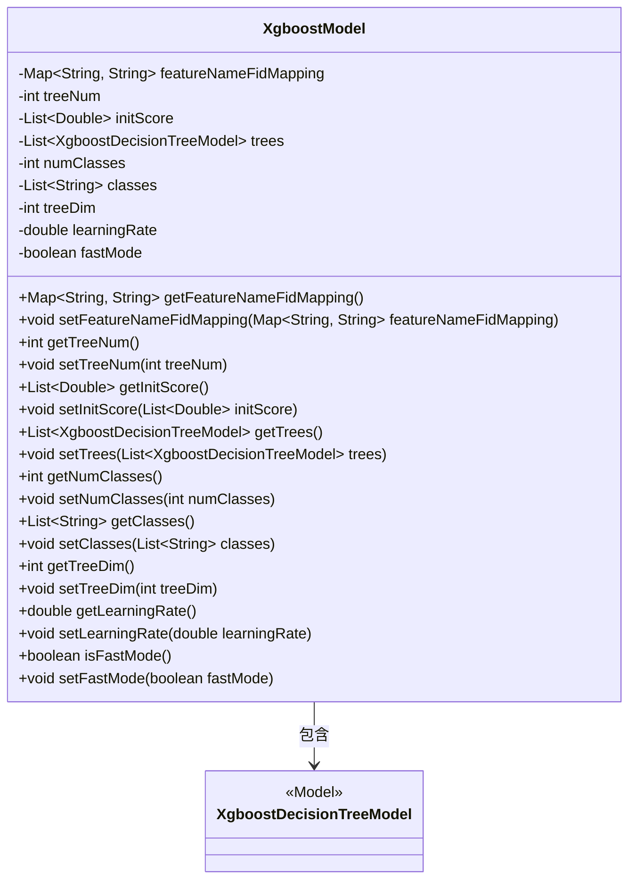

# 基础信息

|      |      |
|------|------|
| 名称 | XgboostModel |
| 编码语言 | .java |
| 代码路径 | WeFe/serving/serving-sdk-java/src/main/java/com/welab/wefe/serving/sdk/model/xgboost/XgboostModel.java |
| 包名 | com.welab.wefe.serving.sdk.model.xgboost |
| 依赖项 | ['java.util.HashMap', 'java.util.List', 'java.util.Map'] |
| 概述说明 | XgboostModel类包含特征映射、树数量、初始分数、决策树列表、类别数、类别名、树维度、学习率和快速模式等属性及其getter/setter方法。 |

# 说明

XgboostModel类是一个用于实现XGBoost模型的Java类，包含多个关键属性和对应的getter/setter方法。主要属性包括featureNameFidMapping（特征名与ID的映射）、treeNum（树的数量）、initScore（初始分数列表）、trees（决策树模型列表）、numClasses（类别数量）、classes（类别列表）、treeDim（树的维度）、learningRate（学习率）和fastMode（快速模式标志）。这些属性用于配置和管理XGBoost模型的行为和结构。

# 类列表 Class Summary

| 名称   | 类型  | 说明 |
|-------|------|-------------|
| XgboostModel | class | XgboostModel类包含特征名映射、树数量、初始分数、决策树列表、类别数、类别名、树维度、学习率和快速模式等属性，提供各属性的getter和setter方法。 |

## 类 XgboostModel

|      |      |
|------|------|
| 访问范围 | public |
| 类型 | class |
| 名称 | XgboostModel |
| 说明 | XgboostModel类包含特征名映射、树数量、初始分数、决策树列表、类别数、类别名、树维度、学习率和快速模式等属性，提供各属性的getter和setter方法。 |

### UML类图

这段类图展示了XgboostModel类及其与XgboostDecisionTreeModel的关系。XgboostModel是一个封装了XGBoost模型参数的类，包含特征名称映射、树数量、初始分数、决策树集合、类别数量、类别列表、树维度、学习率和快速模式标志等属性。通过getter和setter方法管理这些属性，并与XgboostDecisionTreeModel形成聚合关系，表示模型由多个决策树组成。该设计支持灵活的模型配置和参数调整。

### 内部方法调用关系图

```mermaid
graph TD
    A["类XgboostModel"]
    B["属性: Map<String,String> featureNameFidMapping"]
    C["属性: int treeNum"]
    D["属性: List<Double> initScore"]
    E["属性: List<XgboostDecisionTreeModel> trees"]
    F["属性: int numClasses"]
    G["属性: List<String> classes"]
    H["属性: int treeDim"]
    I["属性: double learningRate"]
    J["属性: boolean fastMode"]
    K["方法: get/setFeatureNameFidMapping"]
    L["方法: get/setTreeNum"]
    M["方法: get/setInitScore"]
    N["方法: get/setTrees"]
    O["方法: get/setNumClasses"]
    P["方法: get/setClasses"]
    Q["方法: get/setTreeDim"]
    R["方法: get/setLearningRate"]
    S["方法: is/setFastMode"]

    A --> B
    A --> C
    A --> D
    A --> E
    A --> F
    A --> G
    A --> H
    A --> I
    A --> J
    A --> K
    A --> L
    A --> M
    A --> N
    A --> O
    A --> P
    A --> Q
    A --> R
    A --> S
```

该流程图展示了XgboostModel类的完整结构，包含9个核心属性和对应的16个getter/setter方法。属性涵盖了特征映射、树数量、初始分数、决策树集合、类别数量等XGBoost模型的关键配置项，方法则提供了对这些属性的标准化访问接口。类设计采用典型的JavaBean模式，通过私有属性和公共访问方法实现封装，支持机器学习模型的参数管理和状态控制。

### 字段列表 Field List

| 名称  | 类型  | 说明 |
|-------|-------|------|
| treeNum | int | 私有整型变量treeNum，用于存储树的数量。 |
| treeDim | int | 私有整型变量treeDim |
| numClasses | int | 声明一个私有整型变量numClasses。 |
| featureNameFidMapping = new HashMap<>() | Map<String, String> | 定义了一个私有HashMap，用于存储特征名与特征ID的映射关系。 |
| classes | List<String> | 声明一个私有字符串列表变量classes。 |
| learningRate | double | 私有双精度浮点型变量，表示学习率。 |
| fastMode = true | boolean | 布尔变量fastMode初始值为true，表示启用快速模式。 |
| trees | List<XgboostDecisionTreeModel> | 私有变量trees，类型为Xgboost决策树模型的列表。 |
| initScore | List<Double> | 声明一个私有列表变量initScore，存储Double类型数据。 |

### 方法列表

| 名称  | 类型  | 说明 |
|-------|-------|------|
| setFastMode | void | 设置快速模式的方法，通过布尔参数控制fastMode状态。 |
| setTreeDim | void | 设置树维度的方法，将输入参数treeDim赋值给当前对象的treeDim属性。 |
| setLearningRate | void | 设置学习率的方法，将输入值赋给类的learningRate变量。 |
| getClasses | List<String> | 方法返回字符串列表classes。 |
| isFastMode | boolean | Java方法isFastMode返回布尔值fastMode，表示是否启用快速模式。 |
| setNumClasses | void | 设置分类数量方法，将输入参数赋值给类的成员变量numClasses。 |
| getNumClasses | int | 方法返回变量numClasses的值，表示获取类别数量。 |
| getTreeNum | int | 获取树数量的方法，返回整型变量treeNum的值。 |
| setTreeNum | void | 设置树的数量方法，将输入参数treeNum赋值给类的成员变量treeNum。 |
| getInitScore | List<Double> | 获取初始分数列表的方法。 |
| setTrees | void | 设置Xgboost决策树模型列表到当前对象。 |
| setFeatureNameFidMapping | void | 设置特征名称与FID的映射关系。 |
| getLearningRate | double | 获取学习率的方法，返回值为double类型。 |
| getFeatureNameFidMapping | Map<String, String> | 该方法返回一个映射表，包含特征名称与对应ID的键值对。 |
| getTreeDim | int | 获取树结构的维度值。 |
| getTrees | List<XgboostDecisionTreeModel> | 获取Xgboost决策树模型列表的方法，返回trees变量。 |
| setInitScore | void | 方法setInitScore用于设置初始分数列表。 |
| setClasses | void | 设置类列表的方法，将输入参数classes赋值给当前对象的classes属性。 |

