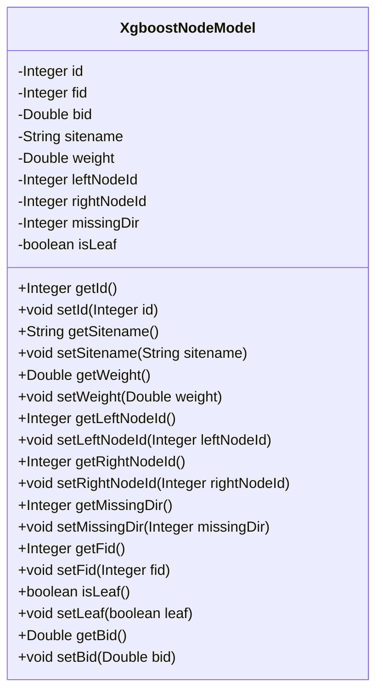

# 基础信息

|      |      |
|------|------|
| 名称 | XgboostNodeModel |
| 编码语言 | .java |
| 代码路径 | WeFe/serving/serving-sdk-java/src/main/java/com/welab/wefe/serving/sdk/model/xgboost/XgboostNodeModel.java |
| 包名 | com.welab.wefe.serving.sdk.model.xgboost |
| 依赖项 | [] |
| 概述说明 | XgboostNodeModel类定义了XGBoost树节点属性，包括ID、特征ID、分裂值、权重、左右子节点ID、缺失值处理方向及是否为叶节点。提供各属性的getter和setter方法。 |

# 说明

XgboostNodeModel类定义了XGBoost模型中的节点结构，包含节点ID、特征ID、分裂阈值、站点名称、权重、左右子节点ID、缺失值处理方向以及是否为叶节点的标志。提供了所有属性的getter和setter方法，用于访问和修改这些属性。

# 类列表 Class Summary

| 名称   | 类型  | 说明 |
|-------|------|-------------|
| XgboostNodeModel | class | XgboostNodeModel类定义了XGBoost树节点模型，包含节点ID、特征ID、分裂值、站点名、权重、左右子节点ID、缺失值处理方向及是否为叶子节点等属性。 |

## 类 XgboostNodeModel

|      |      |
|------|------|
| 访问范围 | public |
| 类型 | class |
| 名称 | XgboostNodeModel |
| 说明 | XgboostNodeModel类定义了XGBoost树节点模型，包含节点ID、特征ID、分裂值、站点名、权重、左右子节点ID、缺失值处理方向及是否为叶子节点等属性。 |

### UML类图

这段代码定义了一个名为XgboostNodeModel的类，用于表示XGBoost决策树模型中的节点。该类包含多个私有字段，如节点ID、特征ID、分裂阈值、站点名称、权重、左右子节点ID、缺失值处理方向以及是否为叶子节点的标志。每个字段都有对应的getter和setter方法，用于访问和修改这些属性。这个类主要用于存储和管理决策树节点的信息，支持XGBoost模型的构建和预测过程。

### 内部方法调用关系图

```mermaid
graph TD
    A["类XgboostNodeModel"]
    B["属性: Integer id = 0"]
    C["属性: Integer fid"]
    D["属性: Double bid"]
    E["属性: String sitename"]
    F["属性: Double weight"]
    G["属性: Integer leftNodeId"]
    H["属性: Integer rightNodeId"]
    I["属性: Integer missingDir"]
    J["属性: boolean isLeaf = false"]
    K["方法: Integer getId()"]
    L["方法: void setId(Integer id)"]
    M["方法: String getSitename()"]
    N["方法: void setSitename(String sitename)"]
    O["方法: Double getWeight()"]
    P["方法: void setWeight(Double weight)"]
    Q["方法: Integer getLeftNodeId()"]
    R["方法: void setLeftNodeId(Integer leftNodeId)"]
    S["方法: Integer getRightNodeId()"]
    T["方法: void setRightNodeId(Integer rightNodeId)"]
    U["方法: Integer getMissingDir()"]
    V["方法: void setMissingDir(Integer missingDir)"]
    W["方法: Integer getFid()"]
    X["方法: void setFid(Integer fid)"]
    Y["方法: boolean isLeaf()"]
    Z["方法: void setLeaf(boolean leaf)"]
    AA["方法: Double getBid()"]
    AB["方法: void setBid(Double bid)"]

    A --> B
    A --> C
    A --> D
    A --> E
    A --> F
    A --> G
    A --> H
    A --> I
    A --> J
    A --> K
    A --> L
    A --> M
    A --> N
    A --> O
    A --> P
    A --> Q
    A --> R
    A --> S
    A --> T
    A --> U
    A --> V
    A --> W
    A --> X
    A --> Y
    A --> Z
    A --> AA
    A --> AB
```

这段代码定义了一个XGBoost树模型的节点类，包含节点ID、特征ID、分裂阈值、站点名称、权重、左右子节点ID、缺失值处理方向以及是否为叶子节点等属性。每个属性都有对应的getter和setter方法，用于封装和访问这些私有属性。该类主要用于表示XGBoost算法中决策树的节点结构，支持节点的各种操作和属性访问。

### 字段列表 Field List

| 名称  | 类型  | 说明 |
|-------|-------|------|
| sitename | String | 定义私有字符串变量sitename。 |
| weight | Double | 声明一个私有的双精度浮点型变量weight。 |
| rightNodeId | Integer | 私有整型变量，用于存储右节点ID。 |
| bid | Double | 私有双精度浮点数变量bid。 |
| missingDir | Integer | 私有整型变量missingDir，用于表示缺失目录的状态或标识。 |
| isLeaf = false | boolean | 私有布尔变量isLeaf，标识是否为叶子节点，默认值false。 |
| id = 0 | Integer | 私有整型变量id，初始值为0。 |
| leftNodeId | Integer | 私有整型变量leftNodeId，用于存储左节点ID。 |
| fid | Integer | 私有整型字段fid。 |

### 方法列表

| 名称  | 类型  | 说明 |
|-------|-------|------|
| setId | void | 设置对象ID的方法，参数为整型id。 |
| getLeftNodeId | Integer | 获取左节点ID的方法，返回值为Integer类型。 |
| getSitename | String | 获取站点名称的方法，返回变量sitename的值。 |
| setLeaf | void | 设置节点是否为叶子状态。 |
| getWeight | Double | 方法返回Double类型的weight值。 |
| getBid | Double | 这是一个Java方法，返回Double类型的bid值。 |
| getId | Integer | 获取对象ID的方法，返回整型数值。 |
| setRightNodeId | void | 设置右节点ID的方法，参数为Integer类型，赋值给成员变量rightNodeId。 |
| setLeftNodeId | void | 设置左节点ID的方法，参数为整型leftNodeId，赋值给当前对象的leftNodeId属性。 |
| getFid | Integer | 这是一个Java方法，返回整数类型的私有变量fid的值。 |
| setBid | void | 设置投标价格的方法，将输入的Double类型值赋给对象的bid属性。 |
| setSitename | void | 定义了一个公共方法setSitename，用于设置类成员变量sitename的值。 |
| setMissingDir | void | 定义了一个公共方法setMissingDir，用于设置missingDir属性的整数值。 |
| getRightNodeId | Integer | 获取右节点ID的方法，返回值为整数类型。 |
| setFid | void | 这是一个Java方法，用于设置类成员变量fid的值。方法接收一个Integer参数，并将其赋值给类的fid字段。 |
| setWeight | void | 设置对象重量属性的方法，参数为Double类型。 |
| isLeaf | boolean | 该方法返回一个布尔值，表示当前节点是否为叶子节点。 |
| getMissingDir | Integer | 获取缺失目录的整数值。 |

