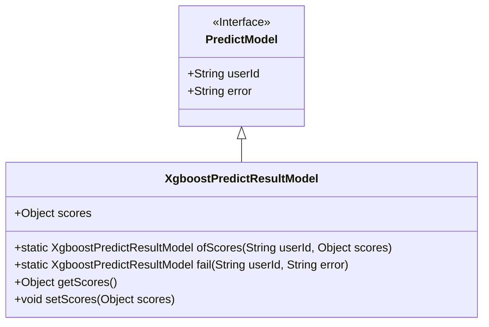
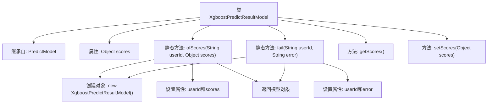

# 基础信息

|      |      |
|------|------|
| 名称 | XgboostPredictResultModel |
| 编码语言 | .java |
| 代码路径 | WeFe/serving/serving-sdk-java/src/main/java/com/welab/wefe/serving/sdk/model/xgboost/XgboostPredictResultModel.java |
| 包名 | com.welab.wefe.serving.sdk.model.xgboost |
| 依赖项 | ['com.welab.wefe.serving.sdk.model.PredictModel'] |
| 概述说明 | XgboostPredictResultModel继承PredictModel，包含scores属性和两个静态方法：ofScores用于设置用户ID和分数，fail用于设置用户ID和错误信息。提供scores的getter和setter方法。 |

# 说明

XgboostPredictResultModel是一个继承自PredictModel的类，用于存储XGBoost模型的预测结果。该类包含一个scores属性用于存储预测分数，可以通过getScores和setScores方法进行访问和修改。提供了两个静态工厂方法：ofScores用于创建包含用户ID和预测分数的实例，fail用于创建包含用户ID和错误信息的失败实例。该类主要用于封装预测结果或错误信息，便于统一处理。

# 类列表 Class Summary

| 名称   | 类型  | 说明 |
|-------|------|-------------|
| XgboostPredictResultModel | class | XgboostPredictResultModel继承PredictModel，含scores属性，提供ofScores和fail两种构建方法，支持获取和设置scores。 |

## 类 XgboostPredictResultModel

|      |      |
|------|------|
| 访问范围 | public |
| 类型 | class |
| 名称 | XgboostPredictResultModel |
| 说明 | XgboostPredictResultModel继承PredictModel，含scores属性，提供ofScores和fail两种构建方法，支持获取和设置scores。 |

### UML类图

该代码展示了一个Xgboost预测结果模型类，继承自PredictModel接口。XgboostPredictResultModel包含一个Object类型的scores字段，提供静态工厂方法ofScores()和fail()来创建实例，以及getter/setter方法。类图清晰地显示了继承关系和成员结构，其中PredictModel作为接口定义了基础字段，XgboostPredictResultModel作为实现类扩展了功能。

### 内部方法调用关系图

这段代码展示了一个Xgboost预测结果模型的实现，继承自PredictModel类。主要包含两个静态工厂方法：ofScores用于创建包含用户ID和预测分数的成功结果模型，fail用于创建包含用户ID和错误信息的失败结果模型。类中还提供了对scores属性的getter和setter方法。流程图清晰地展示了类的继承关系、属性定义以及方法间的调用流程，特别是两个静态工厂方法内部的对象创建和属性设置过程。

### 字段列表 Field List

| 名称  | 类型  | 说明 |
|-------|-------|------|
| scores | Object | 定义了一个公共变量scores，类型为Object。 |

### 方法列表

| 名称  | 类型  | 说明 |
|-------|-------|------|
| getScores | Object | 方法getScores返回scores对象。 |
| setScores | void | 方法setScores用于设置scores属性，参数为Object类型。 |
| ofScores | XgboostPredictResultModel | 创建XgboostPredictResultModel实例，设置用户ID和分数并返回。 |
| fail | XgboostPredictResultModel | 静态方法创建失败预测结果对象，设置用户ID和错误信息后返回。 |

