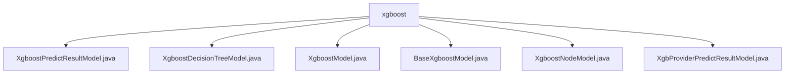

# 基础信息

|      |      |
|------|------|
| 名称 | xgboost |
| 编码语言 | .java |
| 代码路径 | WeFe/serving/serving-sdk-java/src/main/java/com/welab/wefe/serving/sdk/model/xgboost |
| 包名 | docs.serving.serving-sdk-java.src.main.java.com.welab.wefe.serving.sdk.model.xgboost |
| 概述说明 | XgboostPredictResultModel存储预测分数和错误信息。XgboostDecisionTreeModel管理决策树节点和缺失值处理。XgboostModel配置XGBoost模型参数和结构。BaseXgboostModel封装模型参数。XgboostNodeModel定义节点结构。XgbProviderPredictResultModel封装预测结果。 |

# 说明

## 概述  
该模块核心职责是实现XGBoost模型预测功能的数据封装与处理，包括模型结构定义、预测结果存储和错误处理。接口规范统一采用Getter/Setter模式，例如XgboostModel通过featureNameFidMapping管理特征映射，XgboostNodeModel通过节点属性控制决策逻辑。关键数据结构包含XgboostNodeModel（树节点）、XgboostDecisionTreeModel（决策树）和XgboostPredictResultModel（预测结果）。外部依赖仅为XGBoost算法框架。例如XgboostModel通过trees列表存储多棵决策树，类似森林结构。

## 主要业务场景  
模块支持完整的XGBoost预测流程：先通过BaseXgboostModel加载参数，再使用XgboostDecisionTreeModel构建树结构，最终用XgboostPredictResultModel返回结果。交互模式采用工厂方法（例如ofScores创建成功结果）和统一错误处理（例如fail方法）。典型应用如特征映射转换、缺失值处理（通过missingDirMaskdict）和多分类预测（numClasses控制）。API类型包含模型配置、节点操作和结果封装三类，例如XgbProviderPredictResultModel通过xgboostTree对象集成树结构数据。

### 包内部结构视图

该流程图展示了XGBoost模型相关Java文件的层级结构，所有文件均位于xgboost目录下，包含6个具体的模型类文件，分别用于处理预测结果、决策树、基础模型、节点模型等不同功能模块，体现了XGBoost模型在serving-sdk中的完整实现体系。

# 文件列表

| 名称   | 类型  | 说明 |
|-------|------|-------------|
| [XgboostPredictResultModel.java](XgboostPredictResultModel.md) | file | XgboostPredictResultModel继承PredictModel，包含scores属性和两个静态方法：ofScores用于设置用户ID和分数，fail用于设置用户ID和错误信息。提供scores的getter和setter方法。 |
| [XgboostDecisionTreeModel.java](XgboostDecisionTreeModel.md) | file | Xgboost决策树模型类，包含树节点列表、分割掩码字典和缺失方向掩码字典，提供各属性的获取和设置方法。 |
| [XgboostModel.java](XgboostModel.md) | file | XgboostModel类包含特征映射、树数量、初始分数、决策树列表、类别数、类别名、树维度、学习率和快速模式等属性及其getter/setter方法。 |
| [BaseXgboostModel.java](BaseXgboostModel.md) | file | BaseXgboostModel继承BaseAlgorithmModel，包含XgboostModel参数及其getter/setter方法，getter会设置学习率。 |
| [XgboostNodeModel.java](XgboostNodeModel.md) | file | XgboostNodeModel类定义了XGBoost树节点属性，包括ID、特征ID、分裂值、权重、左右子节点ID、缺失值处理方向及是否为叶节点。提供各属性的getter和setter方法。 |
| [XgbProviderPredictResultModel.java](XgbProviderPredictResultModel.md) | file | XgbProviderPredictResultModel继承PredictModel，包含xgboostTree属性和两个静态方法：ofObject用于创建带用户ID和xgboostTree的实例，fail用于创建带错误信息的实例。提供xgboostTree的getter和setter。 |

