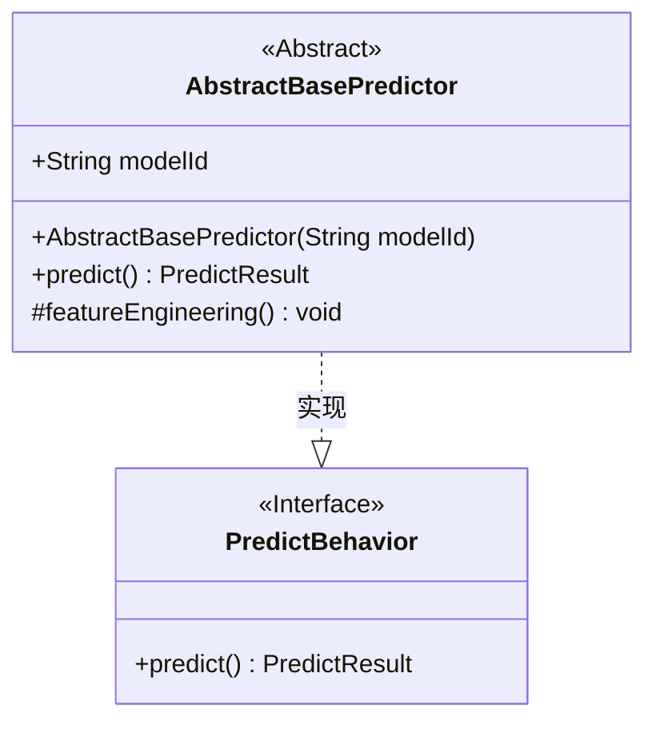
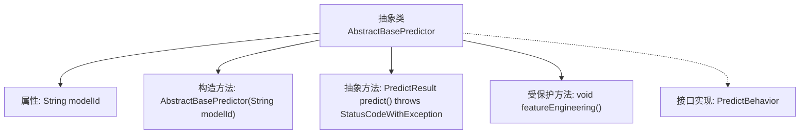

# 基础信息

|      |      |
|------|------|
| 名称 | AbstractBasePredictor |
| 编码语言 | .java |
| 代码路径 | WeFe/serving/serving-sdk-java/src/main/java/com/welab/wefe/serving/sdk/predicter/AbstractBasePredictor.java |
| 包名 | com.welab.wefe.serving.sdk.predicter |
| 依赖项 | ['com.welab.wefe.common.exception.StatusCodeWithException', 'com.welab.wefe.serving.sdk.dto.PredictResult'] |
| 概述说明 | 抽象基类AbstractBasePredictor实现PredictBehavior接口，包含模型ID属性和预测方法，支持特征工程处理。 |

# 说明

AbstractBasePredictor是一个抽象基类，实现了PredictBehavior接口。它包含一个modelId字符串成员变量，并通过构造函数初始化。该类定义了一个抽象方法predict，用于模型预测，可能抛出StatusCodeWithException异常。同时提供了一个受保护的空方法featureEngineering，用于特征工程处理。这个类为预测行为提供了基础框架，但需要子类实现具体预测逻辑。

# 类列表 Class Summary

| 名称   | 类型  | 说明 |
|-------|------|-------------|
| AbstractBasePredictor | class | 抽象预测基类，含模型ID属性和构造方法，提供预测抽象方法和默认空实现的特征工程方法。 |

## 类 AbstractBasePredictor

|      |      |
|------|------|
| 访问范围 | public abstract |
| 类型 | class |
| 名称 | AbstractBasePredictor |
| 说明 | 抽象预测基类，含模型ID属性和构造方法，提供预测抽象方法和默认空实现的特征工程方法。 |

### UML类图

这段类图描述了一个预测器的基础抽象类结构。AbstractBasePredictor作为抽象基类实现了PredictBehavior接口，包含模型ID属性和构造方法，定义了一个抽象的predict()方法用于模型预测（可能抛出StatusCodeWithException异常），同时提供了一个受保护的空方法featureEngineering()用于特征工程处理。该设计体现了模板方法模式，强制子类实现核心预测逻辑，同时允许选择性重写特征处理方法。

### 内部方法调用关系图

该流程图展示了抽象类AbstractBasePredictor的结构，它实现了PredictBehavior接口。类包含一个modelId属性、一个构造方法、一个必须由子类实现的抽象预测方法predict()，以及一个可被子类覆盖的特征工程方法featureEngineering()。箭头清晰地表示了类成员之间的从属关系和接口实现关系。

### 字段列表 Field List

| 名称  | 类型  | 说明 |
|-------|-------|------|
| modelId | String | 声明一个公开的字符串类型变量modelId。 |

### 方法列表

| 名称  | 类型  | 说明 |
|-------|-------|------|
| predict | PredictResult | 抽象方法predict()返回PredictResult，可能抛出StatusCodeWithException异常。 |
| featureEngineering | void | 空方法，用于特征工程处理，无具体实现。 |

