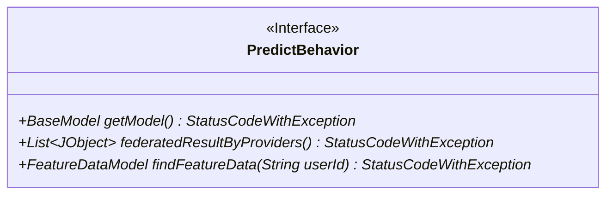
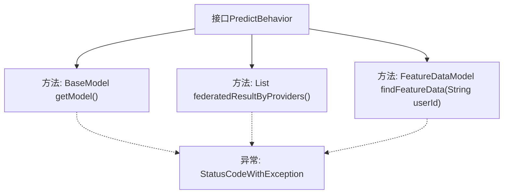

# 基础信息

|      |      |
|------|------|
| 名称 | PredictBehavior |
| 编码语言 | .java |
| 代码路径 | WeFe/serving/serving-sdk-java/src/main/java/com/welab/wefe/serving/sdk/predicter/PredictBehavior.java |
| 包名 | com.welab.wefe.serving.sdk.predicter |
| 依赖项 | ['com.welab.wefe.common.exception.StatusCodeWithException', 'com.welab.wefe.common.util.JObject', 'com.welab.wefe.serving.sdk.model.BaseModel', 'com.welab.wefe.serving.sdk.model.FeatureDataModel', 'com.welab.wefe.serving.sdk.processor.AbstractModelProcessor', 'java.util.List'] |
| 概述说明 | PredictBehavior接口定义了获取模型、处理联邦结果和查找特征数据的方法，均可能抛出StatusCodeWithException异常。 |

# 说明

PredictBehavior接口定义了三个核心方法：getModel用于获取基础模型对象，可能抛出StatusCodeWithException异常；federatedResultByProviders返回由提供者生成的联合结果列表，格式为JObject集合，同样可能抛出异常；findFeatureData根据用户ID查询特征数据，要求返回格式为键值对映射的FeatureDataModel对象，也可能抛出异常。所有方法均涉及异常处理机制。

# 类列表 Class Summary

| 名称   | 类型  | 说明 |
|-------|------|-------------|
| PredictBehavior | interface | PredictBehavior接口定义了三个方法：获取模型getModel，获取联合结果federatedResultByProviders，以及查找特征数据findFeatureData，均可能抛出StatusCodeWithException异常。 |

## 类 PredictBehavior

|      |      |
|------|------|
| 访问范围 | public |
| 类型 | interface |
| 名称 | PredictBehavior |
| 说明 | PredictBehavior接口定义了三个方法：获取模型getModel，获取联合结果federatedResultByProviders，以及查找特征数据findFeatureData，均可能抛出StatusCodeWithException异常。 |

### UML类图

这段类图描述了一个名为PredictBehavior的接口，该接口定义了三个方法：getModel()用于获取基础模型，可能抛出StatusCodeWithException异常；federatedResultByProviders()返回一个JObject列表，表示联合计算结果；findFeatureData()根据用户ID查找特征数据并返回FeatureDataModel对象。该接口主要用于规范预测行为，要求实现类必须提供模型获取、联合计算和特征查找功能。

### 内部方法调用关系图

这段流程图展示了PredictBehavior接口的结构，该接口定义了三个核心方法：获取模型的getModel()、处理联邦结果的federatedResultByProviders()和查找特征数据的findFeatureData()。所有方法都可能抛出StatusCodeWithException异常。接口作为行为规范，明确了实现类必须提供的功能契约，特别关注模型操作、数据联邦和特征查找三个关键领域，异常处理贯穿所有方法调用过程。

### 字段列表 Field List

| 名称  | 类型  | 说明 |
|-------|-------|------|

### 方法列表

| 名称  | 类型  | 说明 |
|-------|-------|------|
| federatedResultByProviders | List<JObject> | 方法返回提供者联合结果列表，可能抛出状态码异常。 |
| getModel | BaseModel | 获取模型方法，可能抛出状态码异常。 |
| findFeatureData | FeatureDataModel | 根据用户ID查询特征数据模型，可能抛出状态码异常。 |

