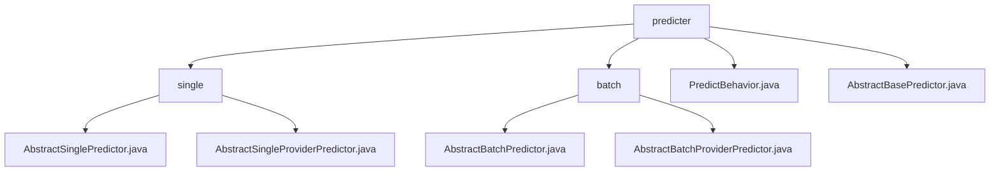

# 基础信息

|      |      |
|------|------|
| 名称 | predicter |
| 编码语言 | .java |
| 代码路径 | WeFe/serving/serving-sdk-java/src/main/java/com/welab/wefe/serving/sdk/predicter |
| 包名 | docs.serving.serving-sdk-java.src.main.java.com.welab.wefe.serving.sdk.predicter |
| 概述说明 | 单次预测模块封装预测流程，支持模型加载和特征处理。批量预测框架提供常规和联邦计算场景支持。PredictBehavior接口定义获取模型和特征数据方法。AbstractBasePredictor为预测行为提供基础框架。 |

# 说明

## 概述  
该模块核心职责是提供单次和批量预测的统一框架，通过抽象类封装预测流程，支持常规预测与联邦学习场景。接口规范包括PredictParams参数传递、getProcessor获取模型处理器、predict执行预测等，关键数据结构含PredictResult（算法类型等）和BatchPredictParams（角色等）。外部依赖涉及AlgorithmManager、联邦学习框架和模型处理组件。例如AbstractSinglePredictor实现单次预测，AbstractBatchPredictor处理批量任务。

## 主要业务场景  
模块采用模板方法模式，父类（如AbstractBasePredictor）定义预测骨架，子类可扩展特定逻辑（例如联邦学习结果处理）。典型流程为：初始化参数→加载模型→执行算法→返回结果，类似工厂流水线。支持两种场景：常规预测（如单次/批量）和联邦计算（需子类实现federatedResultByProviders）。API涵盖参数构造器与预测执行器，例如PredictBehavior接口规范了模型获取、特征查询等核心方法。

### 包内部结构视图

该流程图展示了WeFe服务SDK中预测器模块的层级结构。顶层是predicter目录，包含single和batch两个子目录以及两个抽象基类文件。single目录下有两个单例预测器实现，batch目录下有两个批量预测器实现。整个结构清晰地展示了预测器模块的继承关系和功能划分。

# 文件列表

| 名称   | 类型  | 说明 |
|-------|------|-------------|
| [PredictBehavior.java](PredictBehavior.md) | file | PredictBehavior接口定义了获取模型、处理联邦结果和查找特征数据的方法，均可能抛出StatusCodeWithException异常。 |
| [AbstractBasePredictor.java](AbstractBasePredictor.md) | file | 抽象基类AbstractBasePredictor实现PredictBehavior接口，包含模型ID属性和预测方法，支持特征工程处理。 |
| [batch](batch/_module.md) | package | AbstractBatchPredictor是批量预测的抽象类，继承自AbstractBasePredictor，包含参数初始化、模型处理和预测流程。AbstractBatchProviderPredictor继承它，重写federatedResultByProviders方法，支持联邦计算。 |
| [single](single/_module.md) | package | AbstractSinglePredictor是继承自AbstractBasePredictor的抽象类，用于单次预测，包含predictParams属性和predict方法，涉及模型处理器和算法协同工作。AbstractSingleProviderPredictor继承自AbstractSinglePredictor，重写了federatedResultByProviders方法但未实现具体功能。 |

