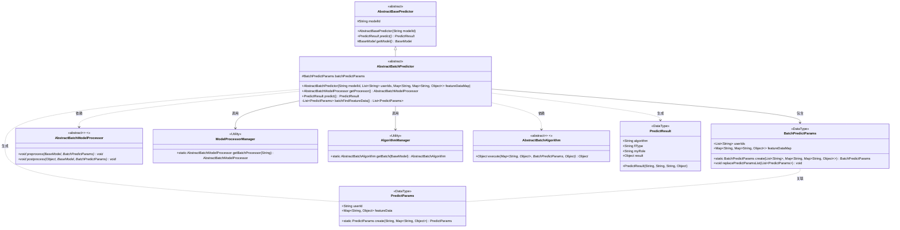
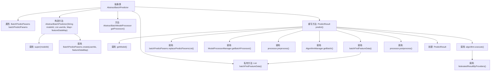

# 基础信息

|      |      |
|------|------|
| 名称 | AbstractBatchPredictor |
| 编码语言 | .java |
| 代码路径 | WeFe/serving/serving-sdk-java/src/main/java/com/welab/wefe/serving/sdk/predicter/batch/AbstractBatchPredictor.java |
| 包名 | com.welab.wefe.serving.sdk.predicter.batch |
| 依赖项 | ['com.welab.wefe.common.exception.StatusCodeWithException', 'com.welab.wefe.serving.sdk.algorithm.AbstractBatchAlgorithm', 'com.welab.wefe.serving.sdk.dto.BatchPredictParams', 'com.welab.wefe.serving.sdk.dto.PredictParams', 'com.welab.wefe.serving.sdk.dto.PredictResult', 'com.welab.wefe.serving.sdk.manager.AlgorithmManager', 'com.welab.wefe.serving.sdk.manager.ModelProcessorManager', 'com.welab.wefe.serving.sdk.model.BaseModel', 'com.welab.wefe.serving.sdk.predicter.AbstractBasePredictor', 'com.welab.wefe.serving.sdk.processor.AbstractBatchModelProcessor', 'java.util.HashMap', 'java.util.List', 'java.util.Map', 'java.util.stream.Collectors'] |
| 概述说明 | 抽象类AbstractBatchPredictor继承AbstractBasePredictor，实现批量预测功能。包含参数处理、模型处理器获取、预处理、算法执行和后处理步骤，最终返回预测结果。 |

# 说明

AbstractBatchPredictor是一个抽象类，继承自AbstractBasePredictor，用于批量预测。它包含BatchPredictParams参数对象，通过构造函数初始化模型ID、用户ID列表和特征数据映射。提供获取对应模型处理器的方法getProcessor。核心方法predict执行预测流程：获取模型、替换预测参数列表、预处理、获取批量算法并执行、后处理，最后返回包含算法类型、联邦学习类型、角色和结果的PredictResult。内部方法batchFindFeatureData遍历用户ID，为每个用户创建PredictParams对象并收集成列表。

# 类列表 Class Summary

| 名称   | 类型  | 说明 |
|-------|------|-------------|
| AbstractBatchPredictor | class | 抽象类AbstractBatchPredictor继承AbstractBasePredictor，实现批量预测功能。包含参数处理、模型处理器获取、预处理、算法执行和后处理步骤，最终返回预测结果。 |

## 类 AbstractBatchPredictor

|      |      |
|------|------|
| 访问范围 | public abstract |
| 类型 | class |
| 名称 | AbstractBatchPredictor |
| 说明 | 抽象类AbstractBatchPredictor继承AbstractBasePredictor，实现批量预测功能。包含参数处理、模型处理器获取、预处理、算法执行和后处理步骤，最终返回预测结果。 |

### UML类图

该类图展示了一个批处理预测框架的核心结构。AbstractBatchPredictor作为抽象基类，通过组合BatchPredictParams处理批量预测参数，依赖ModelProcessorManager获取处理器实例，使用AlgorithmManager获取算法实现。整个流程涉及特征数据查找、预处理、算法执行和后处理四个关键阶段，最终生成PredictResult结果对象。各组件职责明确，通过接口抽象实现算法和处理器逻辑的解耦，支持不同模型和算法的灵活扩展。

### 内部方法调用关系图

这段代码流程图展示了AbstractBatchPredictor类的核心结构和执行流程。该类是一个抽象批处理预测器，继承自AbstractBasePredictor，主要功能是通过模型处理器和算法管理器完成批量预测任务。流程从构造函数初始化开始，通过getProcessor获取处理器，在predict方法中依次执行模型获取、特征数据替换、预处理、算法执行和后处理等步骤，最终返回预测结果。私有方法batchFindFeatureData负责为每个用户ID创建预测参数并处理异常情况。整个流程体现了批处理预测的完整生命周期和组件间的协作关系。

### 字段列表 Field List

| 名称  | 类型  | 说明 |
|-------|-------|------|
| batchPredictParams | BatchPredictParams | 保护类型的批量预测参数对象。 |

### 方法列表

| 名称  | 类型  | 说明 |
|-------|-------|------|
| predict | PredictResult | 方法predict执行预测流程：获取模型和参数，预处理后调用算法执行，处理后返回预测结果，包含算法类型、联邦类型、角色和执行结果。 |
| getProcessor | AbstractBatchModelProcessor | 获取指定modelId对应的批处理模型处理器实例。 |
| batchFindFeatureData | List<PredictParams> | 方法批量获取用户特征数据，遍历用户ID列表，为每个ID创建PredictParams对象。成功时包含特征数据，失败时返回空Map并记录异常。最后返回PredictParams列表。 |

