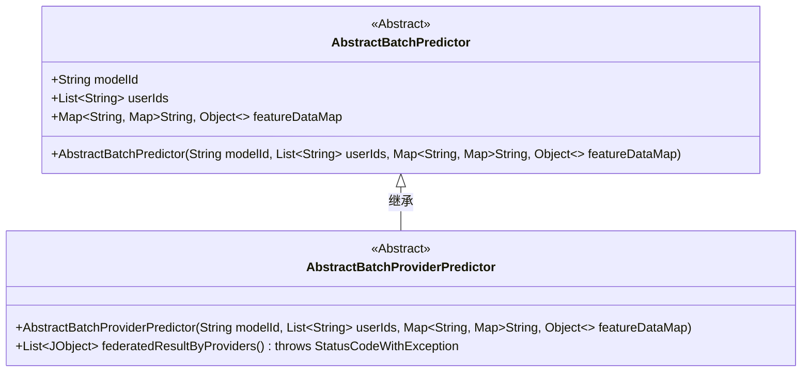
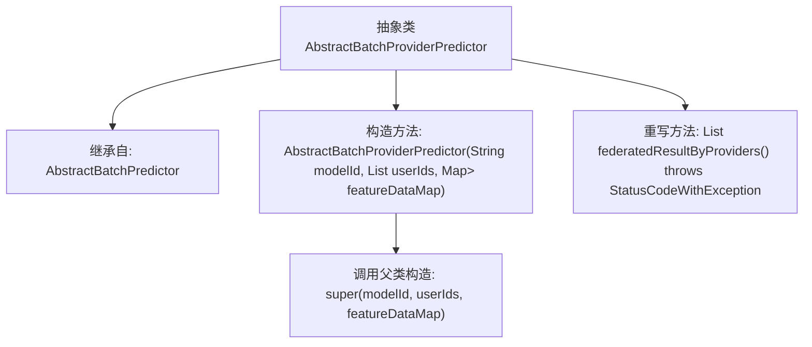

# 基础信息

|      |      |
|------|------|
| 名称 | AbstractBatchProviderPredictor |
| 编码语言 | .java |
| 代码路径 | WeFe/serving/serving-sdk-java/src/main/java/com/welab/wefe/serving/sdk/predicter/batch/AbstractBatchProviderPredictor.java |
| 包名 | com.welab.wefe.serving.sdk.predicter.batch |
| 依赖项 | ['com.welab.wefe.common.exception.StatusCodeWithException', 'com.welab.wefe.common.util.JObject', 'java.util.List', 'java.util.Map'] |
| 概述说明 | 抽象批处理预测类，继承自AbstractBatchPredictor，包含模型ID、用户ID列表和特征数据映射，提供空实现的联邦结果方法。 |

# 说明

这是一个名为AbstractBatchProviderPredictor的抽象类，继承自AbstractBatchPredictor。它通过构造函数接收模型ID、用户ID列表和特征数据映射，并传递给父类。该类重写了federatedResultByProviders方法，当前返回null，可能需要在子类中实现具体逻辑。该方法声明可能抛出StatusCodeWithException异常。整体设计用于支持基于提供方的联邦计算结果。

# 类列表 Class Summary

| 名称   | 类型  | 说明 |
|-------|------|-------------|
| AbstractBatchProviderPredictor | class | 抽象批处理预测器基类，支持模型ID、用户列表和特征数据，提供联邦结果方法。 |

## 类 AbstractBatchProviderPredictor

|      |      |
|------|------|
| 访问范围 | public abstract |
| 类型 | class |
| 名称 | AbstractBatchProviderPredictor |
| 说明 | 抽象批处理预测器基类，支持模型ID、用户列表和特征数据，提供联邦结果方法。 |

### UML类图

这段类图展示了一个抽象类继承关系，其中AbstractBatchProviderPredictor继承自AbstractBatchPredictor。父类包含模型ID、用户ID列表和特征数据映射表等基础属性，子类新增了联邦结果处理方法。两个类都标记为抽象类，表明需要具体子类实现核心逻辑。类图清晰地反映了层级结构和成员构成，其中泛型集合和异常声明等细节均被准确表达。

### 内部方法调用关系图

这段代码展示了一个抽象类`AbstractBatchProviderPredictor`的继承结构和关键方法。该类继承自`AbstractBatchPredictor`，通过构造方法初始化父类属性，并重写了`federatedResultByProviders()`方法（当前返回null）。流程图清晰地反映了类继承关系、构造方法的父类调用链以及方法重写逻辑，体现了抽象类作为基类的典型设计模式。

### 字段列表 Field List

| 名称  | 类型  | 说明 |
|-------|-------|------|

### 方法列表

| 名称  | 类型  | 说明 |
|-------|-------|------|
| federatedResultByProviders | List<JObject> | 方法federatedResultByProviders重写父类，返回JObject列表，可能抛出StatusCodeWithException异常，当前返回null。 |

