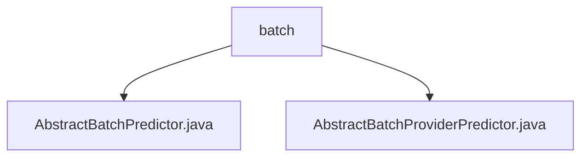

# 基础信息

|      |      |
|------|------|
| 名称 | batch |
| 编码语言 | .java |
| 代码路径 | WeFe/serving/serving-sdk-java/src/main/java/com/welab/wefe/serving/sdk/predicter/batch |
| 包名 | docs.serving.serving-sdk-java.src.main.java.com.welab.wefe.serving.sdk.predicter.batch |
| 概述说明 | AbstractBatchPredictor是批量预测的抽象类，继承自AbstractBasePredictor，包含参数初始化、模型处理和预测流程。AbstractBatchProviderPredictor继承它，重写federatedResultByProviders方法，支持联邦计算。 |

# 说明

## 概述  
该模块核心职责是提供批量预测的抽象实现框架，支持常规批量预测和基于提供方的联邦计算场景。接口规范包含PredictParams参数构造、模型处理器获取和联邦结果处理等方法。关键数据结构涉及BatchPredictParams、PredictResult等，包含算法类型、角色等字段。外部依赖包括联邦学习框架和模型处理组件。例如AbstractBatchPredictor实现标准预测流程，而AbstractBatchProviderPredictor预留联邦计算扩展点。

## 主要业务场景  
模块支持两种典型应用模式：常规批量预测流程（获取模型→参数替换→算法执行）和联邦计算扩展场景。交互模式类似模板方法，父类控制主流程，子类重写特定步骤。功能完整性体现在预处理、算法执行、后处理的链条式处理。例如AbstractBatchProviderPredictor通过federatedResultByProviders方法支持提供方结果定制，但需子类实现具体逻辑。API类型涵盖参数构造器和预测执行器两类。

### 包内部结构视图

该流程图展示了batch目录下的两个Java类文件关系。AbstractBatchPredictor.java和AbstractBatchProviderPredictor.java都直接隶属于batch目录，没有更深层级的嵌套结构。整个结构简洁明了，仅包含一个父节点和两个并列的子节点文件。

# 文件列表

| 名称   | 类型  | 说明 |
|-------|------|-------------|
| [AbstractBatchPredictor.java](AbstractBatchPredictor.md) | file | 抽象类AbstractBatchPredictor继承AbstractBasePredictor，实现批量预测功能。包含参数处理、模型处理器获取、预处理、算法执行和后处理步骤，最终返回预测结果。 |
| [AbstractBatchProviderPredictor.java](AbstractBatchProviderPredictor.md) | file | 抽象批处理预测类，继承自AbstractBatchPredictor，包含模型ID、用户ID列表和特征数据映射，提供空实现的联邦结果方法。 |

