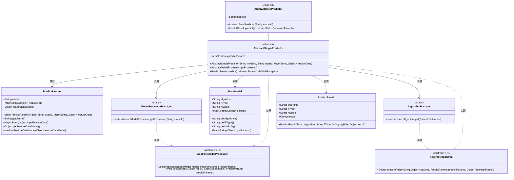
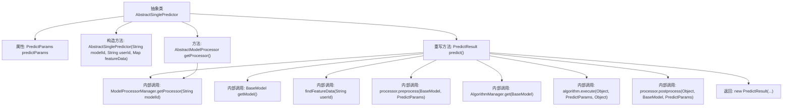

# 基础信息

|      |      |
|------|------|
| 名称 | AbstractSinglePredictor |
| 编码语言 | .java |
| 代码路径 | WeFe/serving/serving-sdk-java/src/main/java/com/welab/wefe/serving/sdk/predicter/single/AbstractSinglePredictor.java |
| 包名 | com.welab.wefe.serving.sdk.predicter.single |
| 依赖项 | ['com.welab.wefe.common.exception.StatusCodeWithException', 'com.welab.wefe.serving.sdk.algorithm.AbstractAlgorithm', 'com.welab.wefe.serving.sdk.dto.PredictParams', 'com.welab.wefe.serving.sdk.dto.PredictResult', 'com.welab.wefe.serving.sdk.manager.AlgorithmManager', 'com.welab.wefe.serving.sdk.manager.ModelProcessorManager', 'com.welab.wefe.serving.sdk.model.BaseModel', 'com.welab.wefe.serving.sdk.predicter.AbstractBasePredictor', 'com.welab.wefe.serving.sdk.processor.AbstractModelProcessor', 'java.util.Map'] |
| 概述说明 | 抽象类AbstractSinglePredictor继承AbstractBasePredictor，封装单次预测逻辑，包含参数处理、模型获取、预处理、算法执行和后处理步骤，最终返回预测结果。 |

# 说明

AbstractSinglePredictor是一个抽象类，继承自AbstractBasePredictor，用于实现单次预测功能。它包含PredictParams类型的predictParams属性，通过构造函数初始化模型ID、用户ID和特征数据。提供了获取模型处理器的方法getProcessor。核心方法predict执行预测流程：获取模型、设置特征数据、预处理、通过AlgorithmManager获取算法执行预测、后处理，最后返回包含算法类型、联邦学习类型、角色和结果的PredictResult对象。整个过程涉及模型处理器和算法的协同工作。

# 类列表 Class Summary

| 名称   | 类型  | 说明 |
|-------|------|-------------|
| AbstractSinglePredictor | class | 抽象类AbstractSinglePredictor继承AbstractBasePredictor，封装单次预测逻辑，包含参数处理、模型处理器获取及预测流程，最终返回预测结果。 |

## 类 AbstractSinglePredictor

|      |      |
|------|------|
| 访问范围 | public abstract |
| 类型 | class |
| 名称 | AbstractSinglePredictor |
| 说明 | 抽象类AbstractSinglePredictor继承AbstractBasePredictor，封装单次预测逻辑，包含参数处理、模型处理器获取及预测流程，最终返回预测结果。 |

### UML类图

该类图展示了抽象预测器`AbstractSinglePredictor`的核心结构及其关联类。作为`AbstractBasePredictor`的子类，它通过`PredictParams`管理预测参数，依赖`ModelProcessorManager`和`AlgorithmManager`获取处理器和算法实例，最终生成`PredictResult`。图中包含6个主要类和2个接口，清晰呈现了预测流程中的关键组件交互关系，如模型预处理、算法执行和后处理等环节的协作方式。

### 内部方法调用关系图

该流程图展示了AbstractSinglePredictor抽象类的核心结构和预测流程。类包含predictParams属性和构造方法，核心方法是predict()，该方法通过7个内部调用步骤完成预测：获取模型数据、查找特征数据、获取处理器、预处理、获取算法、执行算法计算、后处理，最后返回预测结果。getProcessor()方法则通过ModelProcessorManager获取对应处理器。整个流程体现了预测请求的标准处理链条。

### 字段列表 Field List

| 名称  | 类型  | 说明 |
|-------|-------|------|
| predictParams | PredictParams | 保护成员predictParams，类型为PredictParams。 |

### 方法列表

| 名称  | 类型  | 说明 |
|-------|-------|------|
| getProcessor | AbstractModelProcessor | 获取指定modelId对应的AbstractModelProcessor实例。 |
| predict | PredictResult | 方法predict()执行预测流程：获取模型和特征数据，预处理后通过算法执行预测，后处理结果并返回预测结果对象。 |

