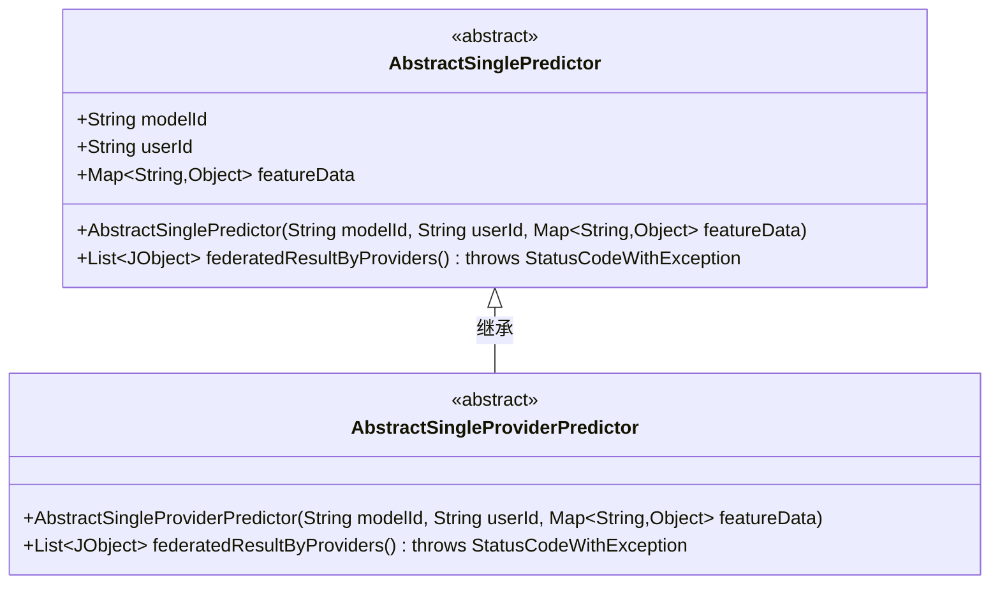
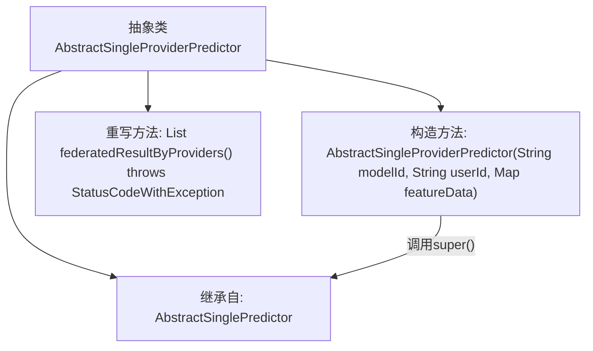

# 基础信息

|      |      |
|------|------|
| 名称 | AbstractSingleProviderPredictor |
| 编码语言 | .java |
| 代码路径 | WeFe/serving/serving-sdk-java/src/main/java/com/welab/wefe/serving/sdk/predicter/single/AbstractSingleProviderPredictor.java |
| 包名 | com.welab.wefe.serving.sdk.predicter.single |
| 依赖项 | ['com.welab.wefe.common.exception.StatusCodeWithException', 'com.welab.wefe.common.util.JObject', 'java.util.List', 'java.util.Map'] |
| 概述说明 | 抽象类AbstractSingleProviderPredictor继承AbstractSinglePredictor，提供基于模型和用户特征的预测功能，未实现联合结果方法。 |

# 说明

这是一个名为AbstractSingleProviderPredictor的抽象类，继承自AbstractSinglePredictor类。它包含一个构造函数，接收modelId、userId和featureData三个参数，并调用父类构造函数进行初始化。该类重写了federatedResultByProviders方法，但当前实现仅返回null，未提供具体功能。

# 类列表 Class Summary

| 名称   | 类型  | 说明 |
|-------|------|-------------|
| AbstractSingleProviderPredictor | class | 抽象类AbstractSingleProviderPredictor继承AbstractSinglePredictor，提供基于提供者的联合结果方法，默认返回null。 |

## 类 AbstractSingleProviderPredictor

|      |      |
|------|------|
| 访问范围 | public abstract |
| 类型 | class |
| 名称 | AbstractSingleProviderPredictor |
| 说明 | 抽象类AbstractSingleProviderPredictor继承AbstractSinglePredictor，提供基于提供者的联合结果方法，默认返回null。 |

### UML类图

类图描述：该图展示了一个抽象类继承结构，其中`AbstractSingleProviderPredictor`继承自`AbstractSinglePredictor`。父类包含模型ID、用户ID和特征数据等核心属性，子类重写了联邦结果计算方法但暂返回空值。两者均为抽象类，体现了预测器的基础设计模式，适用于需要多提供者协同计算的场景。

### 内部方法调用关系图

这段代码展示了一个抽象类`AbstractSingleProviderPredictor`的继承结构和关键方法。该类继承自`AbstractSinglePredictor`，包含一个调用父类构造器的初始化方法，并重写了`federatedResultByProviders()`方法（当前返回null）。流程图清晰地呈现了类继承关系、构造方法的super调用链以及方法重写关系，体现了该抽象类作为中间层的设计意图。

### 字段列表 Field List

| 名称  | 类型  | 说明 |
|-------|-------|------|

### 方法列表

| 名称  | 类型  | 说明 |
|-------|-------|------|
| federatedResultByProviders | List<JObject> | 重写方法federatedResultByProviders，返回JObject列表，可能抛出StatusCodeWithException异常，当前返回null。 |

