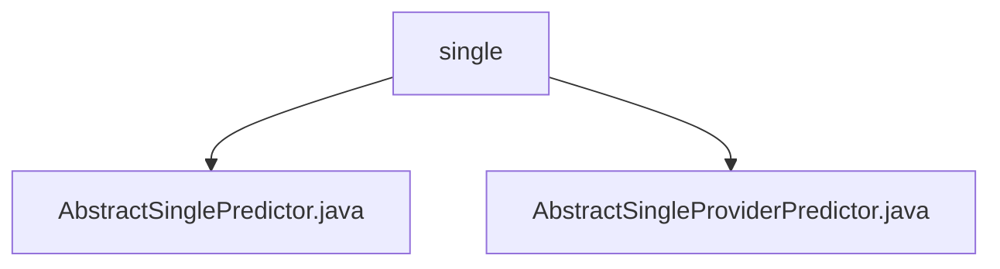

# 基础信息

|      |      |
|------|------|
| 名称 | single |
| 编码语言 | .java |
| 代码路径 | WeFe/serving/serving-sdk-java/src/main/java/com/welab/wefe/serving/sdk/predicter/single |
| 包名 | docs.serving.serving-sdk-java.src.main.java.com.welab.wefe.serving.sdk.predicter.single |
| 概述说明 | AbstractSinglePredictor是继承自AbstractBasePredictor的抽象类，用于单次预测，包含predictParams属性和predict方法，涉及模型处理器和算法协同工作。AbstractSingleProviderPredictor继承自AbstractSinglePredictor，重写了federatedResultByProviders方法但未实现具体功能。 |

# 说明

## 概述  
该模块核心职责是实现单次预测功能，通过抽象类封装预测流程，支持模型加载、特征处理、算法执行等步骤。接口规范包括PredictParams参数传递、getProcessor获取模型处理器、predict执行完整预测流程。关键数据结构包含PredictResult（含算法类型、联邦学习类型等字段）和PredictParams（模型ID等）。外部依赖涉及AlgorithmManager算法管理器和模型处理器。例如AbstractSinglePredictor通过AlgorithmManager协调算法执行预测。

## 主要业务场景  
模块采用模板方法模式，父类定义预测骨架（如预处理/后处理），子类可扩展特定逻辑（例如AbstractSingleProviderPredictor预留联邦结果处理方法）。典型流程为：初始化模型参数→加载处理器→执行算法预测→返回结构化结果。适用于需分阶段处理的预测任务，类似工厂流水线模式。例如子类可重写federatedResultByProviders实现联邦学习场景定制。

### 包内部结构视图

该流程图展示了WeFe项目中serving-sdk-java模块的预测器类文件结构。根节点"single"目录下包含两个抽象类文件：AbstractSinglePredictor.java和AbstractSingleProviderPredictor.java，这两个类都位于com/welab/wefe/serving/sdk/predicter/single路径下，属于单例预测器的核心实现文件，体现了Java项目中典型的抽象基类设计模式。

# 文件列表

| 名称   | 类型  | 说明 |
|-------|------|-------------|
| [AbstractSinglePredictor.java](AbstractSinglePredictor.md) | file | 抽象类AbstractSinglePredictor继承AbstractBasePredictor，封装单次预测逻辑，包含参数处理、模型获取、预处理、算法执行和后处理步骤，最终返回预测结果。 |
| [AbstractSingleProviderPredictor.java](AbstractSingleProviderPredictor.md) | file | 抽象类AbstractSingleProviderPredictor继承AbstractSinglePredictor，提供基于模型和用户特征的预测功能，未实现联合结果方法。 |

