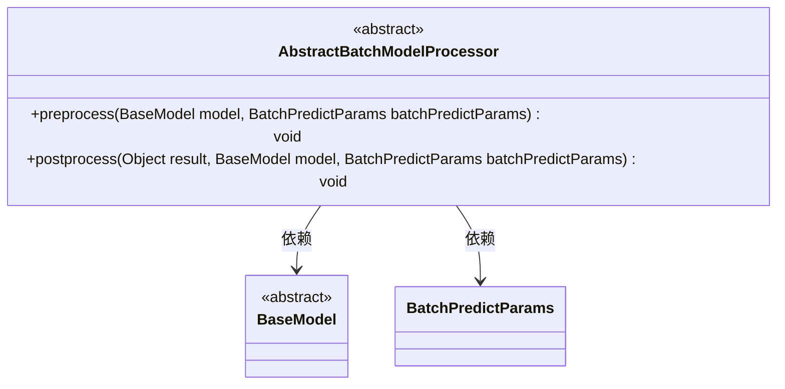
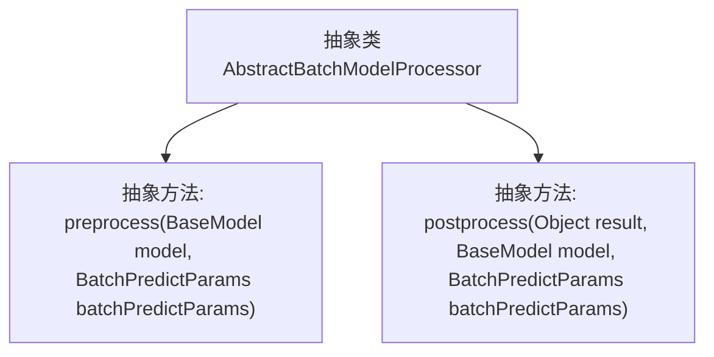

# 基础信息

|      |      |
|------|------|
| 名称 | AbstractBatchModelProcessor |
| 编码语言 | .java |
| 代码路径 | WeFe/serving/serving-sdk-java/src/main/java/com/welab/wefe/serving/sdk/processor/AbstractBatchModelProcessor.java |
| 包名 | com.welab.wefe.serving.sdk.processor |
| 依赖项 | ['com.welab.wefe.serving.sdk.dto.BatchPredictParams', 'com.welab.wefe.serving.sdk.dto.PredictResult', 'com.welab.wefe.serving.sdk.model.BaseModel'] |
| 概述说明 | 抽象类AbstractBatchModelProcessor定义预处理和后处理方法，分别用于模型预测前后的操作。预处理接收模型和参数，后处理接收结果、模型和参数。 |

# 说明

这是一个抽象类AbstractBatchModelProcessor，定义了两个核心抽象方法。preprocess方法在模型预测前执行，接收BaseModel和BatchPredictParams参数。postprocess方法在模型预测后执行，接收预测结果、BaseModel和BatchPredictParams参数。这两个方法为批量模型处理提供了预处理和后处理的框架，具体实现由子类完成。

# 类列表 Class Summary

| 名称   | 类型  | 说明 |
|-------|------|-------------|
| AbstractBatchModelProcessor | class | 抽象类AbstractBatchModelProcessor定义模型预测前后处理的方法preprocess和postprocess，需传入模型和参数。 |

## 类 AbstractBatchModelProcessor

|      |      |
|------|------|
| 访问范围 | public abstract |
| 类型 | class |
| 名称 | AbstractBatchModelProcessor |
| 说明 | 抽象类AbstractBatchModelProcessor定义模型预测前后处理的方法preprocess和postprocess，需传入模型和参数。 |

### UML类图

这段代码定义了一个抽象类`AbstractBatchModelProcessor`，它提供了批处理模型预测的前置和后置处理方法的抽象定义。该类依赖`BaseModel`和`BatchPredictParams`两个类，分别表示基础模型和批处理预测参数。抽象类中的`preprocess`和`postprocess`方法需要子类实现，用于在模型预测前后执行特定操作。类图清晰地展示了这些类之间的关系和抽象类的结构。

### 内部方法调用关系图

这段代码定义了一个名为AbstractBatchModelProcessor的抽象类，包含两个抽象方法：preprocess和postprocess。preprocess方法在模型预测前执行，接收BaseModel和BatchPredictParams参数；postprocess方法在模型预测后执行，额外接收预测结果Object参数。该抽象类为批量模型处理提供了模板结构，具体实现需由子类完成预处理和后处理逻辑。

### 字段列表 Field List

| 名称  | 类型  | 说明 |
|-------|-------|------|

### 方法列表

| 名称  | 类型  | 说明 |
|-------|-------|------|
| preprocess | void | 抽象预处理方法，接收基础模型和批量预测参数。 |
| postprocess | void | 抽象方法postprocess，处理结果对象、基础模型和批量预测参数。 |

