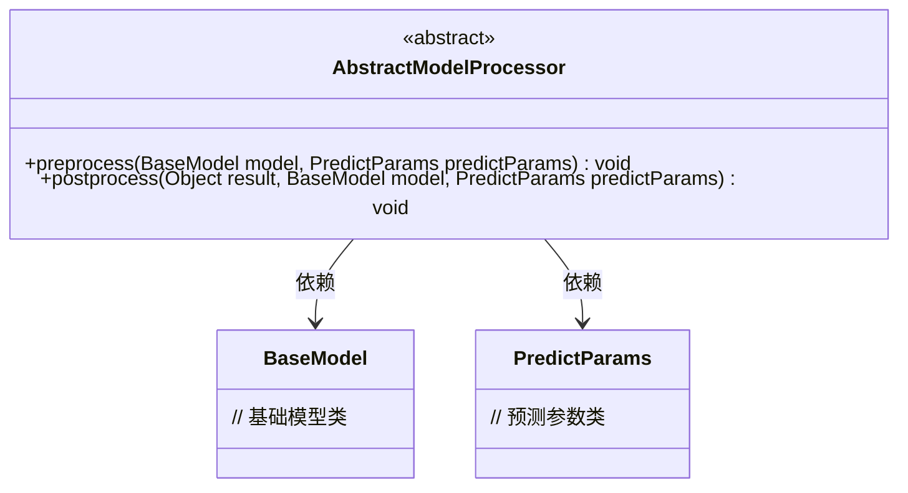
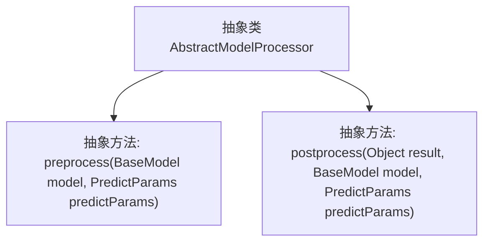

# 基础信息

|      |      |
|------|------|
| 名称 | AbstractModelProcessor |
| 编码语言 | .java |
| 代码路径 | WeFe/serving/serving-sdk-java/src/main/java/com/welab/wefe/serving/sdk/processor/AbstractModelProcessor.java |
| 包名 | com.welab.wefe.serving.sdk.processor |
| 依赖项 | ['com.welab.wefe.serving.sdk.dto.PredictParams', 'com.welab.wefe.serving.sdk.dto.PredictResult', 'com.welab.wefe.serving.sdk.model.BaseModel'] |
| 概述说明 | 抽象类AbstractModelProcessor定义模型预测前后处理接口：preprocess预处理和postprocess后处理，需传入模型和预测参数。 |

# 说明

这是一个名为AbstractModelProcessor的抽象类，定义了两个抽象方法用于模型预测前后的处理。preprocess方法在模型预测前执行，接收BaseModel和PredictParams参数。postprocess方法在预测后执行，额外接收预测结果作为参数。这两个方法为模型处理流程提供了标准化的前后处理接口。

# 类列表 Class Summary

| 名称   | 类型  | 说明 |
|-------|------|-------------|
| AbstractModelProcessor | class | 抽象类AbstractModelProcessor定义模型预测前后处理接口：preprocess预处理模型和参数，postprocess后处理结果、模型和参数。 |

## 类 AbstractModelProcessor

|      |      |
|------|------|
| 访问范围 | public abstract |
| 类型 | class |
| 名称 | AbstractModelProcessor |
| 说明 | 抽象类AbstractModelProcessor定义模型预测前后处理接口：preprocess预处理模型和参数，postprocess后处理结果、模型和参数。 |

### UML类图

这段类图描述了一个抽象模型处理器AbstractModelProcessor，它定义了两个抽象方法：preprocess用于模型预测前的预处理操作，postprocess用于模型预测后的后处理操作。该类依赖于BaseModel和PredictParams两个类，分别表示基础模型和预测参数。这是一个典型的模板方法模式设计，为具体模型处理器提供了处理框架，子类需要实现具体的预处理和后处理逻辑。

### 内部方法调用关系图

该流程图展示了AbstractModelProcessor抽象类的结构，包含两个核心抽象方法。preprocess方法在模型预测前执行预处理操作，接收BaseModel和PredictParams参数；postprocess方法在预测后执行后处理，额外接收预测结果Object参数。箭头表示类与方法间的从属关系，强调子类必须实现这两个关键处理阶段。

### 字段列表 Field List

| 名称  | 类型  | 说明 |
|-------|-------|------|

### 方法列表

| 名称  | 类型  | 说明 |
|-------|-------|------|
| preprocess | void | 抽象方法preprocess用于预处理BaseModel和PredictParams对象。 |
| postprocess | void | 抽象方法postprocess处理预测结果，接收结果对象、基础模型和预测参数。 |

