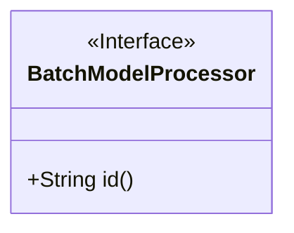
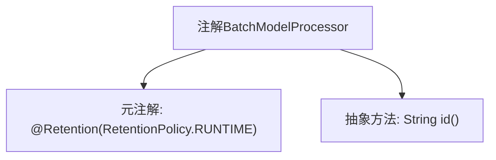

# 基础信息

|      |      |
|------|------|
| 名称 | BatchModelProcessor |
| 编码语言 | .java |
| 代码路径 | WeFe/serving/serving-sdk-java/src/main/java/com/welab/wefe/serving/sdk/processor/BatchModelProcessor.java |
| 包名 | com.welab.wefe.serving.sdk.processor |
| 依赖项 | ['java.lang.annotation.Retention', 'java.lang.annotation.RetentionPolicy'] |
| 概述说明 | 运行时保留的注解BatchModelProcessor，需指定id属性。 |

# 说明

该内容定义了一个名为BatchModelProcessor的Java注解，使用@Retention(RetentionPolicy.RUNTIME)指定注解在运行时保留。注解包含一个名为id的字符串类型属性，该属性为必填项。该注解适用于需要在运行时通过反射处理的场景。

# 类列表 Class Summary

| 名称   | 类型  | 说明 |
|-------|------|-------------|
| BatchModelProcessor | annotation | Java注解`@BatchModelProcessor`，运行时保留，需指定唯一标识符`id`。 |

## 类 BatchModelProcessor

|      |      |
|------|------|
| 访问范围 | @Retention(RetentionPolicy.RUNTIME);public |
| 类型 | annotation |
| 名称 | BatchModelProcessor |
| 说明 | Java注解`@BatchModelProcessor`，运行时保留，需指定唯一标识符`id`。 |

### UML类图

该图展示了一个名为BatchModelProcessor的注解接口，使用<<Interface>>标记表示其接口性质。该接口定义了一个公开方法id()，返回String类型。注解在运行时保留（由@Retention(RetentionPolicy.RUNTIME)指定），主要用于标识批处理模型处理器。这种设计常用于框架中实现可扩展的批处理逻辑，允许通过注解ID动态识别不同处理器。

### 内部方法调用关系图

这段代码定义了一个名为`BatchModelProcessor`的运行时注解，该注解包含一个必须实现的`id()`方法。通过`@Retention(RetentionPolicy.RUNTIME)`元注解声明该注解在运行时保留，使得可以通过反射机制读取注解信息。注解通常用于标记或配置类、方法等元素，此处设计的`id()`方法可能用于标识不同的批处理模型处理器。

### 字段列表 Field List

| 名称  | 类型  | 说明 |
|-------|-------|------|
| id | String | 方法声明：返回字符串类型的id。 |

### 方法列表

| 名称  | 类型  | 说明 |
|-------|-------|------|

