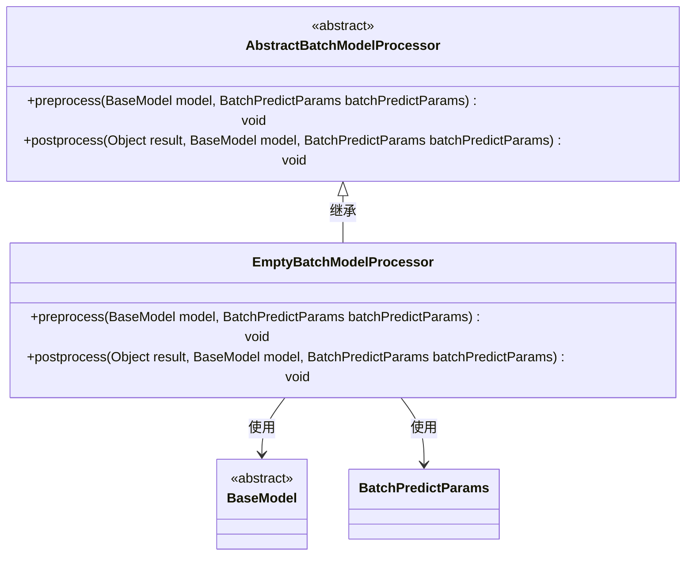
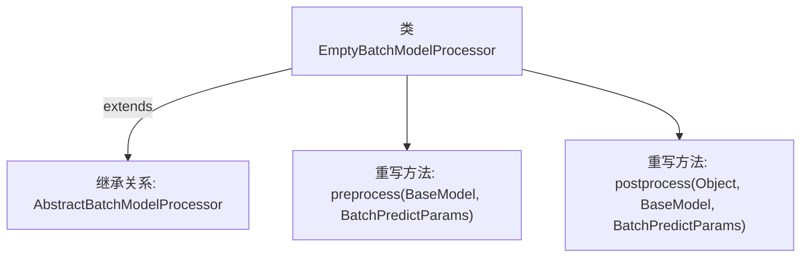

# 基础信息

|      |      |
|------|------|
| 名称 | EmptyBatchModelProcessor |
| 编码语言 | .java |
| 代码路径 | WeFe/serving/serving-sdk-java/src/main/java/com/welab/wefe/serving/sdk/processor/EmptyBatchModelProcessor.java |
| 包名 | com.welab.wefe.serving.sdk.processor |
| 依赖项 | ['com.welab.wefe.serving.sdk.dto.BatchPredictParams', 'com.welab.wefe.serving.sdk.dto.PredictResult', 'com.welab.wefe.serving.sdk.model.BaseModel'] |
| 概述说明 | 空批处理模型处理器，继承抽象类，包含预处理和后处理方法，均无具体实现。 |

# 说明

EmptyBatchModelProcessor是一个继承自AbstractBatchModelProcessor的类，主要用于批处理模型的前后处理。该类包含两个空实现方法：preprocess用于模型预测前的预处理，接收BaseModel和BatchPredictParams参数；postprocess用于预测结果的后处理，接收结果对象、BaseModel和BatchPredictParams参数。该类未包含具体逻辑，可能作为模板或默认实现使用。

# 类列表 Class Summary

| 名称   | 类型  | 说明 |
|-------|------|-------------|
| EmptyBatchModelProcessor | class | 空批处理模型处理器类，继承抽象批处理类，包含预处理和后处理方法，均无具体实现。 |

## 类 EmptyBatchModelProcessor

|      |      |
|------|------|
| 访问范围 | public |
| 类型 | class |
| 名称 | EmptyBatchModelProcessor |
| 说明 | 空批处理模型处理器类，继承抽象批处理类，包含预处理和后处理方法，均无具体实现。 |

### UML类图

这段类图展示了EmptyBatchModelProcessor继承自抽象类AbstractBatchModelProcessor，并实现了其中的preprocess和postprocess方法。这两个方法分别接收BaseModel和BatchPredictParams作为参数，但当前为空实现。BaseModel是一个抽象基类，BatchPredictParams是参数类。该结构体现了典型的模板方法模式，父类定义算法骨架，子类可选择性重写特定步骤。

### 内部方法调用关系图

这段代码展示了一个名为EmptyBatchModelProcessor的空实现类，它继承自AbstractBatchModelProcessor抽象类。类中重写了两个方法：preprocess用于模型预测前的预处理（当前为空实现），postprocess用于预测后的后处理（同样为空）。流程图清晰地反映了继承关系和重写方法的结构，表明这是一个待具体实现的模板类。

### 字段列表 Field List

| 名称  | 类型  | 说明 |
|-------|-------|------|

### 方法列表

| 名称  | 类型  | 说明 |
|-------|-------|------|
| postprocess | void | 这是一个Java方法重写，用于后处理预测结果，接收结果对象、基础模型和批量预测参数。 |
| preprocess | void | Java方法重写，空实现预处理逻辑，接收BaseModel和BatchPredictParams参数。 |

