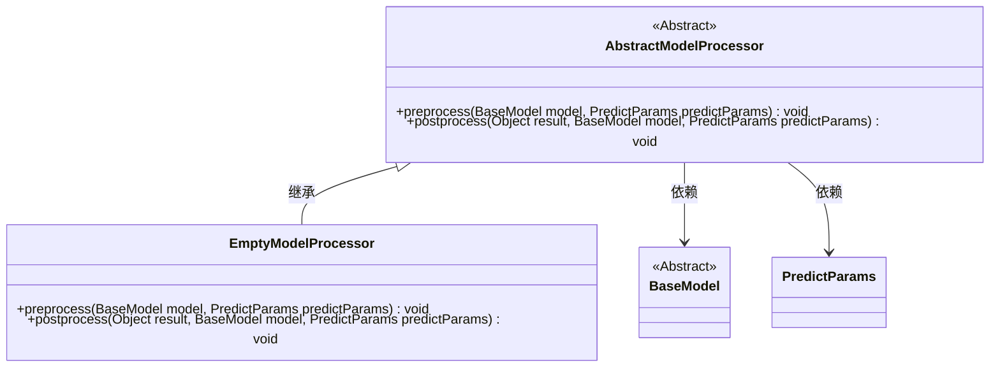
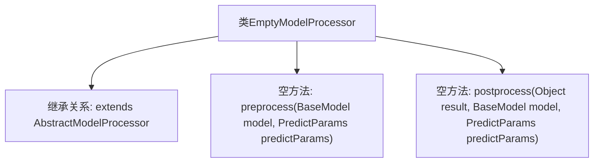

# 基础信息

|      |      |
|------|------|
| 名称 | EmptyModelProcessor |
| 编码语言 | .java |
| 代码路径 | WeFe/serving/serving-sdk-java/src/main/java/com/welab/wefe/serving/sdk/processor/EmptyModelProcessor.java |
| 包名 | com.welab.wefe.serving.sdk.processor |
| 依赖项 | ['com.welab.wefe.serving.sdk.dto.PredictParams', 'com.welab.wefe.serving.sdk.dto.PredictResult', 'com.welab.wefe.serving.sdk.model.BaseModel'] |
| 概述说明 | EmptyModelProcessor是继承AbstractModelProcessor的空实现类，包含预处理和后处理两个空方法。 |

# 说明

这是一个名为EmptyModelProcessor的类，继承自AbstractModelProcessor。它包含两个空实现的方法：preprocess和postprocess。preprocess方法接收BaseModel和PredictParams参数但不执行任何操作，postprocess方法接收Object、BaseModel和PredictParams参数同样为空实现。该类可能用作模型处理器的默认或占位实现。

# 类列表 Class Summary

| 名称   | 类型  | 说明 |
|-------|------|-------------|
| EmptyModelProcessor | class | 空模型处理器类，继承抽象模型处理器，包含预处理和后处理方法，均无具体实现。 |

## 类 EmptyModelProcessor

|      |      |
|------|------|
| 访问范围 | public |
| 类型 | class |
| 名称 | EmptyModelProcessor |
| 说明 | 空模型处理器类，继承抽象模型处理器，包含预处理和后处理方法，均无具体实现。 |

### UML类图

该类图展示了EmptyModelProcessor继承自抽象类AbstractModelProcessor，并实现了其预处理和后处理方法。AbstractModelProcessor依赖于BaseModel和PredictParams两个类，用于处理模型预测前后的逻辑。EmptyModelProcessor作为具体实现类，目前方法体为空，可能用于默认或占位场景。整体结构体现了模板方法模式的应用，父类定义算法骨架，子类可选择性重写特定步骤。

### 内部方法调用关系图

这段流程图展示了EmptyModelProcessor类的结构，它是一个继承自AbstractModelProcessor的空实现类。图中包含两个空方法：preprocess用于模型预测前的预处理（未实现具体逻辑），postprocess用于模型预测后的后处理（同样未实现）。该类作为抽象处理器的默认实现，为子类提供可重写的模板方法结构，适用于不需要预处理/后处理的场景。

### 字段列表 Field List

| 名称  | 类型  | 说明 |
|-------|-------|------|

### 方法列表

| 名称  | 类型  | 说明 |
|-------|-------|------|
| postprocess | void | Java方法重写，用于后处理预测结果，接收结果对象、基础模型和预测参数。 |
| preprocess | void | Java方法重写，空实现预处理逻辑，接收BaseModel和PredictParams参数。 |

