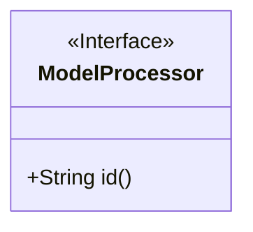
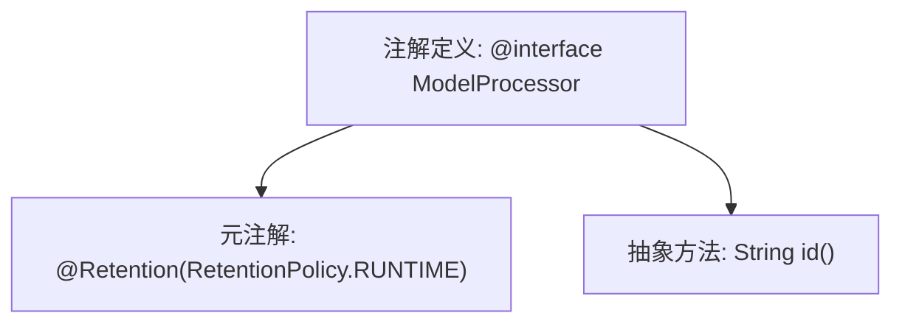

# 基础信息

|      |      |
|------|------|
| 名称 | ModelProcessor |
| 编码语言 | .java |
| 代码路径 | WeFe/serving/serving-sdk-java/src/main/java/com/welab/wefe/serving/sdk/processor/ModelProcessor.java |
| 包名 | com.welab.wefe.serving.sdk.processor |
| 依赖项 | ['java.lang.annotation.Retention', 'java.lang.annotation.RetentionPolicy'] |
| 概述说明 | 这是一个Java运行时保留的注解`ModelProcessor`，包含一个必需属性`id`，用于标识模型处理器。 |

# 说明

该内容定义了一个名为ModelProcessor的Java注解，使用@Retention(RetentionPolicy.RUNTIME)指定其保留策略为运行时可见。该注解包含一个名为id的字符串类型属性。

# 类列表 Class Summary

| 名称   | 类型  | 说明 |
|-------|------|-------------|
| ModelProcessor | annotation | 定义运行时保留的注解ModelProcessor，包含必填属性id。 |

## 类 ModelProcessor

|      |      |
|------|------|
| 访问范围 | @Retention(RetentionPolicy.RUNTIME);public |
| 类型 | annotation |
| 名称 | ModelProcessor |
| 说明 | 定义运行时保留的注解ModelProcessor，包含必填属性id。 |

### UML类图

该代码定义了一个名为`ModelProcessor`的运行时注解接口，其中包含一个必须实现的`id()`方法。注解使用`@Retention(RetentionPolicy.RUNTIME)`元注解标记，表示该注解在运行时可通过反射获取。类图中使用`<<Interface>>`标记表示这是一个注解接口，公有方法`id()`返回字符串类型，符合注解属性的定义规范。这种设计常用于框架中标识需要处理的模型类或处理器组件。

### 内部方法调用关系图

该流程图展示了Java注解`ModelProcessor`的结构定义。顶部节点表示注解声明，通过`@Retention`元注解指定运行时保留策略，并包含一个名为`id()`的抽象方法。图中清晰呈现了注解的元数据配置与成员方法的层级关系，符合Java注解的语法规范。

### 字段列表 Field List

| 名称  | 类型  | 说明 |
|-------|-------|------|
| id | String | 定义返回字符串类型ID的方法。 |

### 方法列表

| 名称  | 类型  | 说明 |
|-------|-------|------|

