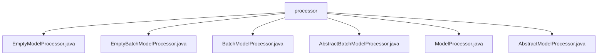

# 基础信息

|      |      |
|------|------|
| 名称 | processor |
| 编码语言 | .java |
| 代码路径 | WeFe/serving/serving-sdk-java/src/main/java/com/welab/wefe/serving/sdk/processor |
| 包名 | docs.serving.serving-sdk-java.src.main.java.com.welab.wefe.serving.sdk.processor |
| 概述说明 | EmptyModelProcessor和EmptyBatchModelProcessor是空实现的模型处理器类，分别用于单例和批量处理。BatchModelProcessor和ModelProcessor是运行时注解，含id属性。AbstractModelProcessor和AbstractBatchModelProcessor是抽象类，定义了预处理和后处理的框架方法。 |

# 说明

## 概述  
该模块提供模型处理的标准框架，包含单条和批量处理两种模式。核心职责是通过抽象类和空实现定义前后处理接口规范，例如`preprocess`接收`BaseModel`和预测参数，`postprocess`处理预测结果。关键数据结构包括`BaseModel`、`PredictParams`和`BatchPredictParams`。依赖运行时注解（如`@ModelProcessor`）实现反射处理，类似策略模式中的占位实现。例如`EmptyModelProcessor`作为默认实现，`AbstractBatchModelProcessor`定义批量处理模板。

## 主要业务场景  
模块支持模型预测的全流程处理，包括预处理参数校验和结果后处理转换。典型交互模式为：通过注解标识处理器ID，子类实现具体逻辑。例如单条处理使用`PredictParams`，批处理使用`BatchPredictParams`。完整功能通过抽象方法强制标准化，应用场景涵盖实时预测和离线批量处理。API类型包含运行时注解和模板方法，集成案例可见空实现类的占位用法。

### 包内部结构视图

该流程图展示了WeFe服务SDK中处理器模块的类结构关系。所有处理器类都直接位于processor目录下，包括基础抽象类AbstractModelProcessor和AbstractBatchModelProcessor，以及它们的实现类ModelProcessor和BatchModelProcessor，还有两个特殊处理器EmptyModelProcessor和EmptyBatchModelProcessor。

# 文件列表

| 名称   | 类型  | 说明 |
|-------|------|-------------|
| [EmptyModelProcessor.java](EmptyModelProcessor.md) | file | EmptyModelProcessor是继承AbstractModelProcessor的空实现类，包含预处理和后处理两个空方法。 |
| [EmptyBatchModelProcessor.java](EmptyBatchModelProcessor.md) | file | 空批处理模型处理器，继承抽象类，包含预处理和后处理方法，均无具体实现。 |
| [BatchModelProcessor.java](BatchModelProcessor.md) | file | 运行时保留的注解BatchModelProcessor，需指定id属性。 |
| [AbstractBatchModelProcessor.java](AbstractBatchModelProcessor.md) | file | 抽象类AbstractBatchModelProcessor定义预处理和后处理方法，分别用于模型预测前后的操作。预处理接收模型和参数，后处理接收结果、模型和参数。 |
| [ModelProcessor.java](ModelProcessor.md) | file | 这是一个Java运行时保留的注解`ModelProcessor`，包含一个必需属性`id`，用于标识模型处理器。 |
| [AbstractModelProcessor.java](AbstractModelProcessor.md) | file | 抽象类AbstractModelProcessor定义模型预测前后处理接口：preprocess预处理和postprocess后处理，需传入模型和预测参数。 |

