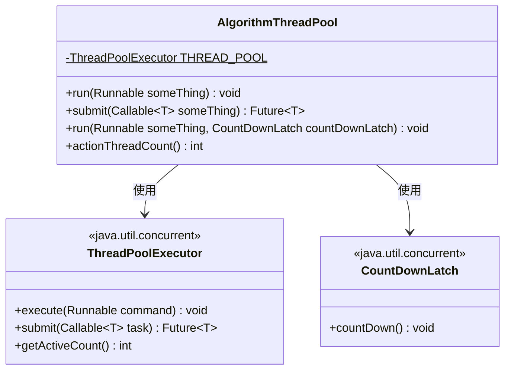
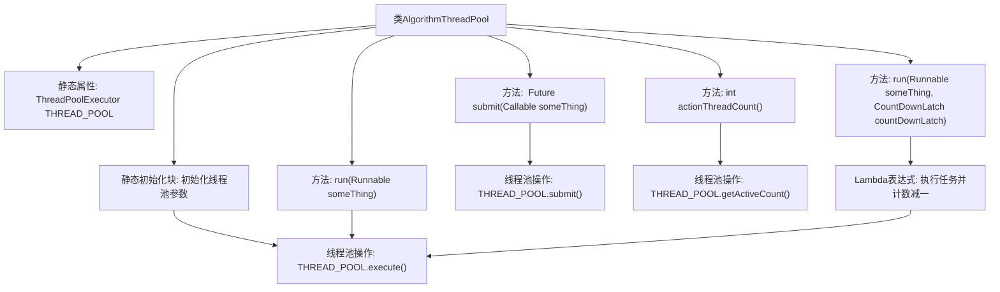

# 基础信息

|      |      |
|------|------|
| 名称 | AlgorithmThreadPool |
| 编码语言 | .java |
| 代码路径 | WeFe/serving/serving-sdk-java/src/main/java/com/welab/wefe/serving/sdk/utils/AlgorithmThreadPool.java |
| 包名 | com.welab.wefe.serving.sdk.utils |
| 依赖项 | ['java.util.concurrent'] |
| 概述说明 | AlgorithmThreadPool类实现了一个静态线程池，核心线程数为CPU核心数，最大线程数为两倍核心数，提供执行Runnable和Callable任务的方法，支持CountDownLatch计数，并能获取活跃线程数。 |

# 说明

AlgorithmThreadPool类实现了一个静态线程池，核心线程数等于CPU核心数，最大线程数为核心数的两倍，使用100毫秒空闲超时和无限容量队列。提供三种任务执行方式：直接执行Runnable任务，提交Callable任务并返回Future，以及带CountDownLatch的异步任务（执行后递减计数器）。还包含获取活动线程数的方法。所有方法均为静态调用。

# 类列表 Class Summary

| 名称   | 类型  | 说明 |
|-------|------|-------------|
| AlgorithmThreadPool | class | AlgorithmThreadPool类实现线程池管理，核心线程数为CPU核数，最大线程数为核数2倍，提供执行Runnable任务、提交Callable任务及带CountDownLatch的异步任务方法，支持获取活跃线程数。 |

## 类 AlgorithmThreadPool

|      |      |
|------|------|
| 访问范围 | public |
| 类型 | class |
| 名称 | AlgorithmThreadPool |
| 说明 | AlgorithmThreadPool类实现线程池管理，核心线程数为CPU核数，最大线程数为核数2倍，提供执行Runnable任务、提交Callable任务及带CountDownLatch的异步任务方法，支持获取活跃线程数。 |

### UML类图

这段代码定义了一个算法线程池工具类AlgorithmThreadPool，它封装了ThreadPoolExecutor的功能，提供了三种任务执行方式：直接执行Runnable任务、提交Callable任务并返回Future，以及带CountDownLatch通知的任务执行。类图展示了AlgorithmThreadPool与Java标准库中ThreadPoolExecutor和CountDownLatch的依赖关系，其中AlgorithmThreadPool通过静态方法对外提供线程池服务，内部维护一个静态的线程池实例，支持获取活跃线程数和不同类型的任务提交方式。

### 内部方法调用关系图

这段代码展示了一个线程池工具类AlgorithmThreadPool的实现。通过静态初始化块创建了一个核心线程数为CPU核心数、最大线程数为两倍CPU核心数的线程池，提供了四种操作方法：直接执行Runnable任务、提交Callable任务并返回Future、带CountDownLatch计数的任务执行，以及获取活跃线程数。其中带CountDownLatch的方法通过Lambda表达式确保任务执行后计数器减一，体现了线程池与同步工具的结合使用。

### 字段列表 Field List

| 名称  | 类型  | 说明 |
|-------|-------|------|
| THREAD_POOL | ThreadPoolExecutor | 私有静态线程池执行器THREAD_POOL。 |

### 方法列表

| 名称  | 类型  | 说明 |
|-------|-------|------|
| submit | Future<T> | Java方法：使用线程池提交Callable任务并返回Future对象。 |
| run | void | 使用线程池执行任务，完成后减少CountDownLatch计数。 |
| run | void | 定义静态方法run，接收Runnable参数，使用线程池THREAD_POOL执行该任务。 |
| actionThreadCount | int | 该方法返回线程池中当前活跃的线程数量。 |

