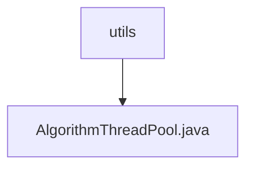

# 基础信息

|      |      |
|------|------|
| 名称 | utils |
| 编码语言 | .java |
| 代码路径 | WeFe/serving/serving-sdk-java/src/main/java/com/welab/wefe/serving/sdk/utils |
| 包名 | docs.serving.serving-sdk-java.src.main.java.com.welab.wefe.serving.sdk.utils |
| 概述说明 | AlgorithmThreadPool类实现了一个静态线程池，核心线程数为CPU核心数，最大线程数为两倍核心数，提供执行Runnable和Callable任务的方法，支持CountDownLatch计数，并能获取活跃线程数。 |

# 说明

AlgorithmThreadPool类实现了一个静态线程池，核心线程数等于CPU核心数，最大线程数为核心数的两倍，使用100毫秒空闲超时和无限容量队列。提供三种任务执行方式：直接执行Runnable任务，提交Callable任务并返回Future，以及带CountDownLatch的异步任务（执行后递减计数器）。还包含获取活动线程数的方法。所有方法均为静态调用。

### 包内部结构视图

该流程图展示了WeFe项目中serving-sdk-java模块下的utils工具包层级结构，其中utils作为父目录包含AlgorithmThreadPool.java线程池工具类。这是一个典型的三级目录结构，体现了Java项目中工具类的常见组织方式，总节点数严格匹配输入路径数量。

# 文件列表

| 名称   | 类型  | 说明 |
|-------|------|-------------|
| [AlgorithmThreadPool.java](AlgorithmThreadPool.md) | file | AlgorithmThreadPool类实现了一个静态线程池，核心线程数为CPU核心数，最大线程数为两倍核心数，提供执行Runnable和Callable任务的方法，支持CountDownLatch计数，并能获取活跃线程数。 |

