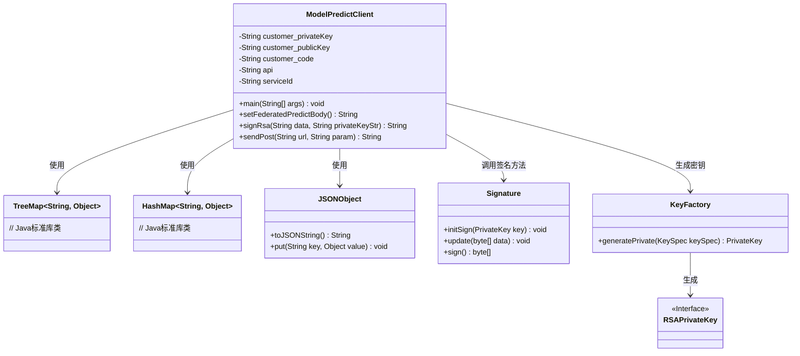
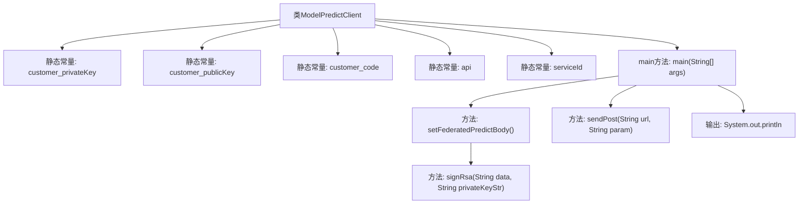
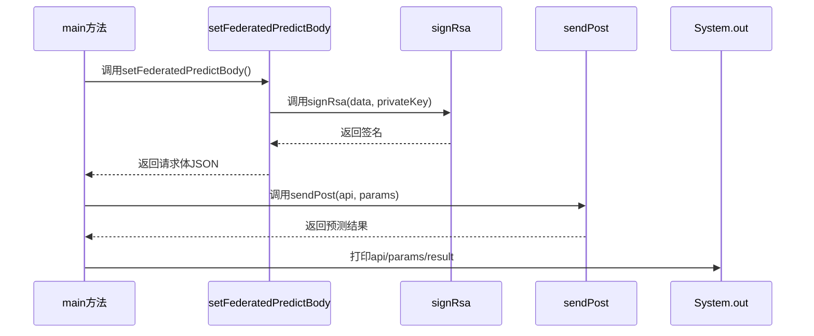

# 基础信息

|      |      |
|------|------|
| 名称 | ModelPredictClient |
| 编码语言 | .java |
| 代码路径 | WeFe/serving/serving-service/sdk_dir/ModelPredictClient.java |
| 包名 | com.welab.wefe.mpc |
| 依赖项 | ['com.alibaba.fastjson.JSONObject', 'java.io', 'java.math.BigInteger', 'java.net', 'java.nio.charset.StandardCharsets', 'java.security.KeyFactory', 'java.security.Signature', 'java.security.interfaces.RSAPrivateKey', 'java.security.spec.PKCS8EncodedKeySpec', 'java.util'] |
| 概述说明 | Java客户端类ModelPredictClient，用于调用预测API，包含密钥配置、请求参数签名（RSA/SM2）及POST请求发送功能。 |

# 说明

该代码实现了一个模型预测客户端类ModelPredictClient，包含密钥配置、API地址设置和预测请求功能。主要功能包括：通过setFederatedPredictBody方法构建包含特征数据、用户ID和服务ID的请求体，并使用RSA私钥对数据进行签名；通过sendPost方法向指定URL发送POST请求，设置请求头并处理响应。代码还预留了SM2签名方法的注释实现，但当前未启用。整个流程实现了安全的数据传输和模型预测请求功能。

# 类列表 Class Summary

| 名称   | 类型  | 说明 |
|-------|------|-------------|
| ModelPredictClient | class | Java客户端类ModelPredictClient，包含密钥配置、API调用和RSA签名功能，用于发送预测请求并处理响应。 |

## 类 ModelPredictClient

|      |      |
|------|------|
| 访问范围 | public |
| 类型 | class |
| 名称 | ModelPredictClient |
| 说明 | Java客户端类ModelPredictClient，包含密钥配置、API调用和RSA签名功能，用于发送预测请求并处理响应。 |

### UML类图

类图描述：
ModelPredictClient是一个用于模型预测的客户端类，包含密钥管理、请求体构建、数字签名和HTTP请求功能。它使用TreeMap和HashMap组织请求参数，通过JSONObject序列化数据，调用Signature进行RSA签名，并依赖KeyFactory生成私钥。类中封装了完整的预测请求流程，包括参数组装、签名生成和POST请求发送，体现了安全通信和数据处理的设计。

### 内部方法调用关系图

该流程图展示了ModelPredictClient类的结构，包含5个静态常量和4个核心方法。时序图描述了main方法依次调用setFederatedPredictBody生成签名请求体，通过sendPost发送预测请求，最后输出结果的完整流程。签名过程使用RSA算法，请求体包含特征数据、用户ID和服务标识等参数，通过POST请求发送至预测API端点。

### 字段列表 Field List

| 名称  | 类型  | 说明 |
|-------|-------|------|
| customer_publicKey = "***" | String | 私有静态常量字符串存储客户公钥。 |
| serviceId = "***" | String | 私有静态常量serviceId，值为"***"。 |
| api = "{{baseUrl}}/api/predict/%s" | String | 定义一个静态常量字符串api，格式为baseUrl拼接/api/predict/加参数。 |
| customer_privateKey = "***" | String | 代码定义了一个私有静态常量字符串，存储客户私钥，值为"***"。 |
| customer_code = "***" | String | 私有静态常量字符串customer_code，值为"***"。 |

### 方法列表

| 名称  | 类型  | 说明 |
|-------|-------|------|
| sendPost | String | 发送POST请求的方法，设置请求头，处理输入输出流，捕获异常并返回响应结果。 |
| main | void | Java主方法：设置参数并发送POST请求，打印API、参数和结果。 |
| signRsa | String | 使用SHA1withRSA算法对数据签名，输入数据和私钥字符串，返回Base64编码的签名结果。 |
| setFederatedPredictBody | String | 方法生成联邦预测请求体：构建包含特征数据、用户ID、服务ID等参数的TreeMap，转为JSON后使用RSA签名，最终返回含签名和数据的JSON字符串。 |

