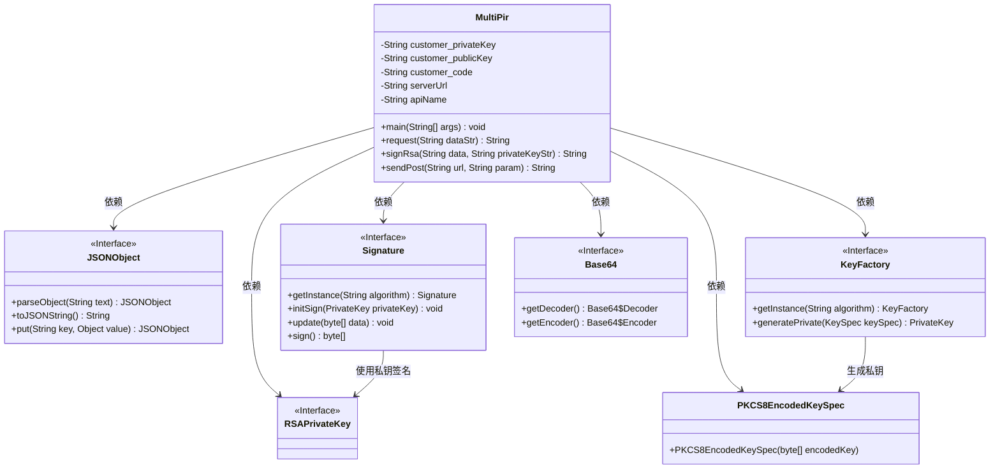
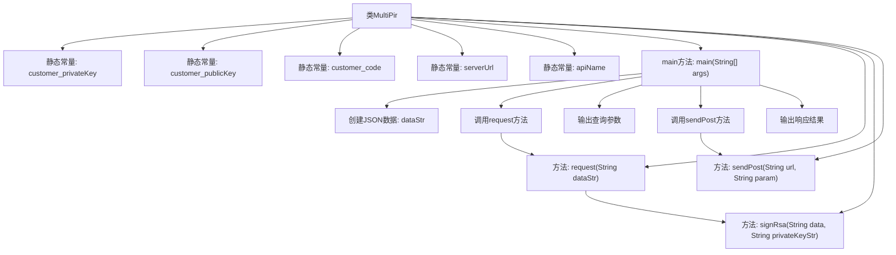

# 基础信息

|      |      |
|------|------|
| 名称 | MultiPir |
| 编码语言 | .java |
| 代码路径 | WeFe/serving/serving-service/sdk_dir/MultiPir.java |
| 包名 | com.welab.wefe.mpc |
| 依赖项 | ['com.alibaba.fastjson.JSONObject', 'com.welab.wefe.mpc.util.RSAUtil', 'java.io.BufferedReader', 'java.io.IOException', 'java.io.InputStreamReader', 'java.io.PrintWriter', 'java.net.URL', 'java.net.URLConnection', 'java.util.TreeMap', 'java.math.BigInteger', 'java.nio.charset.StandardCharsets', 'java.security.KeyFactory', 'java.security.Signature', 'java.util', 'java.security.interfaces.RSAPrivateKey', 'java.security.spec.PKCS8EncodedKeySpec'] |
| 概述说明 | Java类MultiPir实现多方匿踪查询，包含RSA签名、POST请求及JSON数据处理功能。 |

# 说明

该Java类实现了一个多方匿踪查询系统客户端。类中定义了客户端的私钥、公钥、客户代码、服务地址和API名称等配置参数。主方法构造了一个包含多个成员ID和模型ID的JSON请求数据，通过request方法生成签名请求参数，然后使用sendPost方法向指定服务地址发送POST请求。request方法使用RSA算法对数据进行签名，构建包含客户ID、签名、数据和请求ID的JSON请求体。sendPost方法处理HTTP连接，设置请求头并发送POST请求，最后返回服务端响应结果。类中还包含注释掉的SM2签名方法实现，但当前未使用。整个过程实现了客户端与服务端的安全通信和数据传输。

# 类列表 Class Summary

| 名称   | 类型  | 说明 |
|-------|------|-------------|
| MultiPir | class | Java类MultiPir实现多方匿踪查询，包含公私钥配置、数据签名（RSA）及HTTP POST请求功能，用于向指定服务地址发送加密查询请求并获取响应。 |

## 类 MultiPir

|      |      |
|------|------|
| 访问范围 | public |
| 类型 | class |
| 名称 | MultiPir |
| 说明 | Java类MultiPir实现多方匿踪查询，包含公私钥配置、数据签名（RSA）及HTTP POST请求功能，用于向指定服务地址发送加密查询请求并获取响应。 |

### UML类图

这段代码描述了一个多方匿踪查询（Multi-Party Private Information Retrieval）的实现类MultiPir，主要用于处理加密通信和HTTP请求。类中包含私钥签名、数据封装和HTTP POST请求等功能，依赖了JSON处理、RSA签名、Base64编解码等工具类。代码通过TreeMap和JSONObject处理结构化数据，使用SHA1withRSA算法进行数字签名，并通过URLConnection实现HTTP通信。注释中提到的SM2签名方案（国密算法）虽然被注释掉，但展示了可扩展性。

### 内部方法调用关系图

这段代码实现了一个多方匿踪查询系统，主要包含密钥管理、数据签名和HTTP请求功能。流程图展示了从main方法开始，依次执行数据准备、RSA签名生成、参数组装和HTTP POST请求发送的完整流程。核心逻辑是通过request方法构造签名请求体，再通过sendPost方法向服务端发送加密请求，最终输出查询参数和响应结果。代码采用RSA算法进行数据签名，并预留了SM2签名接口，体现了加密通信的安全设计。

### 字段列表 Field List

| 名称  | 类型  | 说明 |
|-------|-------|------|
| customer_privateKey = "***" | String | 私有静态常量字符串存储客户私钥。 |
| apiName = "api/*****" | String | 私有静态常量字符串变量apiName，值为"api/*****"。 |
| customer_code = "***" | String | 私有静态常量字符串customer_code，值为"***"。 |
| customer_publicKey = "***" | String | 私有静态常量字符串存储客户公钥。 |
| serverUrl = "https://***/***/" | String | 私有静态常量字符串serverUrl存储服务器地址"https://***/***/" |

### 方法列表

| 名称  | 类型  | 说明 |
|-------|-------|------|
| request | String | Java方法：接收字符串参数，解析为JSON并加入签名，构建包含客户ID、签名、数据和请求ID的JSON对象后返回字符串。处理异常打印错误。 |
| sendPost | String | Java方法sendPost发送POST请求到指定URL，设置请求头，处理参数和响应，最后关闭流并返回结果。异常时打印错误。 |
| signRsa | String | 使用SHA1withRSA算法和Base64编码的私钥对数据进行签名，返回Base64编码的签名结果。 |
| main | void | Java主方法定义，包含JSON数据字符串，调用request方法处理数据，输出多方匿踪查询参数及服务地址，最后发送POST请求并打印响应结果。 |

