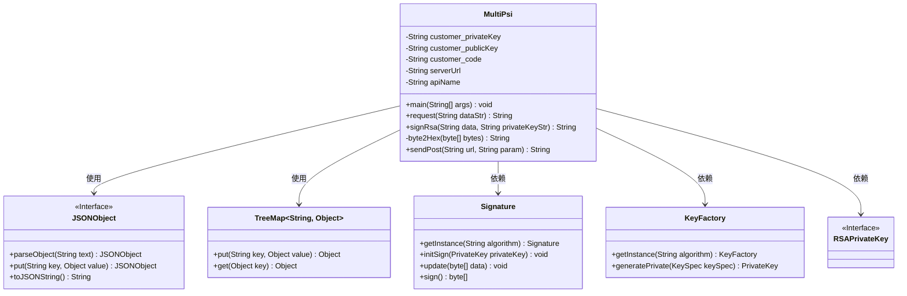
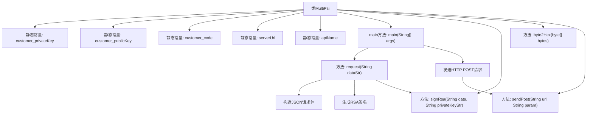

# 基础信息

|      |      |
|------|------|
| 名称 | MultiPsi |
| 编码语言 | .java |
| 代码路径 | WeFe/serving/serving-service/sdk_dir/MultiPsi.java |
| 包名 | com.welab.wefe.mpc |
| 依赖项 | ['com.alibaba.fastjson.JSONObject', 'java.io.BufferedReader', 'java.io.IOException', 'java.io.InputStreamReader', 'java.io.PrintWriter', 'java.net.URL', 'java.net.URLConnection', 'java.util.TreeMap', 'java.math.BigInteger', 'java.nio.charset.StandardCharsets', 'java.security.KeyFactory', 'java.security.Signature', 'java.util', 'java.security.interfaces.RSAPrivateKey', 'java.security.spec.PKCS8EncodedKeySpec'] |
| 概述说明 | Java类MultiPsi实现多方安全交集查询，包含RSA签名、POST请求功能，需配置公私钥和服务地址。 |

# 说明

MultiPsi类实现了一个多方安全交集查询的客户端功能。它包含客户端的私钥、公钥、客户代码和服务地址等配置项。主方法构造包含客户端ID的JSON请求数据，调用request方法生成签名请求参数，并通过sendPost方法发送到服务端。request方法使用RSA算法对请求数据签名，构建包含客户ID、签名和数据的请求体。sendPost方法实现HTTP POST请求，设置请求头并处理响应。类中还提供了SM2签名方法的注释说明和字节转十六进制的辅助方法。整个流程实现了安全的数据传输和身份验证机制。

# 类列表 Class Summary

| 名称   | 类型  | 说明 |
|-------|------|-------------|
| MultiPsi | class | Java类MultiPsi实现多方安全交集查询，包含RSA签名、POST请求功能，需配置公私钥、客户代码和服务地址。 |

## 类 MultiPsi

|      |      |
|------|------|
| 访问范围 | public |
| 类型 | class |
| 名称 | MultiPsi |
| 说明 | Java类MultiPsi实现多方安全交集查询，包含RSA签名、POST请求功能，需配置公私钥、客户代码和服务地址。 |

### UML类图

这段代码描述了一个名为MultiPsi的类，主要用于处理多方安全计算中的请求签名和发送。该类包含私钥签名（RSA）、数据格式转换和HTTP POST请求发送等功能。核心功能是通过request方法构造带签名的请求体，通过sendPost方法发送请求。类图中展示了与JSON处理、集合操作、加密相关的依赖关系，体现了安全数据传输的核心流程。代码结构清晰，但存在硬编码配置和未实现的SM2签名方法（已注释）。

### 内部方法调用关系图

该流程图展示了MultiPsi类的完整处理流程。从main方法入口开始，首先调用request方法构建包含客户ID、签名和数据的JSON请求体，其中签名通过signRsa方法使用RSA算法生成。随后通过sendPost方法向指定URL发送HTTP POST请求，并处理响应结果。流程中包含了异常处理、数据转换和网络通信等关键步骤，完整描述了多方安全计算服务的参数准备和请求过程。

### 字段列表 Field List

| 名称  | 类型  | 说明 |
|-------|-------|------|
| customer_publicKey = "***" | String | 私有静态常量字符串存储客户公钥。 |
| customer_privateKey = "***" | String | 代码中定义了一个私有静态常量字符串变量customer_privateKey，值为"***"。 |
| serverUrl = "http://****/***/" | String | 定义服务器URL常量，值为"http://****/***/"的私有静态字符串。 |
| apiName = "api/*****" | String | 私有静态常量字符串变量apiName，值为"api/*****"。 |
| customer_code = "***" | String | 私有静态常量字符串变量customer_code，值为"***"。 |

### 方法列表

| 名称  | 类型  | 说明 |
|-------|-------|------|
| request | String | Java方法：接收字符串参数，解析为JSON并签名，构造包含客户ID、签名、数据和请求ID的JSON返回。异常处理签名失败。 |
| byte2Hex | String | 将字节数组转换为十六进制字符串，单字节补零后拼接返回。 |
| signRsa | String | 使用RSA私钥对数据进行SHA1withRSA签名，返回Base64编码的签名结果。 |
| main | void | Java代码示例：定义JSON数据字符串，调用request方法处理，打印查询参数、服务地址及POST请求响应结果。 |
| sendPost | String | 发送POST请求的Java方法，设置请求头、参数，处理响应并关闭流。异常时打印错误。 |

