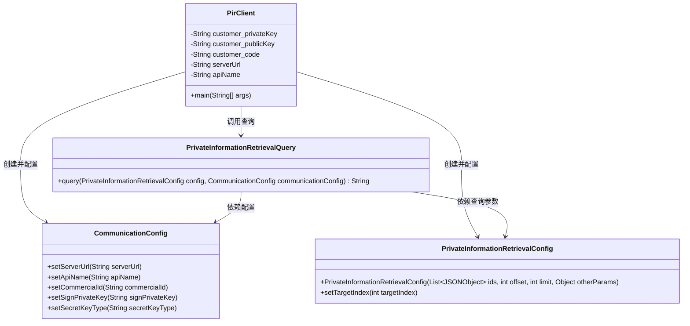
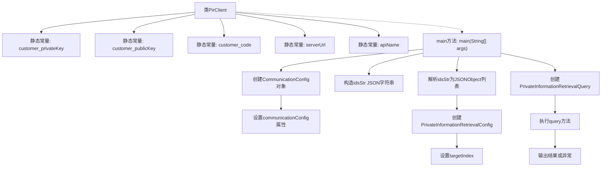

# 基础信息

|      |      |
|------|------|
| 名称 | PirClient |
| 编码语言 | .java |
| 代码路径 | WeFe/serving/serving-service/sdk_dir/PirClient.java |
| 包名 | None |
| 依赖项 | ['com.alibaba.fastjson.JSONObject', 'com.welab.wefe.mpc.config.CommunicationConfig', 'com.welab.wefe.mpc.pir.sdk.PrivateInformationRetrievalQuery', 'com.welab.wefe.mpc.pir.sdk.config.PrivateInformationRetrievalConfig', 'java.util.List'] |
| 概述说明 | Java类PirClient实现私有信息检索功能，配置客户密钥、服务地址及API，通过JSON参数查询目标数据并返回结果。 |

# 说明

PirClient类是一个Java实现的私有信息检索客户端，包含客户私钥、公钥、客户代码和服务地址等配置项。通过CommunicationConfig设置服务地址、API名称、客户代码和私钥，并指定加密类型为RSA。主方法中构建了一个包含多个member_id和model_id的JSON数组作为查询参数，设置目标索引后通过PrivateInformationRetrievalQuery发起查询，最后输出结果或错误信息。

# 类列表 Class Summary

| 名称   | 类型  | 说明 |
|-------|------|-------------|
| PirClient | class | Java类PirClient实现私有信息检索功能，配置客户密钥、服务地址和API，通过RSA加密查询指定目标数据并返回结果。 |

## 类 PirClient

|      |      |
|------|------|
| 访问范围 | public |
| 类型 | class |
| 名称 | PirClient |
| 说明 | Java类PirClient实现私有信息检索功能，配置客户密钥、服务地址和API，通过RSA加密查询指定目标数据并返回结果。 |

### UML类图

这段代码展示了一个私有信息检索(PIR)客户端实现，包含配置管理、查询构建和远程服务调用功能。PirClient作为入口类，通过CommunicationConfig配置通信参数，使用PrivateInformationRetrievalConfig设置查询参数，最终通过PrivateInformationRetrievalQuery执行加密查询。类图清晰地展示了各组件间的依赖关系，其中核心是PrivateInformationRetrievalQuery类，它组合了配置和参数对象来完成安全查询功能。整个设计采用分层结构，符合单一职责原则。

### 内部方法调用关系图

这段代码流程图展示了PirClient类的主要执行流程。该流程从main方法开始，首先初始化通信配置对象并设置各项参数，然后构造JSON格式的查询数据并解析为对象列表。接着创建隐私信息检索配置和查询对象，设置目标索引后执行查询操作，最后输出查询结果或捕获异常。整个过程体现了客户端隐私信息检索请求的完整生命周期，包括参数准备、查询构建和执行等关键步骤。

### 字段列表 Field List

| 名称  | 类型  | 说明 |
|-------|-------|------|
| customer_publicKey = "***" | String | 私有静态常量字符串存储客户公钥。 |
| customer_code = "***" | String | 私有静态常量字符串customer_code，值为"***"。 |
| customer_privateKey = "***" | String | 私有静态常量字符串存储客户私钥。 |
| apiName = "api/*****" | String | 代码定义了一个私有静态常量字符串变量apiName，值为"api/*****"。 |
| serverUrl = "http://xxxxx.com/xxxx/" | String | 私有静态常量serverUrl存储服务器地址"http://xxxxx.com/xxxx/" |

### 方法列表

| 名称  | 类型  | 说明 |
|-------|-------|------|
| main | void | Java主方法配置通信参数，设置服务地址、API名称、客户代码和私钥，使用RSA加密。定义JSON数组作为查询参数，创建私有信息检索配置，执行查询并输出结果。 |

