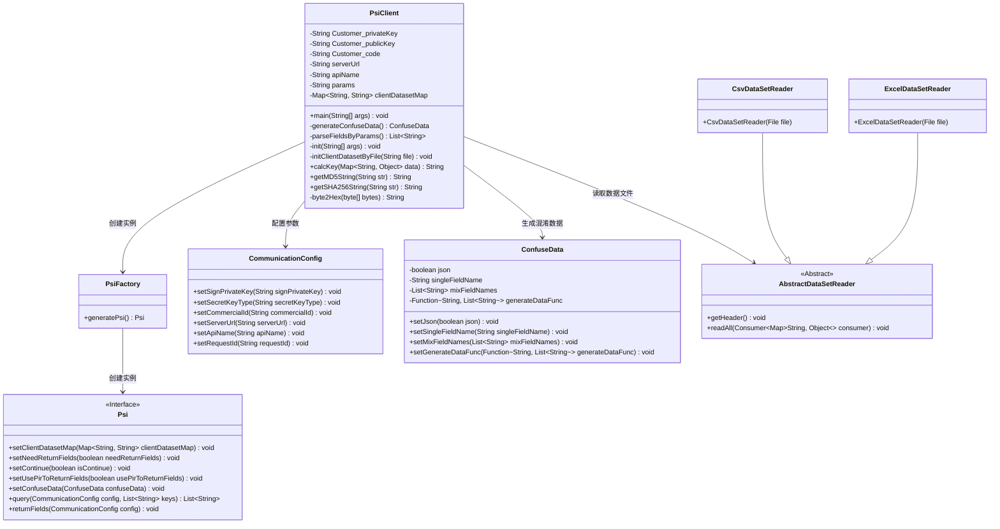
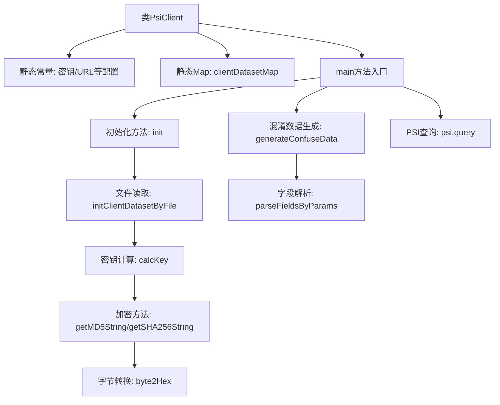
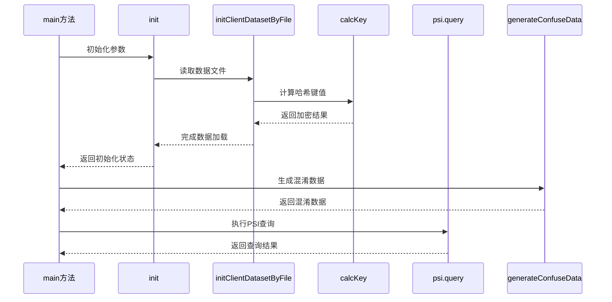

# 基础信息

|      |      |
|------|------|
| 名称 | PsiClient |
| 编码语言 | .java |
| 代码路径 | WeFe/serving/serving-service/sdk_dir/PsiClient.java |
| 包名 | None |
| 依赖项 | ['java.io.File', 'java.math.BigInteger', 'java.security.MessageDigest', 'java.util.ArrayList', 'java.util.Arrays', 'java.util.LinkedHashMap', 'java.util.LinkedList', 'java.util.List', 'java.util.Map', 'java.util.Random', 'com.alibaba.fastjson.JSONArray', 'com.alibaba.fastjson.JSONObject', 'com.welab.wefe.mpc.config.CommunicationConfig', 'com.welab.wefe.mpc.psi.sdk.Psi', 'com.welab.wefe.mpc.psi.sdk.PsiFactory', 'com.welab.wefe.mpc.psi.sdk.excel.AbstractDataSetReader', 'com.welab.wefe.mpc.psi.sdk.excel.CsvDataSetReader', 'com.welab.wefe.mpc.psi.sdk.excel.ExcelDataSetReader', 'com.welab.wefe.mpc.psi.sdk.model.ConfuseData'] |
| 概述说明 | PsiClient类实现隐私集合求交功能，包含密钥配置、数据混淆、哈希计算及服务通信逻辑，支持MD5/SHA256加密，通过CSV/Excel文件初始化数据集。 |

# 说明

PsiClient类实现了一个基于隐私保护集合交集（PSI）的客户端系统，用于安全数据比对。核心功能包括初始化客户密钥、服务地址和API配置，支持MD5/SHA256哈希算法处理输入数据。系统通过读取CSV/Excel文件构建数据集映射（哈希值到原始数据），并生成混淆数据增强隐私性。主流程包含PSI查询、结果统计和可选字段返回功能，同时支持续跑模式和RSA/SM2加密通信。数据处理模块自动解析参数规则，实现多字段联合哈希及JSON格式转换，确保数据安全传输和高效比对。

# 类列表 Class Summary

| 名称   | 类型  | 说明 |
|-------|------|-------------|
| PsiClient | class | PsiClient类实现PSI协议客户端功能，包含密钥配置、数据混淆、哈希计算及服务通信逻辑，支持CSV/Excel数据输入，通过MD5/SHA256加密生成查询键，与服务器交互获取匹配结果。 |

## 类 PsiClient

|      |      |
|------|------|
| 访问范围 | public |
| 类型 | class |
| 名称 | PsiClient |
| 说明 | PsiClient类实现PSI协议客户端功能，包含密钥配置、数据混淆、哈希计算及服务通信逻辑，支持CSV/Excel数据输入，通过MD5/SHA256加密生成查询键，与服务器交互获取匹配结果。 |

### UML类图

这段代码实现了一个PSI（Private Set Intersection）客户端，主要功能包括初始化客户端数据集、生成混淆数据、执行隐私集合求交查询。PsiClient类通过PsiFactory创建Psi实例，使用CommunicationConfig配置通信参数，通过AbstractDataSetReader的子类读取CSV或Excel格式的数据文件。代码实现了MD5和SHA256哈希算法，支持单字段和多字段的混淆数据生成，并通过配置化的方式实现灵活的查询参数设置。类图展示了核心类之间的关系和职责划分，包括数据读取、PSI协议执行、通信配置等关键组件。

### 内部方法调用关系图

这段代码实现了一个PSI（Private Set Intersection）客户端，主要功能包括：初始化配置参数、读取客户数据集文件、对数据进行加密哈希处理、生成混淆数据，最后通过PSI协议与服务端进行隐私集合求交查询。流程图中清晰展示了类结构关系，时序图则详细描述了从初始化到查询执行的完整调用链，突出了文件读取、数据加密和PSI查询三个关键阶段。

### 字段列表 Field List

| 名称  | 类型  | 说明 |
|-------|-------|------|
| params = "[{\"field\":\"xxx\",\"operator\":\"xxx\"}]" | String | 静态字符串变量params存储了一个JSON数组，包含字段和操作符的键值对。 |
| Customer_code = "xxxx" | String | 私有静态常量字符串Customer_code，值为"xxxx"。 |
| Customer_privateKey = "xxxx" | String | 私有静态常量字符串，存储客户私钥"xxxx"。 |
| serverUrl = "http://xxxxx.com/xxxx/" | String | 私有静态常量serverUrl存储服务器地址"http://xxxxx.com/xxxx/" |
| Customer_publicKey = "xxxx" | String | 私有静态常量字符串，存储客户公钥"xxxx"。 |
| clientDatasetMap | Map<String, String> | 定义私有静态映射变量clientDatasetMap，键值均为字符串类型。 |
| apiName = "api/*****" | String | 私有静态常量字符串变量apiName，值为"api/*****"。 |

### 方法列表

| 名称  | 类型  | 说明 |
|-------|-------|------|
| parseFieldsByParams | List<String> | 解析JSON参数并提取字段列表，将结果存入List返回。 |
| generateConfuseData | ConfuseData | 生成混淆数据的方法，根据字段名列表生成单值或JSON格式的随机数据，默认混入4条数据。 |
| initClientDatasetByFile | void | 该方法通过文件初始化客户端数据集，支持CSV和Excel格式。检查文件非空后，根据扩展名选择读取器，读取表头和所有数据行，存储到Map中并计算键值。 |
| calcKey | String | 方法calcKey根据规则处理输入数据，生成哈希值。遍历规则数组，对每个字段按操作符（MD5、SHA256或无处理）拼接并哈希，保存原始数据到JSON。最后将哈希值与原始数据存入映射并返回哈希结果。 |
| main | void | Java主方法初始化PSI查询，设置私钥、客户ID等配置，执行查询并输出结果大小和耗时。 |
| getMD5String | String | 这是一个Java方法，用于将输入字符串转换为MD5哈希值，使用UTF-8编码处理异常。 |
| init | void | 初始化方法检查参数，若无则尝试加载data.csv文件，文件不存在或为空时抛出异常，成功加载后打印客户端数据集大小。 |
| getSHA256String | String | Java方法：使用SHA-256算法对输入字符串进行加密，返回十六进制格式的哈希值。处理异常并打印错误。 |
| byte2Hex | String | 将字节数组转换为十六进制字符串，单字节补零后拼接返回。 |

