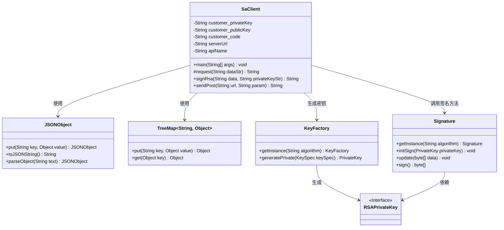
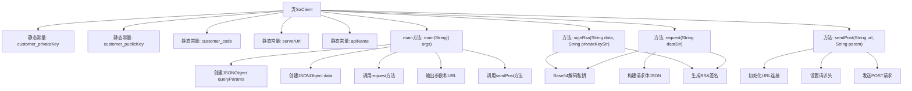

# 基础信息

|      |      |
|------|------|
| 名称 | SaClient |
| 编码语言 | .java |
| 代码路径 | WeFe/serving/serving-service/sdk_dir/SaClient.java |
| 包名 | None |
| 依赖项 | ['java.io.BufferedReader', 'java.io.IOException', 'java.io.InputStreamReader', 'java.io.PrintWriter', 'java.net.URL', 'java.net.URLConnection', 'java.security.interfaces.RSAPrivateKey', 'java.security.spec.PKCS8EncodedKeySpec', 'java.util.TreeMap', 'java.math.BigInteger', 'java.nio.charset.StandardCharsets', 'java.security.KeyFactory', 'java.security.Signature', 'java.util', 'com.alibaba.fastjson.JSONObject', 'com.welab.wefe.mpc.util.RSAUtil'] |
| 概述说明 | Java类SaClient实现多方安全统计功能，包含RSA签名、POST请求及参数处理，需配置公私钥、客户代码和服务地址。 |

# 说明

SaClient类是一个Java客户端实现，用于与多方安全统计服务交互。它包含客户私钥、公钥、客户代码和服务地址等静态配置项。主方法构建查询参数并调用request方法生成签名请求体，然后通过sendPost发送POST请求。request方法使用RSA算法对数据进行签名，生成包含客户ID、签名和数据的JSON请求体。sendPost方法处理HTTP连接，设置请求头并发送数据。类中还包含注释掉的SM2签名方法实现，但当前未启用。整个过程涉及参数组装、数字签名生成和HTTP请求发送。

# 类列表 Class Summary

| 名称   | 类型  | 说明 |
|-------|------|-------------|
| SaClient | class | Java类SaClient实现多方安全统计功能，包含RSA签名、POST请求及参数处理，需配置公私钥、客户代码和服务地址。 |

## 类 SaClient

|      |      |
|------|------|
| 访问范围 | public |
| 类型 | class |
| 名称 | SaClient |
| 说明 | Java类SaClient实现多方安全统计功能，包含RSA签名、POST请求及参数处理，需配置公私钥、客户代码和服务地址。 |

### UML类图

这段代码描述了一个名为`SaClient`的客户端类，主要用于与安全服务进行交互。它包含配置参数、请求构造、RSA签名和HTTP POST请求发送等功能。类图中展示了`SaClient`与`JSONObject`、`TreeMap`等工具类的关系，以及与加密相关的`Signature`、`KeyFactory`和`RSAPrivateKey`接口的交互。整体设计体现了客户端安全通信的核心流程，包括参数组装、数据签名和网络请求。

### 内部方法调用关系图

这段代码是用于实现一个安全客户端（SaClient），主要用于构建和发送加密的HTTP POST请求。代码中包含了RSA签名生成、请求参数构造、HTTP连接管理等功能。主要流程包括：初始化请求参数、生成签名、构建请求体、发送POST请求并处理响应。代码结构清晰，分为常量定义、主流程控制、签名生成和网络请求四个主要部分，适用于需要安全通信的场景。

### 字段列表 Field List

| 名称  | 类型  | 说明 |
|-------|-------|------|
| apiName = "api/*****" | String | 私有静态常量字符串apiName，值为"api/*****"。 |
| customer_publicKey = "***" | String | 代码定义了一个私有静态常量customer_publicKey，值为"***"。 |
| serverUrl = "http://xxxxx.com/xxxx/" | String | 定义了一个私有静态常量serverUrl，值为指定服务端网址。 |
| customer_privateKey = "***" | String | 私有静态常量字符串存储客户私钥，值为"***"。 |
| customer_code = "***" | String | 私有静态常量字符串customer_code，值为"***"。 |

### 方法列表

| 名称  | 类型  | 说明 |
|-------|-------|------|
| signRsa | String | 使用SHA1withRSA算法和Base64编码的私钥对数据进行签名，返回Base64编码的签名结果。 |
| request | String | 该方法接收字符串参数，解析为JSON并签名，构建包含客户ID、签名、数据和请求ID的JSON对象，返回其字符串形式。 |
| main | void | Java代码示例：创建JSON参数，调用API并打印请求URL和响应结果。关键步骤包括设置查询参数、发送POST请求及输出调试信息。 |
| sendPost | String | Java方法：发送POST请求到指定URL，设置请求头，传递参数并返回响应结果。异常处理和资源关闭已包含。 |

