# 基础信息

|      |      |
|------|------|
| 名称 | com |
| 编码语言 | .java |
| 代码路径 | WeFe/serving/serving-service/src/main/java/com |
| 包名 | docs.serving.serving-service.src.main.java.com |
| 概述说明 | Config类：Spring组件，加载外部配置，定义文件路径、邮件主题等属性，支持UTF-8编码。XxxModelProcessor类：继承抽象类，空实现预处理和后处理方法。联邦学习核心API：提供加密通信、成员管理等功能，RESTful设计。预测引擎：支持联合预测，含标准、批量、调试模式。ORM层：JPA实现数据管理，含20+实体类。工具集：签名验证、加密等。枚举模块：定义服务状态和类型。隐私计算框架：处理PSI/PIR/SA请求。特征管理：统一管理数据源和模型。服务治理：全局配置和模型生命周期管理。定时任务：执行统计和状态维护。DTO管理：封装业务数据交互。日志处理：记录API日志到MySQL。启动监听器：执行初始化任务。特征处理框架：注解和SQL驱动。ServingService主类：Spring Boot应用启动配置。 |

# 说明

## 概述  
该模块是联邦学习服务系统的核心组件集合，采用微服务架构设计，核心职责包括系统配置管理、联合预测执行、数据持久化和安全通信。接口规范分层统一：配置类采用Spring属性注入（如Config），处理器类遵循模板方法模式（如XxxModelProcessor），API层继承AbstractApi基类实现RESTful交互。关键数据结构聚合为四类：系统配置（如PSI批量大小）、预测参数（如FederatedPredictParam）、持久化模型（如PredictLogMySqlModel）和枚举状态（如ServiceTypeEnum）。外部依赖去重后包含Spring生态（JPA/Cloud）、加密组件（SM2/RSA）、多数据库驱动（MySQL/Doris/Hive）及JNI调用。例如Config管理SM2密钥，PromoterPredictor协调多方预测。  

## 主要业务场景  
模块支撑联邦学习全生命周期管理，业务流程整合为：1) 系统初始化（密钥生成→配置加载→服务注册）；2) 联合预测（特征获取→安全计算→结果聚合）；3) 服务治理（日志统计→费用结算→状态跟踪）。典型交互模式类似主从架构，通过PromoterPredictor协调多节点计算，依赖签名验证框架保障通信安全。功能完整性体现在：配置中心（Config）、预测引擎（Predicter）、持久化层（Database）和服务治理（Service）的协同。例如金融风控场景中，银行通过InitializeApi初始化→调用PromoterPredictor→记录PredictLogMySqlModel→生成FeeDetailMysqlModel。API类型覆盖加密通信、成员管理、模型预测和定时任务，集成案例可见于ServingService的启动流程（加载处理器→初始化监听器→启动API服务）。

### 包内部结构视图

```mermaid
graph TD
    serving --> service
    serving --> predicter
    serving --> database
    serving --> utils
    serving --> enums
    serving --> service_processor
    serving --> manager
    serving --> scheduler
    serving --> dto
    serving --> operation
    serving --> listener
    serving --> feature
    
    service --> api
    service --> globalconfig
    service --> model
    service --> EmailService.java
    service --> TableModelService.java
    service --> ModelPredictScoreRecordService.java
    service --> ModelPredictScoreStatisticsService.java
    service --> PartnerService.java
    service --> ApiRequestRecordService.java
    service --> AccountService.java
    service --> ServiceCallLogService.java
    service --> FeeConfigService.java
    service --> PredictStatisticsService.java
    service --> MessageService.java
    service --> PredictLogService.java
    service --> TestTempService.java
    service --> RequestStatisticsService.java
    service --> PaymentsRecordsService.java
    service --> UnionServiceService.java
    service --> ModelMemberService.java
    service --> ClientServiceService.java
    service --> CacheObjects.java
    service --> PrivacyDatabaseEncryptService.java
    service --> ServiceOrderService.java
    service --> ModelService.java
    service --> DataSourceService.java
    service --> MemberService.java
    service --> ServiceService.java
    service --> OperationLogService.java
    service --> OrderStatisticsService.java
    service --> FeeDetailService.java
    service --> PsiServiceResultService.java
    service --> ModelSqlConfigService.java
    
    api --> crypto
    api --> client
    api --> system
    api --> account
    api --> orderstatistics
    api --> partner
    api --> apirequestrecord
    api --> sa
    api --> predict
    api --> feeconfig
    api --> serviceorder
    api --> clientservice
    api --> paymentsrecords
    api --> logger
    api --> requeststatistics
    api --> file
    api --> feedetail
    api --> pir
    api --> operation
    api --> datasource
    api --> member
    api --> model
    
    predicter --> single
    predicter --> batch
    predicter --> Predictor.java
    
    database --> repository
    database --> entity
    database --> config
    
    utils --> deep_learning
    utils --> sign
    utils --> component
    utils --> SHA256Utils.java
    utils --> MD5Util.java
    utils --> ServiceUtil.java
    utils --> SerializeUtil.java
    utils --> ZipUtils.java
    utils --> RedisIntermediateCache.java
    utils --> ServingFileUtil.java
    utils --> SignUtils.java
    utils --> DeepLearningUtil.java
    
    feature --> code
    feature --> sql
    feature --> SqlFeatureDataHandler.java
    feature --> AbstractFeatureDataHandler.java
    feature --> CodeFeatureDataHandler.java
```

该流程图展示了WeFe服务模块的完整目录结构，从顶层serving节点开始，逐级展开service、api、predicter等主要功能模块。其中service模块包含30多个具体服务类，api模块细分为20多个子模块，每个子模块又包含多个API实现类。整体结构清晰展示了服务层、API层、数据库层、工具层等核心组件及其从属关系，体现了模块化设计的微服务架构特点。

# 文件列表

| 名称   | 类型  | 说明 |
|-------|------|-------------|
| [welab](welab/_module.md) | package | Config类：Spring组件，加载外部配置，定义文件路径、邮件主题等属性，支持UTF-8编码。XxxModelProcessor类：继承抽象类，空实现预处理和后处理方法。联邦学习核心API：提供加密通信、成员管理等功能，RESTful设计。预测引擎：支持联合预测，含标准、批量、调试模式。ORM层：JPA实现数据管理，含20+实体类。工具集：签名验证、加密等。枚举模块：定义服务状态和类型。隐私计算框架：处理PSI/PIR/SA请求。特征管理：统一管理数据源和模型。服务治理：全局配置和模型生命周期管理。定时任务：执行统计和状态维护。DTO管理：封装业务数据交互。日志处理：记录API日志到MySQL。启动监听器：执行初始化任务。特征处理框架：注解和SQL驱动。ServingService主类：Spring Boot应用启动配置。 |

