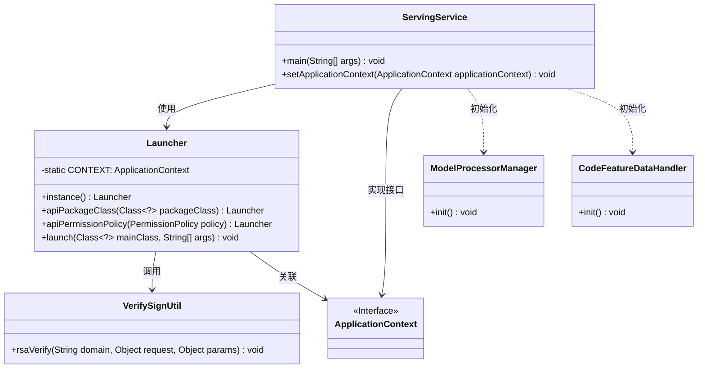
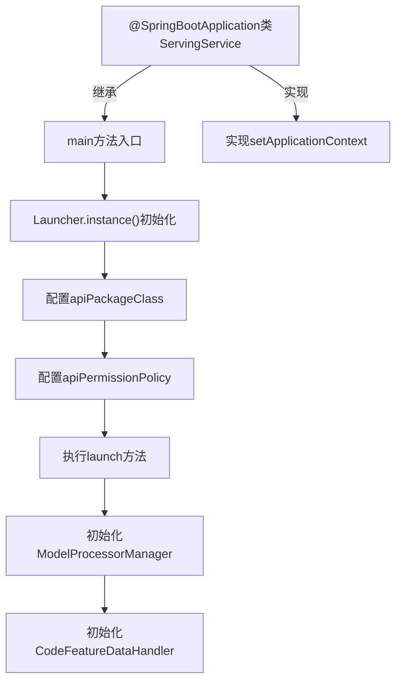
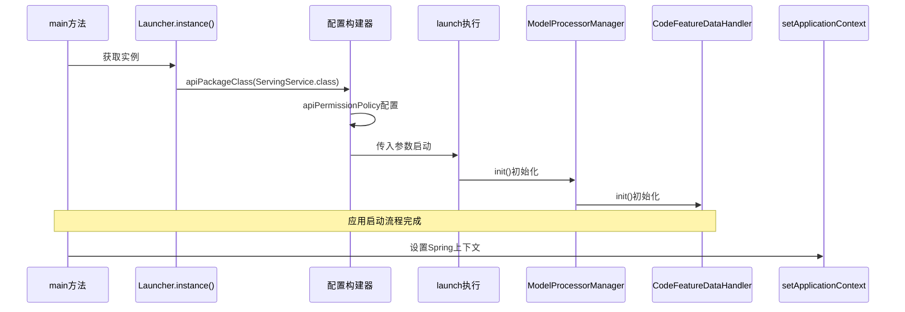

# 基础信息

|      |      |
|------|------|
| 名称 | ServingService |
| 编码语言 | .java |
| 代码路径 | WeFe/serving/serving-service/src/main/java/com/welab/wefe/serving/service/ServingService.java |
| 包名 | com.welab.wefe.serving.service |
| 依赖项 | ['org.springframework.beans.BeansException', 'org.springframework.boot.autoconfigure.SpringBootApplication', 'org.springframework.boot.autoconfigure.jdbc.DataSourceAutoConfiguration', 'org.springframework.context.ApplicationContext', 'org.springframework.context.ApplicationContextAware', 'org.springframework.context.annotation.ComponentScan', 'org.springframework.scheduling.annotation.EnableScheduling', 'com.welab.wefe.common.web.Launcher', 'com.welab.wefe.common.web.config.ApiBeanNameGenerator', 'com.welab.wefe.serving.sdk.manager.ModelProcessorManager', 'com.welab.wefe.serving.service.feature.CodeFeatureDataHandler', 'com.welab.wefe.serving.service.utils.sign.VerifySignUtil'] |
| 概述说明 | 这是一个Spring Boot应用启动类，排除了数据源自动配置，启用了定时任务，自定义了组件扫描命名规则。主方法通过Launcher启动，配置了API权限验证逻辑，并初始化了模型和特征处理器。同时实现了应用上下文注入功能。 |

# 说明

这是一个基于Spring Boot的ServingService主类，使用@SpringBootApplication注解并排除了数据源自动配置。通过@ComponentScan指定了自定义的Bean命名生成器和基础扫描包。类实现了ApplicationContextAware接口以获取应用上下文。main方法中通过Launcher实例配置API包类、权限验证策略（包括签名验证），并启动应用。同时初始化了模型处理器和特征处理器模块。整个类主要负责服务的启动配置和核心组件的初始化。

# 类列表 Class Summary

| 名称   | 类型  | 说明 |
|-------|------|-------------|
| ServingService | class | 这是一个Spring Boot应用启动类，排除了数据源自动配置，启用了定时任务，自定义了组件扫描命名规则。主方法初始化了API启动器、模型处理器和特征处理器，并设置了应用上下文。 |

## 类 ServingService

|      |      |
|------|------|
| 访问范围 | @EnableScheduling;@SpringBootApplication(exclude = {DataSourceAutoConfiguration.class});@ComponentScan(nameGenerator = ApiBeanNameGenerator.class,;        basePackageClasses = {Launcher.class, ServingService.class});public |
| 类型 | class |
| 名称 | ServingService |
| 说明 | 这是一个Spring Boot应用启动类，排除了数据源自动配置，启用了定时任务，自定义了组件扫描命名规则。主方法初始化了API启动器、模型处理器和特征处理器，并设置了应用上下文。 |

### UML类图

这段代码展示了一个基于Spring Boot的服务类ServingService，它通过Launcher类启动应用并配置API权限策略。类图清晰地呈现了核心类之间的关系：ServingService作为入口类，依赖Launcher进行应用启动和配置，同时与验证工具类VerifySignUtil、初始化管理器ModelProcessorManager和CodeFeatureDataHandler交互。Launcher类维护静态应用上下文，而ServingService实现了ApplicationContextAware接口来设置上下文。

### 内部方法调用关系图

这段代码是Spring Boot应用的启动类，通过Launcher构建器模式配置API权限策略和包扫描路径，完成服务启动后初始化模型和特征处理器。流程图展示了从主方法到各组件初始化的调用链，时序图则详细描述了运行时对象间的交互顺序，特别是Launcher的链式配置过程。setApplicationContext实现了Spring上下文注入，支持后续DI操作。

### 字段列表 Field List

| 名称  | 类型  | 说明 |
|-------|-------|------|

### 方法列表

| 名称  | 类型  | 说明 |
|-------|-------|------|
| main | void | Java主方法初始化服务启动器，配置API权限校验和签名验证，并初始化模型与特征处理器。 |
| setApplicationContext | void | 该方法重写setApplicationContext，将传入的ApplicationContext赋值给Launcher.CONTEXT静态变量。 |

