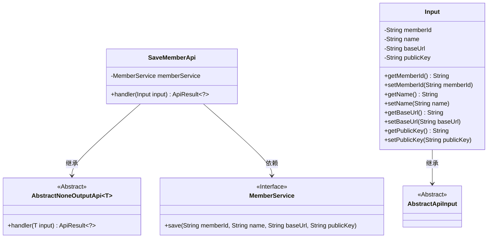
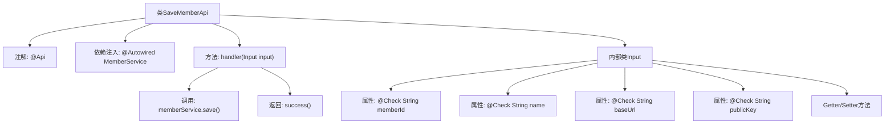

# 基础信息

|      |      |
|------|------|
| 名称 | SaveMemberApi |
| 编码语言 | .java |
| 代码路径 | WeFe/serving/serving-service/src/main/java/com/welab/wefe/serving/service/api/SaveMemberApi.java |
| 包名 | com.welab.wefe.serving.service.api |
| 依赖项 | ['com.welab.wefe.common.fieldvalidate.annotation.Check', 'com.welab.wefe.common.web.api.base.AbstractNoneOutputApi', 'com.welab.wefe.common.web.api.base.Api', 'com.welab.wefe.common.web.api.base.Caller', 'com.welab.wefe.common.web.dto.AbstractApiInput', 'com.welab.wefe.common.web.dto.ApiResult', 'com.welab.wefe.serving.service.service.MemberService', 'org.springframework.beans.factory.annotation.Autowired'] |
| 概述说明 | 保存成员信息的API类，需提供成员ID、名称、调用路径和公钥，调用MemberService保存数据。 |

# 说明

这是一个名为SaveMemberApi的Java类，用于保存成员信息。它继承自AbstractNoneOutputApi，并处理Input类型的输入。类上标注了API路径为member_save，名称为保存成员信息，允许带签名访问，调用域为Caller.Board。类中注入了MemberService，通过handler方法调用memberService的save方法保存成员信息。Input内部类继承自AbstractApiInput，包含四个必填字段：身份id、成员名称、调用路径和公钥，每个字段都有对应的getter和setter方法。handler方法执行保存操作后返回成功结果。

# 类列表 Class Summary

| 名称   | 类型  | 说明 |
|-------|------|-------------|
| SaveMemberApi | class | 保存成员信息的API接口，需身份ID、名称、调用路径和公钥，调用需签名，属于Board域。 |

## 类 SaveMemberApi

|      |      |
|------|------|
| 访问范围 | @Api(;        path = "member_save",;        name = "保存成员信息",;        allowAccessWithSign = true,;        domain = Caller.Board;);public |
| 类型 | class |
| 名称 | SaveMemberApi |
| 说明 | 保存成员信息的API接口，需身份ID、名称、调用路径和公钥，调用需签名，属于Board域。 |

### UML类图

该类图展示了SaveMemberApi及其相关类的结构。SaveMemberApi继承自AbstractNoneOutputApi<Input>，并依赖MemberService接口。Input作为内部类继承自AbstractApiInput，包含成员信息字段及其getter/setter方法。MemberService接口定义了保存成员信息的抽象方法。整体结构体现了API处理输入并调用服务保存数据的典型模式。

### 内部方法调用关系图

这段代码流程图展示了SaveMemberApi类的结构和工作流程。该类是一个带有@Api注解的API控制器，继承自AbstractNoneOutputApi，包含一个内部Input类用于参数校验。主要流程是通过handler方法调用memberService.save()服务保存成员信息，最后返回成功结果。Input类包含四个必填字段（memberId、name、baseUrl、publicKey）及其getter/setter方法，每个字段都带有@Check校验注解确保数据完整性。

### 字段列表 Field List

| 名称  | 类型  | 说明 |
|-------|-------|------|
| memberService | MemberService | 自动注入MemberService实例。 |

### 方法列表

| 名称  | 类型  | 说明 |
|-------|-------|------|
| handler | ApiResult<?> | 处理输入数据并保存成员信息，成功后返回结果。 |

