# 基础信息

|      |      |
|------|------|
| 名称 | api |
| 编码语言 | .java |
| 代码路径 | WeFe/serving/serving-service/src/main/java/com/welab/wefe/serving/service/api |
| 包名 | docs.serving.serving-service.src.main.java.com.welab.wefe.serving.service.api |
| 概述说明 | GenerateRsaKeyPairApi生成RSA密钥对并返回公钥。客户端管理模块支持CRUD操作，校验IP和公钥。系统模块管理全局配置和密钥。账户模块处理SSO登录和查询。订单统计模块提供查询、下载和保存功能。合作伙伴模块管理增删改查。API记录模块支持查询和下载。安全聚合模块处理聚合结果。预测模块提供模型预测服务。计费模块管理配置。服务订单模块处理订单管理。客户端服务模块管理服务生命周期。支付记录模块支持查询和下载。日志模块提供统计和查询。文件模块支持分块上传和合并。费用明细模块查询费用。PIR模块提供私有信息检索。数据源模块管理数据库连接。成员模块管理联邦成员。模型模块管理模型生命周期。SaveMemberApi保存成员信息。 |

# 说明

## 概述  
该模块是联邦学习服务系统的核心API集合，提供加密通信、客户端管理、系统配置、账户认证等基础功能，类似微服务架构中的基础设施层。接口规范统一继承AbstractApi基类，采用RESTful风格设计，路径按功能划分（如`crypto/`、`client/`等），输入输出均通过结构化类封装。关键数据结构包括RSA密钥对、客户信息模型（ID/名称/公钥）、联邦成员模型（ID/地址/状态）等，字段均带校验注解。外部依赖去重后包含12个核心服务组件，如ClientService、GlobalConfigService等。例如GenerateRsaKeyPairApi生成密钥对，InitializeApi初始化联邦环境。

## 主要业务场景  
模块支持联邦学习全链路操作：1) 安全通信（如密钥生成/重置），2) 成员管理（CRUD操作+状态维护），3) 服务编排（模型预测/日志统计），4) 系统运维（配置管理/文件上传）。典型交互模式为：客户端通过SSO登录→获取密钥→调用预测服务→生成计费记录。业务流程示例：InitializeApi初始化→SaveClientApi注册→PredictApi推理→FeeDetailApi计费。API类型覆盖加密类（如RSA）、管理类（如CRUD）、工具类（如文件分块上传）和监控类（如日志查询），集成案例可见于联邦学习全生命周期管理。

### 包内部结构视图

```mermaid
graph TD
    api --> crypto
    api --> client
    api --> system
    api --> account
    api --> orderstatistics
    api --> partner
    api --> apirequestrecord
    api --> sa
    api --> predict
    api --> feeconfig
    api --> serviceorder
    api --> clientservice
    api --> paymentsrecords
    api --> logger
    api --> requeststatistics
    api --> service
    api --> servicecalllog
    api --> file
    api --> feedetail
    api --> pir
    api --> operation
    api --> datasource
    api --> member
    api --> model
    api --> SaveMemberApi.java
    
    crypto --> GenerateRsaKeyPairApi.java
    client --> QueryClientListApi.java
    client --> UpdateApi.java
    client --> SaveClientApi.java
    client --> QueryClientApi.java
    system --> InitializeUnionModeApi.java
    system --> ResetRsaKeyApi.java
    system --> GlobalConfigUpdateApi.java
    system --> UpdateRsaKeyByBoardApi.java
    system --> InitializeApi.java
    system --> GlobalConfigDetailApi.java
    system --> IsInitializeApi.java
    account --> SsoLoginApi.java
    account --> QueryAllApi.java
    orderstatistics --> QueryListApi.java
    orderstatistics --> DownloadApi.java
    orderstatistics --> SaveApi.java
    partner --> QueryPartnerListApi.java
    partner --> SavePartnerApi.java
    partner --> UpdateApi.java
    partner --> DetailPartnerApi.java
    partner --> QueryPartnerAllApi.java
    partner --> InitPartnerApi.java
    apirequestrecord --> QueryListApi.java
    apirequestrecord --> DownloadApi.java
    sa --> SecureAggregationForResultApi.java
    predict --> deep_learning
    predict --> PredictApi.java
    predict --> DebugApi.java
    predict --> SqlConfigTestApi.java
    predict --> PromoterApi.java
    predict --> ProviderApi.java
    deep_learning --> DeepLearningPredictApi.java
    feeconfig --> SaveApi.java
    feeconfig --> QueryApi.java
    serviceorder --> QueryListApi.java
    serviceorder --> DownloadApi.java
    serviceorder --> SaveApi.java
    clientservice --> ServiceUrlTestApi.java
    clientservice --> QueryListApi.java
    clientservice --> QueryApi.java
    clientservice --> UpdateApi.java
    clientservice --> ActivateServiceApi.java
    clientservice --> DeleteActivateServiceApi.java
    clientservice --> UpdateClientServiceInfoApi.java
    clientservice --> DetailApi.java
    clientservice --> UpdateStatusApi.java
    clientservice --> SaveApi.java
    clientservice --> UpdateActivateServiceApi.java
    paymentsrecords --> QueryListApi.java
    paymentsrecords --> DownloadApi.java
    paymentsrecords --> SaveApi.java
    logger --> StatisticsApi.java
    logger --> QueryApi.java
    logger --> DateTypeEnumApi.java
    logger --> ModelListApi.java
    requeststatistics --> QueryListApi.java
    service --> QueryApi.java
    service --> RouteApi.java
    service --> UnionServiceApi.java
    service --> UpdateApi.java
    service --> QueryOneApi.java
    service --> OfflineApi.java
    service --> AddApi.java
    service --> ExportSDKApi.java
    service --> DetailApi.java
    service --> OnlineApi.java
    service --> ServiceShowSQLApi.java
    service --> InitApi.java
    service --> ServiceSQLTestApi.java
    servicecalllog --> QueryListApi.java
    file --> security
    file --> FileUploadApi.java
    file --> MergeApi.java
    security --> FileSecurityChecker.java
    feedetail --> QueryListApi.java
    pir --> PrivateInformationRetrievalForNaorPinkasResultsApi.java
    pir --> PrivateInformationRetrievalForRandomLegalApi.java
    pir --> PrivateInformationRetrievalForResultsApi.java
    pir --> PrivateInformationRetrievalForRandomApi.java
    operation --> LogQueryApi.java
    datasource --> QueryApi.java
    datasource --> QueryTablesApi.java
    datasource --> UpdateApi.java
    datasource --> DeleteApi.java
    datasource --> AddApi.java
    datasource --> TestDBConnectApi.java
    datasource --> QueryTableFieldsApi.java
    member --> QueryApi.java
    member --> DeleteApi.java
    member --> SaveApi.java
    model --> QueryApi.java
    model --> ProviderModelStatusCheckApi.java
    model --> ImportApi.java
    model --> PsiApi.java
    model --> UpdateModelApi.java
    model --> SaveModelApi.java
    model --> DetailApi.java
    model --> ModelStatusCheckApi.java
    model --> EnableApi.java
```

该流程图展示了一个微服务API模块的完整结构，包含28个主要功能分类（如system、client、predict等），每个分类下包含若干具体API实现类。其中predict模块具有二级子模块deep_learning，file模块包含security子模块。整体结构清晰展现了服务端API的分层设计和功能划分，覆盖了系统配置、客户端管理、预测服务、日志记录等核心业务领域。

# 文件列表

| 名称   | 类型  | 说明 |
|-------|------|-------------|
| [model](model/_module.md) | package | QueryApi查询模型信息，ProviderModelStatusCheckApi检查模型状态，ImportApi导入模型文件，PsiApi计算模型稳定性指标，UpdateModelApi更新SQL配置，SaveModelApi保存模型信息，DetailApi获取模型详情，ModelStatusCheckApi检查模型状态，EnableApi处理模型上下线。 |
| [datasource](datasource/_module.md) | package | QueryApi查询数据源信息，Input含ID和名称，Output含详情。QueryTablesApi查询数据源表信息，Input含ID，Output含表和字段。UpdateApi更新数据源，Input含ID等参数，Output含ID。DeleteApi删除数据源，Input含ID。AddApi新增数据源，Input含名称等参数，Output含ID。TestDBConnectApi测试数据库连接，Input含参数或ID，Output含结果。QueryTableFieldsApi查询表字段，Input含ID和表名，Output含字段信息。 |
| [crypto](crypto/_module.md) | package | 生成RSA密钥对的API，返回公钥用于数据加密传输。 |
| [clientservice](clientservice/_module.md) | package | ServiceUrlTestApi测试URL；QueryListApi查询服务列表；QueryApi查询服务详情；UpdateApi更新服务；ActivateServiceApi激活服务；DeleteActivateServiceApi删除激活；UpdateClientServiceInfoApi更新服务信息；DetailApi获取详情；UpdateStatusApi更新状态；SaveApi保存服务；UpdateActivateServiceApi更新激活状态。 |
| [SaveMemberApi.java](SaveMemberApi.md) | file | 保存成员信息的API类，需提供成员ID、名称、调用路径和公钥，调用MemberService保存数据。 |
| [member](member/_module.md) | package | QueryApi类处理成员查询，路径member/query，输入含ID和名称，输出分页成员信息。DeleteApi类处理成员删除，路径member/delete，输入需ID。SaveApi类处理成员添加，路径member/save，输入含必填字段。 |
| [operation](operation/_module.md) | package | LogQueryApi用于分页查询操作日志，输入包含接口、操作人员ID、时间范围，输出为分页的操作日志列表。 |
| [pir](pir/_module.md) | package | 该信息描述了四个API类，均继承自AbstractApi，用于处理不同私有信息检索请求。NaorPinkasResultsApi处理Naor-Pinkas协议结果查询，RandomLegalApi处理随机法律信息查询，ResultsApi处理检索结果查询，RandomApi处理随机信息检索。所有API均无需登录，包含输入输出定义及日志记录功能。 |
| [feedetail](feedetail/_module.md) | package | 费用明细查询API，输入含服务名、客户名、类型、时间范围等，输出分页结果包含服务详情、调用次数、总费用等。 |
| [paymentsrecords](paymentsrecords/_module.md) | package | QueryListApi处理支付记录查询，支持分页和条件筛选。DownloadApi提供支付记录下载功能，设置HTTP响应头。SaveApi用于保存支付记录，包含支付类型、金额等字段。均继承AbstractApi，通过PaymentsRecordsService处理业务逻辑。 |
| [file](file/_module.md) | package | FileSecurityChecker是检查文件安全的抽象类，定义允许类型为json、zip、txt，提供验证方法。FileUploadApi处理分块上传，支持检查分块和保存。MergeApi合并分块文件，处理异常并安全检查。 |
| [servicecalllog](servicecalllog/_module.md) | package | 查询服务调用日志的API类，包含输入参数（服务ID、订单ID）和输出结果（调用方、请求/响应ID、数据、IP、时间等），使用分页处理。 |
| [service](service/_module.md) | package | QueryApi处理服务列表查询，RouteApi转发请求，UnionServiceApi查询联合服务，UpdateApi更新服务信息，QueryOneApi按ID查询，OfflineApi下线服务，AddApi添加服务，ExportSDKApi导出SDK，DetailApi获取详情，OnlineApi上线服务，ServiceShowSQLApi展示SQL结果，ServiceSQLTestApi测试SQL。 |
| [requeststatistics](requeststatistics/_module.md) | package | 查询请求统计列表的API类，接收分页参数、时间范围、服务名称和客户名称，返回分页的请求统计结果。 |
| [logger](logger/_module.md) | package | StatisticsApi类继承AbstractApi，处理日志统计请求，输入含校验字段，输出统计结果列表。QueryApi类处理分页日志查询，输入含多种查询条件，输出详细日志信息。DateTypeEnumApi类返回日期类型枚举值集合。ModelListApi类返回模型列表字符串，无需登录。 |
| [serviceorder](serviceorder/_module.md) | package | QueryListApi处理服务订单查询，返回分页结果。DownloadApi处理订单下载，返回文件响应。SaveApi保存订单数据，生成默认ID和状态。 |
| [feeconfig](feeconfig/_module.md) | package | SaveApi是保存计费配置的Java类，继承AbstractApi，处理Input数据并调用FeeConfigService保存。QueryApi是查询费用配置的类，继承AbstractApi，通过FeeConfigService查询并返回结果。两者均包含内部类Input定义请求参数。 |
| [predict](predict/_module.md) | package | 深度学习预测API类，路径predict/deep_learning，无需登录，解压模型调用PaddleServing预测，输入含模型ID和图片路径，输出图片和JSON结果。PredictApi支持签名访问，检查模型状态，处理批量或单用户预测，输入含必填requestId等字段。DebugApi用于调试，路径predict/debug，输入需模型ID等，校验参数后预测。SqlConfigTestApi测试SQL脚本，路径predict/sql_config_test，输入必填数据源ID等。PromoterApi和ProviderApi分别路径predict/promoter和predict/provider，支持签名访问，检查模型状态，处理单条预测，输入含必填requestId等字段。 |
| [sa](sa/_module.md) | package | SecureAggregationForResultApi处理安全聚合结果查询，接收包含uuid、DH公钥、操作符、权重等参数的输入，调用QueryResultService处理请求并返回响应。 |
| [apirequestrecord](apirequestrecord/_module.md) | package | QueryListApi类提供查询API记录功能，路径为apirequestrecord/query-list，支持按条件筛选并返回分页结果，包含服务、客户端、耗时等详细信息。 |
| [partner](partner/_module.md) | package | QueryPartnerListApi查询合作伙伴列表，SavePartnerApi保存合作者信息，UpdateApi更新合作者，DetailPartnerApi获取详情，QueryPartnerAllApi获取所有合作伙伴，InitPartnerApi初始化合作伙伴。 |
| [orderstatistics](orderstatistics/_module.md) | package | QueryListApi用于查询订单统计列表，处理分页及多条件查询，返回统计信息。DownloadApi下载订单统计数据为CSV文件，校验输入参数并处理异常。SaveApi新增订单统计，保存输入数据到服务。 |
| [account](account/_module.md) | package | SsoLoginApi处理单点登录，路径account/sso_login，返回用户ID、令牌、手机号和昵称。QueryAllApi查询所有账户，路径account/queryAll，返回ID和昵称列表。 |
| [system](system/_module.md) | package | 初始化API类：设置全局参数，校验输入后调用服务初始化。重置RSA密钥API：无参请求更新密钥。全局配置更新API：接收分组配置数据并更新。同步board密钥API：更新board的RSA密钥。系统初始化接口：设置参数并生成密钥对。全局配置详情API：根据组名获取配置详情。系统初始化状态API：返回初始化状态布尔值。 |
| [client](client/_module.md) | package | QueryClientListApi用于分页查询客户列表，包含名称时间等参数。UpdateApi处理客户更新，校验必填字段和IP格式。SaveClientApi保存客户信息，校验IP和公钥。QueryClientApi查询单个客户详情。均继承基础API类，通过ClientService处理。 |

