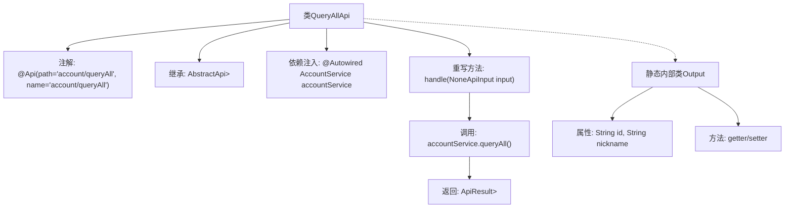

# 基础信息

|      |      |
|------|------|
| 名称 | QueryAllApi |
| 编码语言 | .java |
| 代码路径 | WeFe/serving/serving-service/src/main/java/com/welab/wefe/serving/service/api/account/QueryAllApi.java |
| 包名 | com.welab.wefe.serving.service.api.account |
| 依赖项 | ['java.util.List', 'org.springframework.beans.factory.annotation.Autowired', 'com.welab.wefe.common.web.api.base.AbstractApi', 'com.welab.wefe.common.web.api.base.Api', 'com.welab.wefe.common.web.dto.AbstractApiOutput', 'com.welab.wefe.common.web.dto.ApiResult', 'com.welab.wefe.common.web.dto.NoneApiInput', 'com.welab.wefe.serving.service.service.AccountService'] |
| 概述说明 | QueryAllApi类用于查询所有账户信息，调用AccountService的queryAll方法返回包含id和nickname的列表。 |

# 说明

该代码定义了一个名为QueryAllApi的API类，用于查询所有账户信息。它继承自AbstractApi，接受NoneApiInput作为输入，返回包含Output对象列表的ApiResult。Output类包含id和nickname两个属性，并提供了相应的getter和setter方法。API路径为account/queryAll，通过注入的AccountService调用queryAll方法获取数据。处理逻辑在handle方法中实现，成功时返回查询结果。

# 类列表 Class Summary

| 名称   | 类型  | 说明 |
|-------|------|-------------|
| QueryAllApi | class | QueryAllApi类用于查询所有账户信息，接收空输入，返回包含id和nickname的列表，调用AccountService的queryAll方法实现。 |


## 类 QueryAllApi

|      |      |
|------|------|
| 访问范围 | @Api(path = "account/queryAll", name = "account/queryAll");public |
| 类型 | class |
| 名称 | QueryAllApi |
| 说明 | QueryAllApi类用于查询所有账户信息，接收空输入，返回包含id和nickname的列表，调用AccountService的queryAll方法实现。 |


### UML类图

```mermaid
classDiagram
    class QueryAllApi {
        -AccountService accountService
        +handle(NoneApiInput input) ApiResult~List~Output~~
    }

    class AbstractApi~T, R~ {
        <<Abstract>>
    }

    class NoneApiInput {
    }

    class ApiResult~T~ {
    }

    class AccountService {
        <<Interface>>
        +queryAll() List~QueryAllApi.Output~
    }

    class QueryAllApi$Output {
        -String id
        -String nickname
        +getNickname() String
        +getId() String
        +setId(String id)
        +setNickname(String nickname)
    }

    class AbstractApiOutput {
        <<Abstract>>
    }

    QueryAllApi --> AbstractApi : 继承
    QueryAllApi --> AccountService : 依赖
    QueryAllApi --> NoneApiInput : 使用
    QueryAllApi --> ApiResult : 返回
    QueryAllApi --> QueryAllApi$Output : 嵌套类
    QueryAllApi$Output --> AbstractApiOutput : 继承
    AccountService ..|> QueryAllApi$Output : 返回
```

这段代码展示了一个查询所有账户信息的API类`QueryAllApi`，它继承自泛型抽象类`AbstractApi`，使用`NoneApiInput`作为输入参数，返回包含`Output`对象列表的`ApiResult`。`Output`是继承自`AbstractApiOutput`的静态嵌套类，包含账户ID和昵称字段。`QueryAllApi`通过依赖注入的`AccountService`接口获取数据，实现了`handle`方法来处理请求。类图清晰地展示了这些类之间的关系和层级结构。


### 内部方法调用关系图



这段代码定义了一个名为`QueryAllApi`的API类，用于查询所有账户信息。该类继承自`AbstractApi`，通过`AccountService`调用`queryAll()`方法获取数据，并返回包含`Output`对象列表的`ApiResult`。`Output`是静态内部类，包含`id`和`nickname`属性及其getter/setter方法。流程图展示了类结构、方法调用关系和数据处理流程，清晰呈现了从请求处理到结果返回的完整链路。

### 字段列表 Field List

| 名称  | 类型  | 说明 |
|-------|-------|------|
| accountService | AccountService | 使用@Autowired自动注入AccountService实例。 |

### 方法列表

| 名称  | 类型  | 说明 |
|-------|-------|------|
| handle | ApiResult<List<Output>> | 这段代码重写了handle方法，调用accountService查询所有数据并返回成功结果。 |


