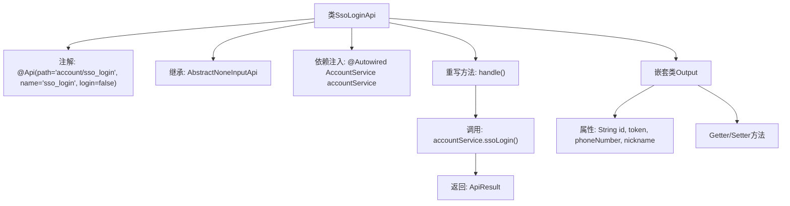

# 基础信息

|      |      |
|------|------|
| 名称 | SsoLoginApi |
| 编码语言 | .java |
| 代码路径 | WeFe/serving/serving-service/src/main/java/com/welab/wefe/serving/service/api/account/SsoLoginApi.java |
| 包名 | com.welab.wefe.serving.service.api.account |
| 依赖项 | ['com.welab.wefe.common.exception.StatusCodeWithException', 'com.welab.wefe.common.web.api.base.AbstractNoneInputApi', 'com.welab.wefe.common.web.api.base.Api', 'com.welab.wefe.common.web.dto.AbstractApiOutput', 'com.welab.wefe.common.web.dto.ApiResult', 'com.welab.wefe.serving.service.service.AccountService', 'org.springframework.beans.factory.annotation.Autowired'] |
| 概述说明 | SSO登录API类，无需登录，调用accountService.ssoLogin返回用户ID、token、手机号和昵称。 |

# 说明

该代码定义了一个名为SsoLoginApi的API类，用于处理单点登录请求。API路径为account/sso_login，无需登录即可访问。类继承自AbstractNoneInputApi，输出类型为内部类Output。通过注入的AccountService调用ssoLogin方法处理请求，返回包含用户ID、令牌、手机号和昵称的输出结果。Output类继承AbstractApiOutput，包含四个可读写字符串属性：id、token、phoneNumber和nickname。

# 类列表 Class Summary

| 名称   | 类型  | 说明 |
|-------|------|-------------|
| SsoLoginApi | class | SSO登录API类，无需登录，调用accountService.ssoLogin()返回用户ID、token、手机号和昵称。 |


## 类 SsoLoginApi

|      |      |
|------|------|
| 访问范围 | @Api(path = "account/sso_login", name = "sso_login", login = false);public |
| 类型 | class |
| 名称 | SsoLoginApi |
| 说明 | SSO登录API类，无需登录，调用accountService.ssoLogin()返回用户ID、token、手机号和昵称。 |


### UML类图

```mermaid
classDiagram
    class AbstractNoneInputApi~T~ {
        <<abstract>>
        +handle() ApiResult~T~
    }

    class SsoLoginApi {
        -AccountService accountService
        +handle() ApiResult~Output~
    }

    class AccountService {
        <<Interface>>
        +ssoLogin() SsoLoginApi$Output
    }

    class AbstractApiOutput {
        <<abstract>>
    }

    class SsoLoginApi$Output {
        -String id
        -String token
        -String phoneNumber
        -String nickname
        +get/set methods
    }

    SsoLoginApi --|> AbstractNoneInputApi : 继承
    SsoLoginApi --> AccountService : 依赖
    SsoLoginApi$Output --|> AbstractApiOutput : 继承
    AccountService ..> SsoLoginApi$Output : 创建
```

这段代码展示了一个SSO登录API的实现结构。SsoLoginApi继承自泛型抽象类AbstractNoneInputApi，通过AccountService接口实现单点登录功能，返回包含用户ID、令牌、电话号码和昵称的输出对象。类图中清晰地展示了继承关系(SsoLoginApi→AbstractNoneInputApi、Output→AbstractApiOutput)、依赖关系(SsoLoginApi→AccountService)以及接口实现关系，Output作为静态内部类封装了登录后的用户信息。整个设计符合面向对象原则，通过抽象类和接口实现了良好的扩展性。


### 内部方法调用关系图



该流程图展示了SSO登录API的核心结构。SsoLoginApi类通过@Api注解定义接口路径，继承抽象基类并注入AccountService。主要逻辑在handle()方法中，调用accountService的ssoLogin()服务并返回封装结果。嵌套类Output定义了包含用户ID、令牌、手机号和昵称的数据结构，通过Getter/Setter方法提供访问控制。整个设计体现了清晰的层级关系和单一职责原则。

### 字段列表 Field List

| 名称  | 类型  | 说明 |
|-------|-------|------|
| accountService | AccountService | 自动注入AccountService实例。 |

### 方法列表

| 名称  | 类型  | 说明 |
|-------|-------|------|
| handle | ApiResult<Output> | 这是一个Java方法重写，调用accountService的ssoLogin方法进行单点登录，返回成功结果或异常。 |


