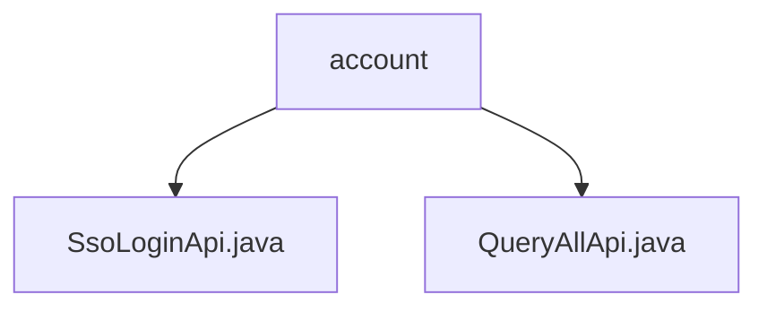

# 基础信息

|      |      |
|------|------|
| 名称 | account |
| 编码语言 | .java |
| 代码路径 | WeFe/serving/serving-service/src/main/java/com/welab/wefe/serving/service/api/account |
| 包名 | docs.serving.serving-service.src.main.java.com.welab.wefe.serving.service.api.account |
| 概述说明 | SsoLoginApi处理单点登录，路径account/sso_login，返回用户ID、令牌、手机号和昵称。QueryAllApi查询所有账户，路径account/queryAll，返回ID和昵称列表。 |

# 说明

## 概述  
该模块核心职责是提供账户管理相关的API服务，包括单点登录和账户信息查询功能。接口规范遵循RESTful风格，例如`account/sso_login`处理SSO登录请求，`account/queryAll`获取账户列表。关键数据结构包括`Output`类（含用户ID、令牌等字段）和`ApiResult`（封装列表结果）。外部依赖仅为`AccountService`，用于业务逻辑处理。例如，`SsoLoginApi`通过`ssoLogin`方法生成令牌，`QueryAllApi`通过`queryAll`获取账户列表。

## 主要业务场景  
模块支持两种典型场景：用户通过SSO登录（类似OAuth流程）获取访问令牌，或管理员查询全部账户信息（类似CRUD操作）。交互模式均为同步HTTP请求，例如登录返回`{id, token}`，查询返回`[{id, nickname}]`列表。功能完整性体现在无状态设计和分层架构，如`AbstractApi`统一处理输入输出。API类型包含无鉴权接口（如登录）和需鉴权接口（如查询），集成案例可对接前端或第三方认证系统。

### 包内部结构视图

该流程图展示了WeFe项目中account目录下的两个API文件结构。根节点为account文件夹，包含两个子节点：SsoLoginApi.java和QueryAllApi.java，分别代表单点登录和查询全部数据的API实现类。整个结构简洁清晰地呈现了账户相关API的层级关系。

# 文件列表

| 名称   | 类型  | 说明 |
|-------|------|-------------|
| [SsoLoginApi.java](SsoLoginApi.md) | file | SSO登录API类，无需登录，调用accountService.ssoLogin返回用户ID、token、手机号和昵称。 |
| [QueryAllApi.java](QueryAllApi.md) | file | QueryAllApi类用于查询所有账户信息，调用AccountService的queryAll方法返回包含id和nickname的列表。 |

