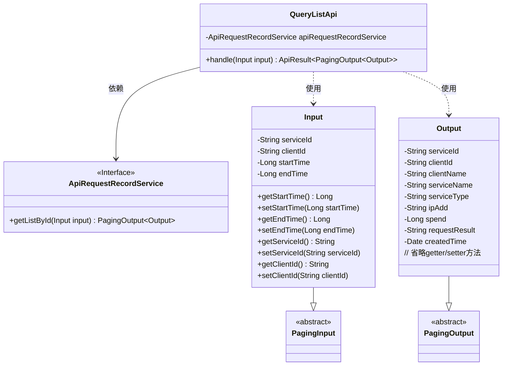

# 基础信息

|      |      |
|------|------|
| 名称 | QueryListApi |
| 编码语言 | .java |
| 代码路径 | WeFe/serving/serving-service/src/main/java/com/welab/wefe/serving/service/api/apirequestrecord/QueryListApi.java |
| 包名 | com.welab.wefe.serving.service.api.apirequestrecord |
| 依赖项 | ['com.welab.wefe.common.fieldvalidate.annotation.Check', 'com.welab.wefe.common.web.api.base.AbstractApi', 'com.welab.wefe.common.web.api.base.Api', 'com.welab.wefe.common.web.dto.ApiResult', 'com.welab.wefe.serving.service.dto.PagingInput', 'com.welab.wefe.serving.service.dto.PagingOutput', 'com.welab.wefe.serving.service.service.ApiRequestRecordService', 'org.springframework.beans.factory.annotation.Autowired', 'java.util.Date'] |
| 概述说明 | 查询API请求记录的接口类，包含输入参数（服务ID、客户端ID、时间范围）和分页输出结果（服务信息、客户端信息、请求详情等）。通过ApiRequestRecordService处理请求并返回结果。 |

# 说明

该代码定义了一个名为QueryListApi的API类，用于查询API请求记录。API路径为apirequestrecord/query-list，接受Input参数并返回分页的Output结果。Input包含serviceId、clientId、startTime和endTime等查询条件。Output包含服务ID、客户端ID、客户名称、服务名称、服务类型、IP地址、耗时、请求结果和创建时间等详细信息。处理逻辑通过apiRequestRecordService的getListById方法实现。

# 类列表 Class Summary

| 名称   | 类型  | 说明 |
|-------|------|-------------|
| QueryListApi | class | 查询API请求记录的类，包含输入参数（服务ID、客户端ID、时间范围）和输出结果（服务信息、客户端信息、请求详情等）。通过分页方式返回数据。 |

## 类 QueryListApi

|      |      |
|------|------|
| 访问范围 | @Api(path = "apirequestrecord/query-list", name = "query api request records");public |
| 类型 | class |
| 名称 | QueryListApi |
| 说明 | 查询API请求记录的类，包含输入参数（服务ID、客户端ID、时间范围）和输出结果（服务信息、客户端信息、请求详情等）。通过分页方式返回数据。 |

### UML类图

这段代码展示了一个API查询系统的类结构，核心是QueryListApi类，它继承自AbstractApi并处理分页查询请求。Input类继承PagingInput，包含查询参数如serviceId、clientId和时间范围；Output类继承PagingOutput，包含详细的查询结果字段如服务信息、客户端信息和请求详情。QueryListApi通过依赖注入的ApiRequestRecordService接口实现具体查询逻辑，体现了清晰的层次结构和职责分离。

### 内部方法调用关系图

```mermaid
graph TD
    A["类QueryListApi"]
    B["继承: AbstractApi<Input, PagingOutput<Output>>"]
    C["依赖: ApiRequestRecordService"]
    D["方法: handle(Input input)"]
    E["调用: apiRequestRecordService.getListById(input)"]
    F["返回: ApiResult<PagingOutput<Output>>"]
    G["内部类Input"]
    H["属性: serviceId, clientId, startTime, endTime"]
    I["getter/setter方法"]
    J["内部类Output"]
    K["属性: serviceId, clientId, clientName等"]
    L["getter/setter方法"]

    A --> B
    A --> C
    A --> D
    D --> E
    E --> F
    A --> G
    G --> H
    G --> I
    A --> J
    J --> K
    J --> L
```

这段代码是一个API查询类，继承自AbstractApi基类，用于处理API请求记录的分页查询。主要包含三个部分：主类QueryListApi负责业务处理，内部类Input封装查询参数，内部类Output定义返回数据结构。流程图展示了类继承关系、依赖服务和主要方法调用链路，以及两个内部类的属性和方法结构。核心业务逻辑是通过apiRequestRecordService服务获取数据列表，最终返回分页结果。

### 字段列表 Field List

| 名称  | 类型  | 说明 |
|-------|-------|------|
| apiRequestRecordService | ApiRequestRecordService | 自动注入ApiRequestRecordService服务实例。 |

### 方法列表

| 名称  | 类型  | 说明 |
|-------|-------|------|
| handle | ApiResult<PagingOutput<Output>> | Java方法重写，调用apiRequestRecordService.getListById处理输入并返回分页结果。 |

