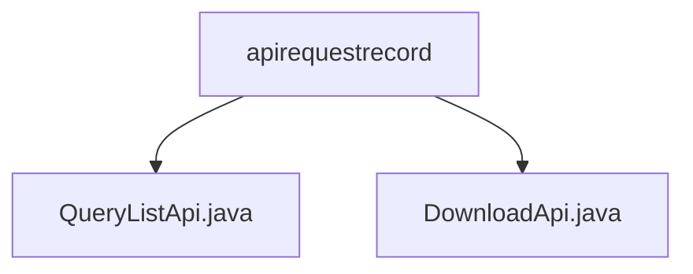

# 基础信息

|      |      |
|------|------|
| 名称 | apirequestrecord |
| 编码语言 | .java |
| 代码路径 | WeFe/serving/serving-service/src/main/java/com/welab/wefe/serving/service/api/apirequestrecord |
| 包名 | docs.serving.serving-service.src.main.java.com.welab.wefe.serving.service.api.apirequestrecord |
| 概述说明 | QueryListApi类提供查询API记录功能，路径为apirequestrecord/query-list，支持按条件筛选并返回分页结果，包含服务、客户端、耗时等详细信息。 |

# 说明

## 概述  
该模块核心职责是提供API请求记录的查询与下载功能，支持按条件筛选和分页获取结果。接口规范包括`QueryListApi`（路径`apirequestrecord/query-list`）和`DownloadApi`，前者通过`Input`参数（含`serviceId`、时间范围等）返回分页的`Output`结果，后者功能暂未描述。关键数据结构包含`Input`（查询条件）和`Output`（记录详情，如服务类型、耗时等）。外部依赖为`apiRequestRecordService`的`getListById`方法。例如，`QueryListApi`通过服务层方法实现数据过滤与分页。

## 主要业务场景  
模块适用于审计与分析场景，例如追踪特定服务或客户端的API调用记录。业务流程包括：用户提交查询条件→系统过滤记录→返回分页结果或生成下载文件。交互模式类似管理后台的数据筛选，支持多条件组合查询。典型应用包括监控服务调用耗时、统计请求成功率等。API类型为RESTful，集成案例需结合`apiRequestRecordService`实现数据获取。

### 包内部结构视图

该流程图展示了serving-service项目中apirequestrecord目录下的两个API文件结构。QueryListApi.java和DownloadApi.java作为同级文件节点，共同隶属于apirequestrecord目录，清晰地呈现了后端服务接口文件的基础层级关系。这种结构常见于微服务架构中的API模块组织方式。

# 文件列表

| 名称   | 类型  | 说明 |
|-------|------|-------------|
| [QueryListApi.java](QueryListApi.md) | file | 查询API请求记录的接口类，包含输入参数（服务ID、客户端ID、时间范围）和分页输出结果（服务信息、客户端信息、请求详情等）。通过ApiRequestRecordService处理请求并返回结果。 |
| [DownloadApi.java](DownloadApi.md) | file | 输入内容为空，无法生成概要描述。 |

