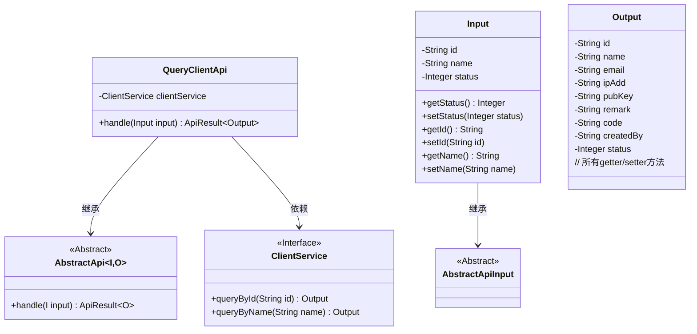

# 基础信息

|      |      |
|------|------|
| 名称 | QueryClientApi |
| 编码语言 | .java |
| 代码路径 | WeFe/serving/serving-service/src/main/java/com/welab/wefe/serving/service/api/client/QueryClientApi.java |
| 包名 | com.welab.wefe.serving.service.api.client |
| 依赖项 | ['com.welab.wefe.common.exception.StatusCodeWithException', 'com.welab.wefe.common.fieldvalidate.annotation.Check', 'com.welab.wefe.common.web.api.base.AbstractApi', 'com.welab.wefe.common.web.api.base.Api', 'com.welab.wefe.common.web.dto.AbstractApiInput', 'com.welab.wefe.common.web.dto.ApiResult', 'com.welab.wefe.serving.service.service.ClientService', 'org.springframework.beans.factory.annotation.Autowired', 'javax.persistence.Column', 'java.io.IOException'] |
| 概述说明 | 查询客户端API，通过ID或名称查询客户信息，返回包含ID、名称、邮箱等详细信息的输出。 |

# 说明

该代码定义了一个名为QueryClientApi的API类，用于查询客户端信息。API路径为client/query-one，名称为get client。该类继承自AbstractApi，输入类型为Input，输出类型为Output。Input类包含客户端ID、名称和状态等字段，Output类包含客户端详细信息如ID、名称、邮箱、IP地址、公钥、备注、创建者和状态等。处理逻辑根据输入ID或名称调用ClientService的相应方法查询数据。

# 类列表 Class Summary

| 名称   | 类型  | 说明 |
|-------|------|-------------|
| QueryClientApi | class | 查询客户端API，根据ID或名称查询客户端信息，返回包含ID、名称、邮箱、IP地址、公钥等字段的客户端详情。输入参数包括ID、名称和状态。 |

## 类 QueryClientApi

|      |      |
|------|------|
| 访问范围 | @Api(path = "client/query-one", name = "get client");public |
| 类型 | class |
| 名称 | QueryClientApi |
| 说明 | 查询客户端API，根据ID或名称查询客户端信息，返回包含ID、名称、邮箱、IP地址、公钥等字段的客户端详情。输入参数包括ID、名称和状态。 |

### UML类图

这段代码展示了一个查询客户端信息的API实现。QueryClientApi继承自泛型抽象类AbstractApi，处理Input输入并返回Output输出。Input类包含客户端ID、名称和状态等字段，Output类包含客户端的详细信息。QueryClientApi通过ClientService接口根据输入参数查询客户端信息，支持按ID或名称查询。类图清晰地展示了继承关系和依赖关系，体现了良好的分层设计。

### 内部方法调用关系图

```mermaid
graph TD
    A["类QueryClientApi"]
    B["注解: @Api(path='client/query-one', name='get client')"]
    C["继承: AbstractApi<Input, Output>"]
    D["依赖注入: @Autowired ClientService"]
    E["重写方法: handle(Input input)"]
    F["条件分支: input.id非空"]
    G["调用: clientService.queryById"]
    H["条件分支: input.name非空"]
    I["调用: clientService.queryByName"]
    J["返回: ApiResult<Output>"]
    K["静态内部类Input"]
    L["属性: String id, String name, Integer status"]
    M["校验注解: @Check"]
    N["静态内部类Output"]
    O["属性: String id, name, email, ipAdd, pubKey, remark, code, createdBy, status"]

    A --> B
    A --> C
    A --> D
    A --> E
    E --> F
    F -->|是| G
    F -->|否| H
    H -->|是| I
    G --> J
    I --> J
    A --> K
    K --> L
    L --> M
    A --> N
    N --> O
```

该流程图展示了QueryClientApi类的完整结构，包含API注解、继承关系、服务注入和核心处理逻辑。handle方法通过判断输入参数选择不同的查询方式，Input和Output作为静态内部类分别定义了请求参数和响应数据的结构。所有属性均带有校验注解或详细注释，体现了严谨的接口设计规范。

### 字段列表 Field List

| 名称  | 类型  | 说明 |
|-------|-------|------|
| clientService | ClientService | 自动注入ClientService实例。 |

### 方法列表

| 名称  | 类型  | 说明 |
|-------|-------|------|
| handle | ApiResult<Output> | 处理输入并返回查询结果：根据ID或名称查询客户信息，无匹配返回空。 |

