# 基础信息

|      |      |
|------|------|
| 名称 | QueryClientListApi |
| 编码语言 | .java |
| 代码路径 | WeFe/serving/serving-service/src/main/java/com/welab/wefe/serving/service/api/client/QueryClientListApi.java |
| 包名 | com.welab.wefe.serving.service.api.client |
| 依赖项 | ['com.welab.wefe.common.exception.StatusCodeWithException', 'com.welab.wefe.common.fieldvalidate.annotation.Check', 'com.welab.wefe.common.web.api.base.AbstractApi', 'com.welab.wefe.common.web.api.base.Api', 'com.welab.wefe.common.web.dto.AbstractApiOutput', 'com.welab.wefe.common.web.dto.ApiResult', 'com.welab.wefe.serving.service.dto.PagingInput', 'com.welab.wefe.serving.service.dto.PagingOutput', 'com.welab.wefe.serving.service.service.ClientService', 'org.springframework.beans.factory.annotation.Autowired', 'java.io.IOException', 'java.util.Date'] |
| 概述说明 | QueryClientListApi是一个分页查询客户列表的接口，输入包含客户名称和时间范围，输出包含客户ID、名称、邮箱、IP白名单、公钥、状态等信息。通过ClientService处理查询逻辑。 |

# 说明

这是一个名为QueryClientListApi的API类，用于获取客户列表。它继承自AbstractApi，输入类型为Input，输出类型为PagingOutput<Output>。输入参数包括客户名称、开始时间和结束时间，支持分页查询。输出结果包含客户ID、名称、邮箱、IP白名单、公钥、客户代码、创建时间、创建人、更新人和状态等信息。该API通过ClientService的queryList方法处理请求，并返回分页结果。所有字段均带有校验注解，确保数据有效性。

# 类列表 Class Summary

| 名称   | 类型  | 说明 |
|-------|------|-------------|
| QueryClientListApi | class | QueryClientListApi是一个分页查询客户列表的接口，输入包含客户名称和时间范围，输出包含客户ID、名称、邮箱、IP白名单、公钥、状态等信息。 |


## 类 QueryClientListApi

|      |      |
|------|------|
| 访问范围 | @Api(path = "client/query-list", name = "get client list");public |
| 类型 | class |
| 名称 | QueryClientListApi |
| 说明 | QueryClientListApi是一个分页查询客户列表的接口，输入包含客户名称和时间范围，输出包含客户ID、名称、邮箱、IP白名单、公钥、状态等信息。 |


### UML类图

```mermaid
classDiagram
    class QueryClientListApi {
        -ClientService clientService
        +handle(Input input) ApiResult~PagingOutput~Output~~
    }
    class AbstractApi~T, R~ {
        <<Abstract>>
    }
    class PagingInput {
        <<Abstract>>
    }
    class PagingOutput~T~ {
        <<Generic>>
    }
    class AbstractApiOutput {
        <<Abstract>>
    }
    class ClientService {
        <<Interface>>
        +queryList(Input input) PagingOutput~Output~
    }
    class Input {
        -String clientName
        -Long startTime
        -Long endTime
        +getClientName() String
        +setClientName(String clientName)
        +getStartTime() Long
        +setStartTime(Long startTime)
        +getEndTime() Long
        +setEndTime(Long endTime)
    }
    class Output {
        -String id
        -String name
        -String email
        -String ipAdd
        -String pubKey
        -String code
        -Date createdTime
        -String createdBy
        -String updatedBy
        -Integer status
        // 省略getter/setter方法
    }

    QueryClientListApi --> AbstractApi~Input, PagingOutput~Output~~ : 继承
    QueryClientListApi --> ClientService : 依赖
    Input --> PagingInput : 继承
    Output --> AbstractApiOutput : 继承
    ClientService ..|> AbstractApi~Input, PagingOutput~Output~~ : 实现
```

这段代码展示了一个查询客户列表的API实现，核心类QueryClientListApi继承自泛型抽象类AbstractApi，处理分页查询请求。Input类继承PagingInput包含查询条件，Output类继承AbstractApiOutput包含返回字段。通过ClientService接口实现业务逻辑，整体采用分层架构设计，符合RESTful API规范。类图清晰地展示了继承关系和依赖关系，体现了控制层与服务层的解耦。


### 内部方法调用关系图

```mermaid
graph TD
    A["类QueryClientListApi"]
    B["继承: AbstractApi<Input, PagingOutput<Output>>"]
    C["依赖: @Autowired ClientService"]
    D["方法: handle(Input input)"]
    E["嵌套类Input"]
    F["嵌套类Output"]
    G["Input属性: clientName, startTime, endTime"]
    H["Input方法: getter/setter"]
    I["Output属性: id, name, email, ipAdd, pubKey, code, createdTime, createdBy, updatedBy, status"]
    J["Output方法: getter/setter"]

    A --> B
    A --> C
    A --> D
    A --> E
    A --> F
    E --> G
    E --> H
    F --> I
    F --> J
    D --> C["调用clientService.queryList(input)"]
```



这段代码展示了一个分页查询客户列表的API实现，包含输入参数校验和输出数据结构。流程图清晰呈现了类继承关系、服务依赖、核心处理方法以及嵌套的Input/Output类的完整结构，其中Input处理分页和查询条件，Output封装客户详细信息字段。整个设计符合分层架构，通过ClientService实现业务逻辑解耦。

### 字段列表 Field List

| 名称  | 类型  | 说明 |
|-------|-------|------|
| clientService | ClientService | 自动注入ClientService实例。 |

### 方法列表

| 名称  | 类型  | 说明 |
|-------|-------|------|
| handle | ApiResult<PagingOutput<Output>> | 重写handle方法，调用clientService.queryList处理输入并返回分页结果。 |


