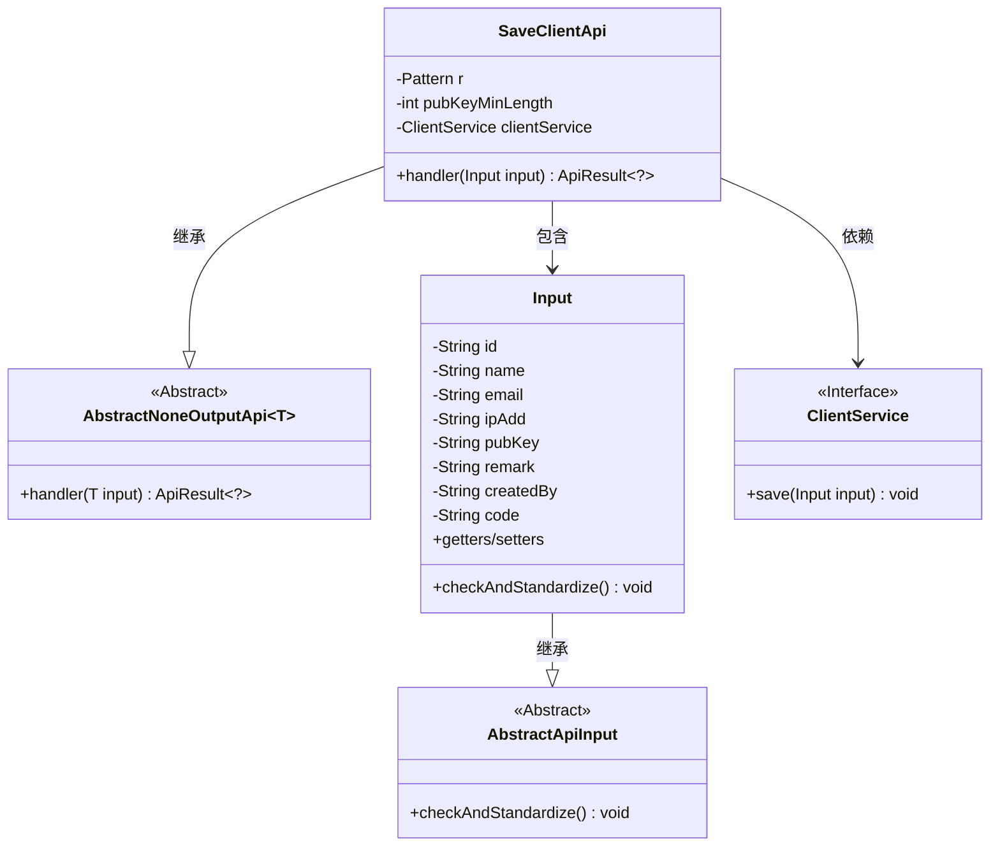

# 基础信息

|      |      |
|------|------|
| 名称 | SaveClientApi |
| 编码语言 | .java |
| 代码路径 | WeFe/serving/serving-service/src/main/java/com/welab/wefe/serving/service/api/client/SaveClientApi.java |
| 包名 | com.welab.wefe.serving.service.api.client |
| 依赖项 | ['com.welab.wefe.common.StatusCode', 'com.welab.wefe.common.exception.StatusCodeWithException', 'com.welab.wefe.common.fieldvalidate.annotation.Check', 'com.welab.wefe.common.util.StringUtil', 'com.welab.wefe.common.web.api.base.AbstractNoneOutputApi', 'com.welab.wefe.common.web.api.base.Api', 'com.welab.wefe.common.web.dto.AbstractApiInput', 'com.welab.wefe.common.web.dto.ApiResult', 'com.welab.wefe.serving.service.service.ClientService', 'org.springframework.beans.factory.annotation.Autowired', 'java.util.List', 'java.util.regex.Matcher', 'java.util.regex.Pattern'] |
| 概述说明 | SaveClientApi用于保存客户信息，包含必填字段如名称、IP地址和公钥，IP需符合格式，公钥长度至少128位。 |

# 说明

这是一个名为SaveClientApi的Java类，用于处理客户端保存操作的API。该类继承自AbstractNoneOutputApi，使用Input类作为输入参数。主要功能包括：通过clientService保存客户端信息，并对输入参数进行校验。输入参数包括客户ID、名称、邮箱、IP地址、公钥等字段，其中名称、IP地址和公钥为必填项。校验逻辑包括：IP地址格式验证（使用正则表达式匹配IPv4格式），公钥长度检查（最小128字符）。校验通过后，将处理结果返回。

# 类列表 Class Summary

| 名称   | 类型  | 说明 |
|-------|------|-------------|
| SaveClientApi | class | SaveClientApi类用于保存客户信息，包含必填字段如名称、IP地址和公钥，并对IP格式和公钥长度进行校验。通过ClientService处理输入数据并返回成功结果。 |

## 类 SaveClientApi

|      |      |
|------|------|
| 访问范围 | @Api(path = "client/save", name = "save");public |
| 类型 | class |
| 名称 | SaveClientApi |
| 说明 | SaveClientApi类用于保存客户信息，包含必填字段如名称、IP地址和公钥，并对IP格式和公钥长度进行校验。通过ClientService处理输入数据并返回成功结果。 |

### UML类图

这段代码描述了一个保存客户端信息的API类结构。SaveClientApi继承自AbstractNoneOutputApi，包含输入参数校验类Input和依赖的ClientService接口。主要功能是通过handler方法处理客户端信息保存请求，其中Input类负责对IP地址格式和公钥长度进行严格校验。整个设计体现了清晰的层次结构，输入校验与业务逻辑分离的原则。

### 内部方法调用关系图

```mermaid
graph TD
    A["类SaveClientApi"]
    B["继承: AbstractNoneOutputApi<Input>"]
    C["注解: @Api(path='client/save', name='save')"]
    D["静态字段: Pattern r (IP正则)"]
    E["静态字段: int pubKeyMinLength=128"]
    F["依赖注入: ClientService clientService"]
    G["重写方法: handler(Input input)"]
    H["内部类: Input"]
    I["继承: AbstractApiInput"]
    J["字段: String id (客户id)"]
    K["字段: String name (客户名称)"]
    L["字段: String email (客户邮箱)"]
    M["字段: String ipAdd (IP地址)"]
    N["字段: String pubKey (公钥)"]
    O["字段: String remark (备注)"]
    P["字段: String createdBy (创建人)"]
    Q["字段: String code (客户code)"]
    R["方法: checkAndStandardize()"]
    S["方法: 各字段getter/setter"]

    A --> B
    A --> C
    A --> D
    A --> E
    A --> F
    A --> G
    A --> H
    H --> I
    H --> J
    H --> K
    H --> L
    H --> M
    H --> N
    H --> O
    H --> P
    H --> Q
    H --> R
    H --> S
    G --> F
    R --> D
    R --> E
```

该流程图展示了SaveClientApi类的完整结构，包含继承关系、注解、字段定义和核心方法调用链。主要流程是：通过handler方法处理Input参数，其中Input类继承AbstractApiInput并包含多个带校验注解的字段。关键校验逻辑在checkAndStandardize()方法中实现，包括IP格式验证和公钥长度检查。整个设计体现了API接口的输入验证、业务处理和数据持久化的分层架构。

### 字段列表 Field List

| 名称  | 类型  | 说明 |
|-------|-------|------|
| pubKeyMinLength = 128 | int | 定义私有静态常量pubKeyMinLength，值为128，表示公钥最小长度限制。 |
| r = Pattern.compile("((2(5[0-5]|[0-4]\\d))|[0-1]?\\d{1,2})(\\.((2(5[0-5]|[0-4]\\d))|[0-1]?\\d{1,2})){3}") | Pattern | Java正则表达式，用于匹配IPv4地址格式，支持0-255的四个数字段，以点分隔。 |
| clientService | ClientService | 使用@Autowired自动注入ClientService实例。 |

### 方法列表

| 名称  | 类型  | 说明 |
|-------|-------|------|
| handler | ApiResult<?> | 覆盖handler方法，调用clientService保存输入并返回成功结果。 |

